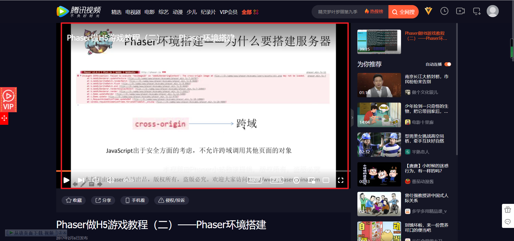
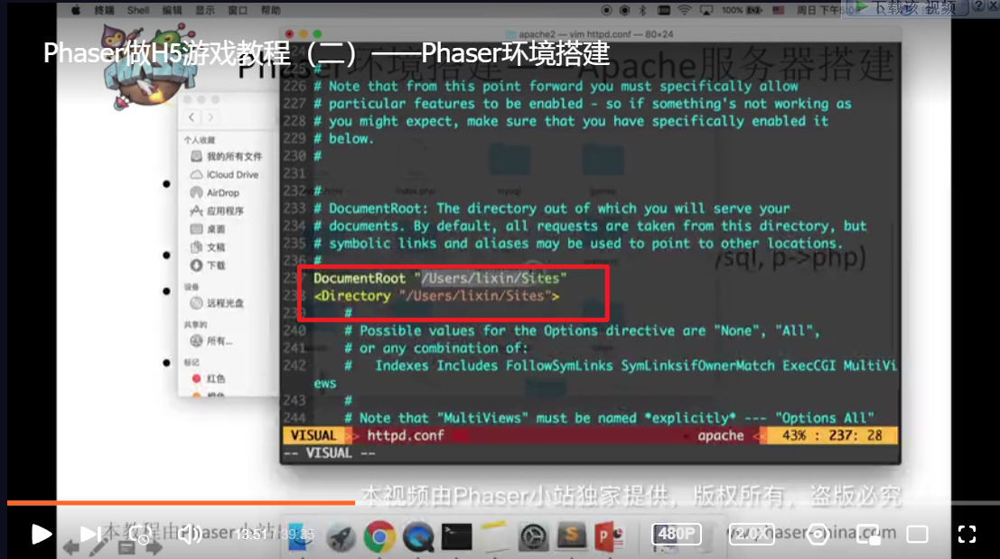
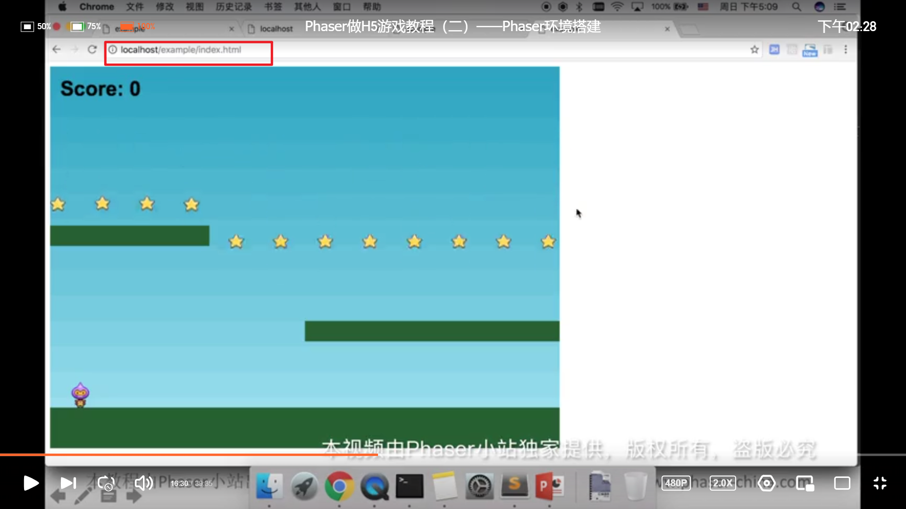
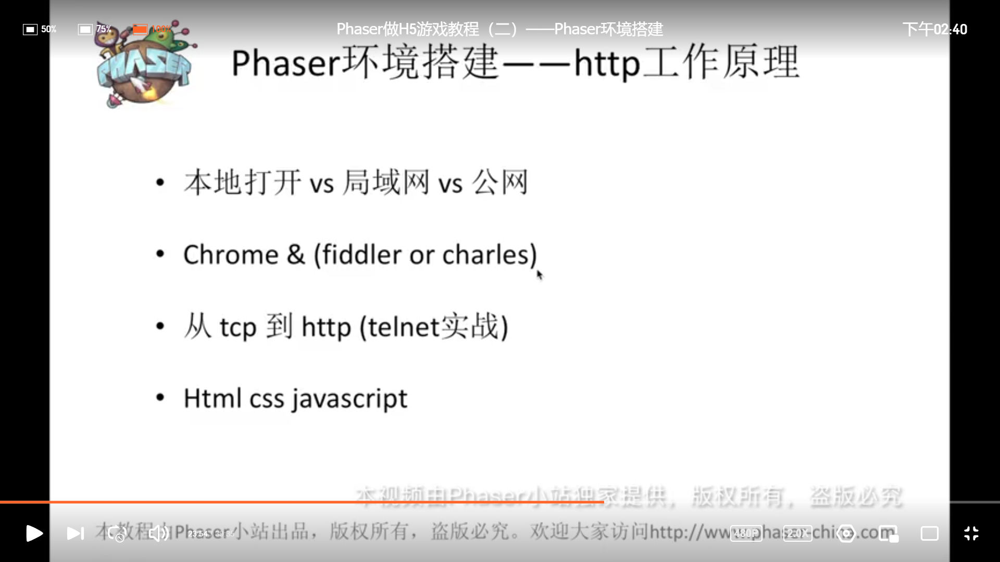
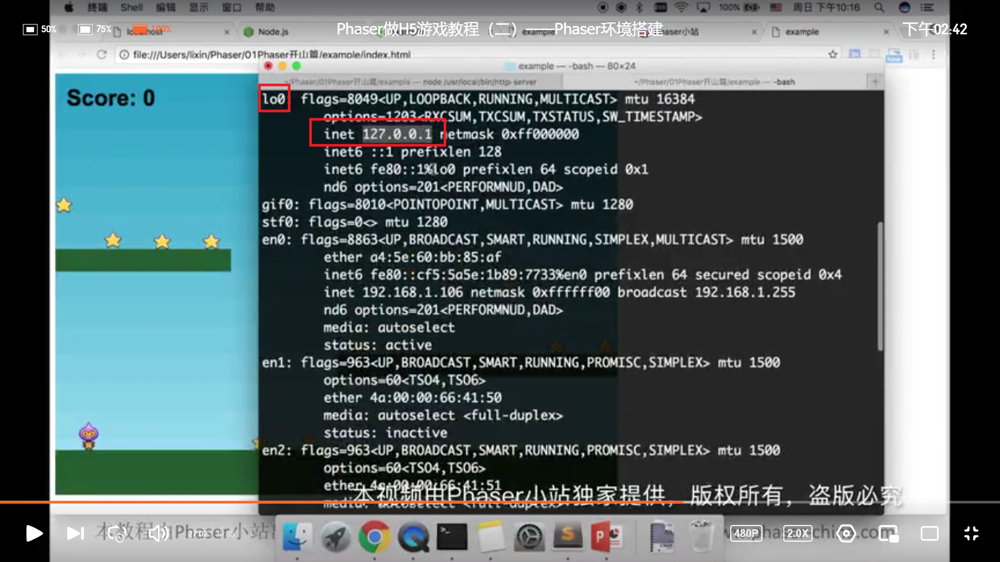
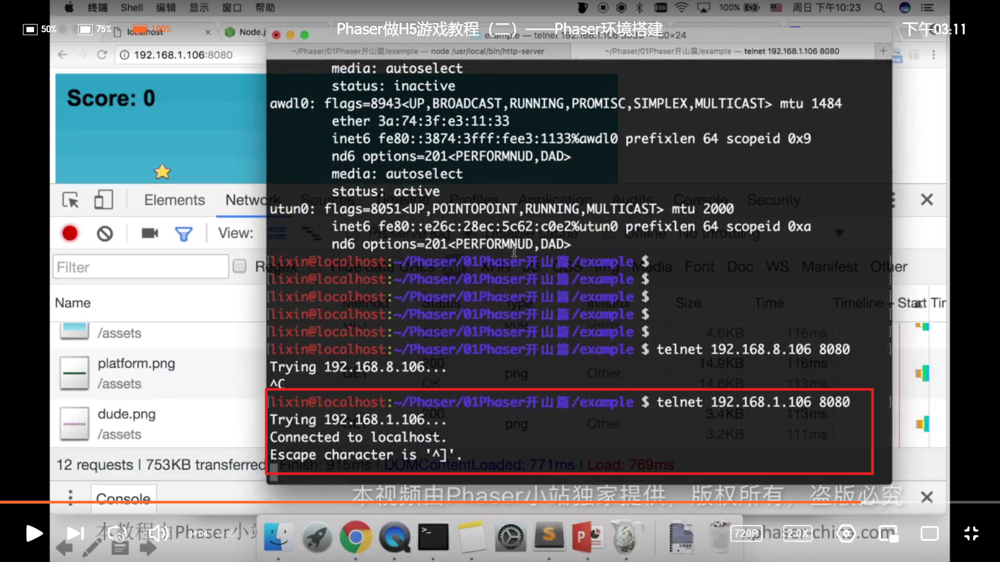
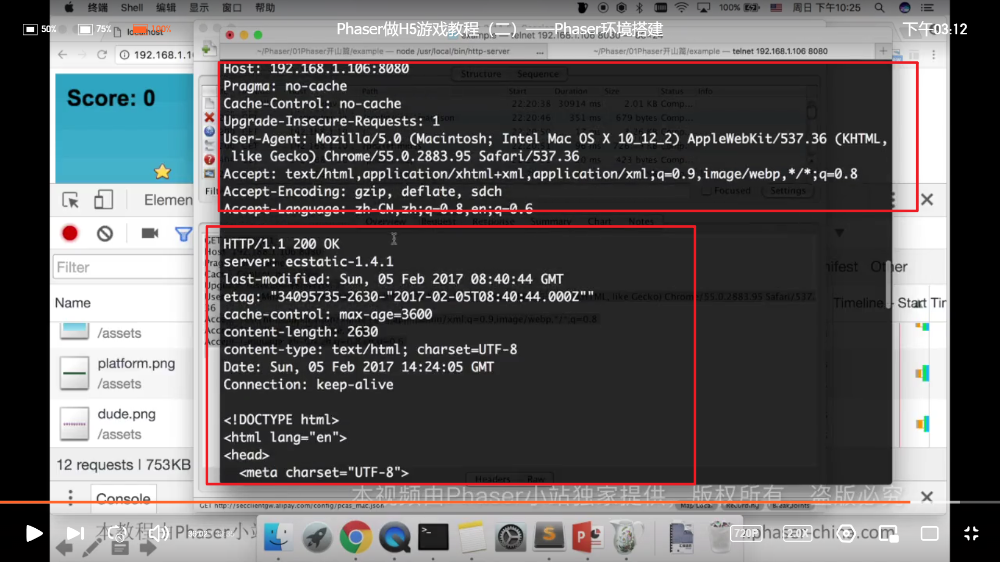

### phaser 环境搭建

## 介绍了很多背景知识，其实只用 npm i -g http-server 并在 js 文件中引入 parse 文件即可搭建起环境。

https://v.qq.com/x/page/r03727n37wu.html

  
作者建议用 http-server 搭建服务器

  
要用服务器的原因是跨域问题。

  
跨域的各种情景

  
搭建 apache，windows 就用 wamp，自带 apache。 搜索 wamp 官网下载，安装后访问 127.0.0.1 成功即可。

  
搜索 httpd.conf 是配置文件

  
设置默认端口

DocumentRoot 配置访问的文件夹

  
直接打开文件会报错，但输入网址就不报错了

安装 nodejs 省略，之后 npm i -g http-server。建议用 http-server，不用 wamp。因为更方便

  
phaser 本身则不需要搭建环境，引入 js 文件即可

  
http 工作原理

  
lo0 代表本机地址

  
en0 是连上家里 wifi 后产生的局域网的地址。家里其它设备使用此地址也可访问

  
访问百度后浏览器发送的第一个请求

使用 charles 工具（mac），启用后 chrome 发起的请求都会经过它做一层代理。此处即是 http 发送出去的原始数据

  
此处是服务器回复的数据

  
可以不打开页面，直接用 telnet 连接。

  
使用 telnet 发送之前相同的请求，就会得到相同的回复
