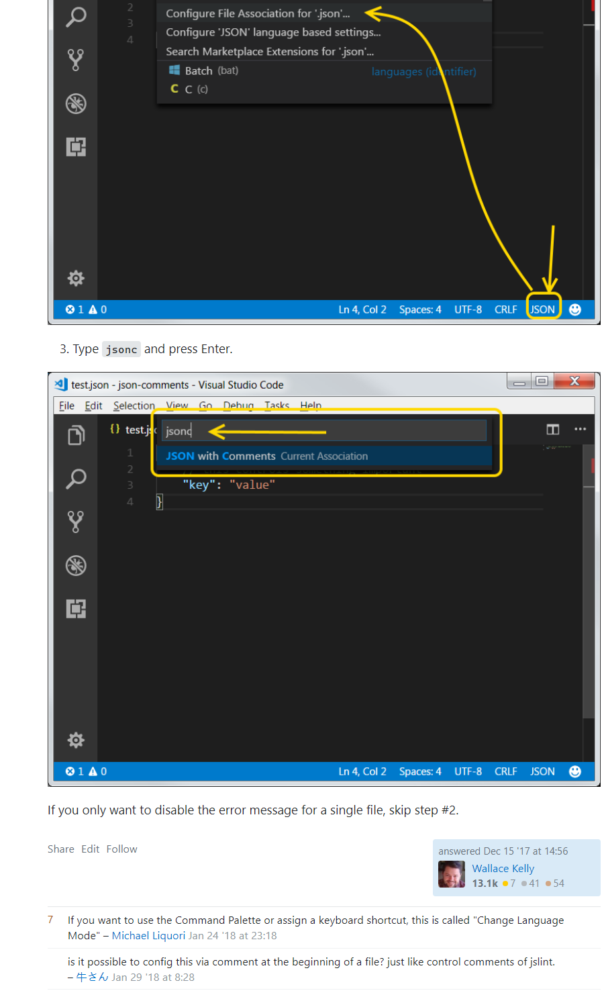
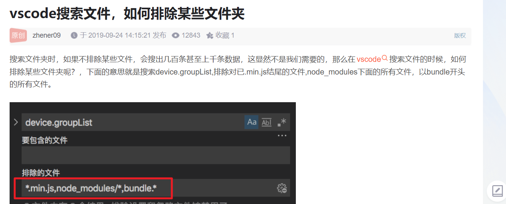

## vscode 预览 markdown，按 ctrl k 后放下 ctrl 再按 v。

## vscode 解决 windows 换行 crlf 与 lf 冲突 ^M 问题

https://blog.csdn.net/glorydx/article/details/110958739
一劳永逸的解决方法
如果你所有的同事都是使用 windows 系统，
vscode 点击文件 --》首选项 --》 设置 --》 搜索 eol，改变 eol 为\n(指 lf)或者改为(\r\n)，有一个统一的标准就好了。
git 在维护版本库的时候统一使用的是 LF，这样就可以保证文件跨平台的时候保持一致。
在 Linux 下默认的换行符也是 LF，那也就不存在什么问题。
在 Windows 下默认的换行符是 CRLF，那么我们需要保证在文件提交到版本库的时候文件的换行符是 LF，通常来说有两种方法：
如果你同事中有使用其它系统开发的
你需要先执行上面的操作，再行 以下代码才能解决
git config --global core.autocrlf false

---

## 避免 json 注释报错

sol 文件里出现 import 报错，将 solidity 插件降到 0.0135。直接降可能失败，下载单独的文件，再将其拖入 vscode 的插件栏来安装。

VSCode 关闭右侧预览功能 缩略图  
关闭方法：点击文件-首选项-设置,搜索"editor.minimap.enabled",默认值为打钩,我们只需要把钩去掉即可；

---

## vscode 快捷键设置

切换侧边栏，默认为 ctrl b，换为 ctrl b 加 ctrl b  
切换活动栏，默认未设置，换位 ctrl b 加 ctrl v

---

## 使用搜索功能时排除指定的文件或文件夹

---

## 在指定位置查找指定内容

## 设置用户代码片段，参照 markdown.md

## 切换中英文

ctrl shift p，display language
