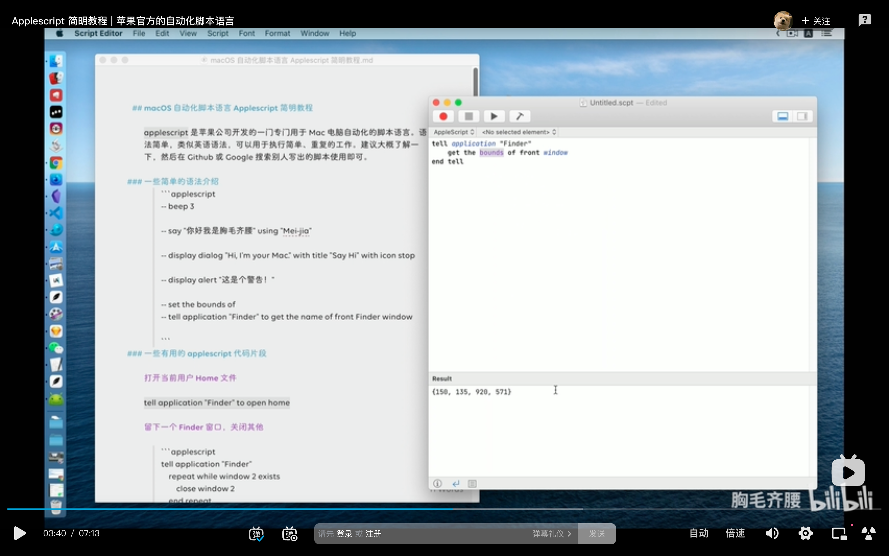

### 简略教程：https://www.bilibili.com/video/BV1NK4y1T7wA

     
获得最前面的访达窗口。

     
访达最前面窗口4个位置坐标。     

     
set4个坐标

### 打开iterm2并进入指定目录实例。
automator.app，新建文稿，快速操作，运行applescript。粘贴以下代码。
```
tell application "iTerm"
	activate
end tell

tell application "System Events"
	tell process "Iterm"
		delay 0.2
		keystroke "cd Desktop/"
		key code 29
		key code 18
		keystroke "workspace"
		key code 36
	end tell
end tell
```     
keystroke里不能输入数字，用key code代替。
key code 列表。
https://eastmanreference.com/complete-list-of-applescript-key-codes