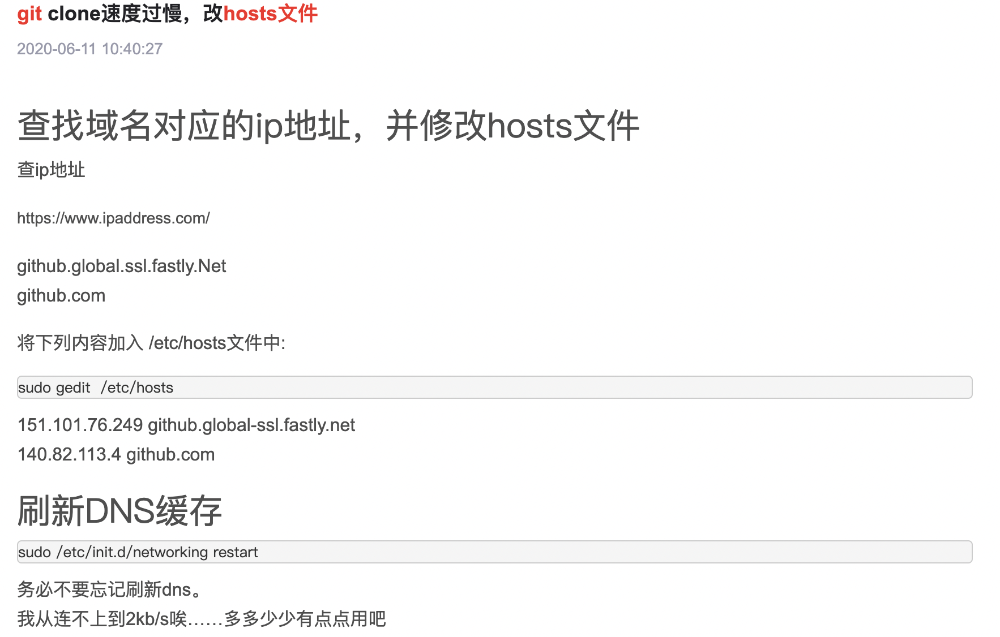
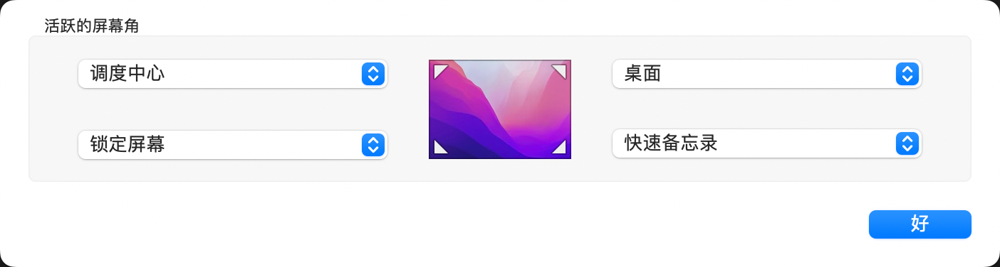

### m1芯片开启系统工具的方法不是网上说的开机后按cmd r，而是一直按开机键     

### 触控板拖动窗口和选择文字 系统偏好设置-->辅助功能--->鼠标与触控板--->触控板选项 启用拖移 三指拖移（add，选不使用拖移锁定就类似win10。） 

### git 遇到网络迟缓或timeout报错     
        
https://www.csdn.net/tags/NtzaggxsMTM1MC1ibG9n.html     
https://www.ipaddress.com/          
mac更新hosts命令：sudo killall -HUP mDNSResponder;say DNS cache has been flushed        

### mac 使用code命令打开VSCode      
安装code：打开VSCode –> command+shift+p –> 输入shell command –> 点击提示Shell Command: Install ‘code’ command in PATH运行

### 常用快捷键      
commant tab：切换不同程序，但如程序已经最小化则无法切换。       
control command f：最大化，正常切换。（有些程序似乎无效果）。       

cmd n：新建终端。       
cmd t：在当前终端新增一个页面。

### mac启动拖选     
设置，辅助功能，鼠标与触控板，触控板选项，启用拖移。        

### 触发角设置      
         

### chrome全屏时标签和地址栏消失    
cmd shift f

### Iterm2 + zsh 安装教程       

https://blog.csdn.net/Top_xiao/article/details/119790555


### 快捷键打开iterm2并进入指定目录实例。
automator.app，新建文稿，快速操作，运行applescript。粘贴以下代码。cmd保存，键盘，快捷键，服务，通用，点选并配置快捷键即可。

```
--此段代码有bug
tell application "iTerm"
	activate
end tell

tell application "System Events"
	tell process "Iterm"
		delay 0.2
		keystroke "cd Desktop/"
		key code 29
		key code 18
		keystroke "workspace"
		key code 36
	end tell
end tell
```     
keystroke里不能输入数字，用key code代替。
key code 列表。
https://eastmanreference.com/complete-list-of-applescript-key-codes


```
--使用这段代码
tell application "iTerm"
	reopen
	activate
	tell current window
		--create tab with default profile  
		tell current session
			write text "cd ~/Desktop/01workspace"
		end tell
	end tell
end tell
```

### iTerm2 设置主题        
https://iterm2colorschemes.com/ 选择主题，点击主题名获得新页面，将新页面所有内容保存着aaa.itermcolors文件里。进入iterm，cmd i，colors，color presets，import。选择aaa文件。之后aaa文件会出现在color presets里，勾选即可。