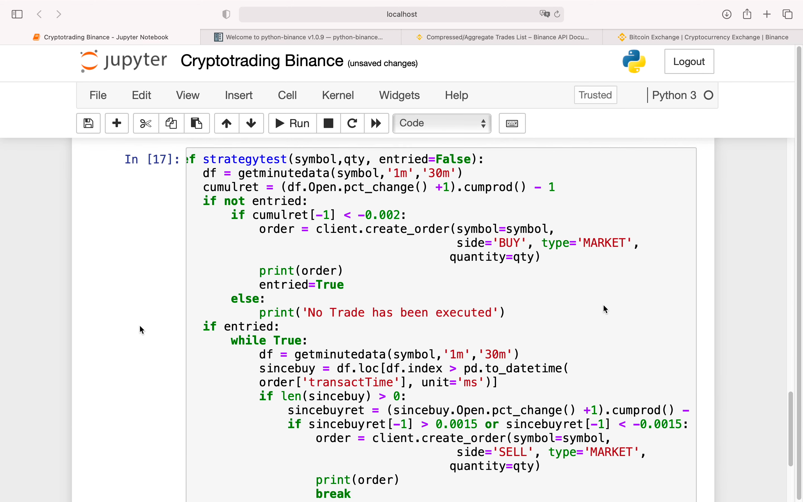

  
首先执行 !pip install python-binance  
然后才是截图的内容，截图源于自己的代码而非视频。
此视频未介绍 websocket 方式  
1m 代表 1 分钟 k 线，30 m ago，代表截取现在以前 30 分钟时间。

  
这里介绍了上图获取到的信息是什么意思。

  
  
  
更好的方式获得数据，具体信息看视频。

  
Open.plot() 可以画出折线图

  
交易策略，一段时间内降了一些就买，涨了一些就卖

  
具体交易策略代码，未显示部分为-1。  
cumulret = cumulative return 查看近 30 分钟资产的表现。  
pct_change = percentage change 显示百分比变化  
cumprod 累计连乘

  
执行交易，返回结果时两个交易，第一个买，第二个卖。
