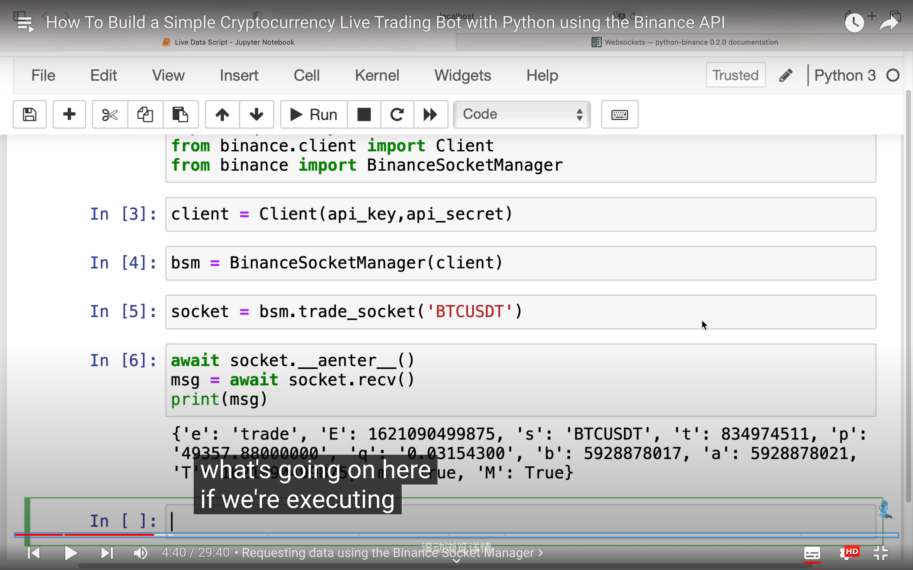

  
概括视频内容

  
第一个脚本，获得价格数据从 binance，使用 binance socket mananger? 并存储这些实时数据到 sqlite 数据库。  
sqlalchemy 用于建立去 sqlite 数据库的连接。

  
有很多使用 socket 的方法，作者这里使用的这种 manully way

  
一段代码后

  
过滤上图获得的数据，并做些转换类型的处理
  
获得了以上数据 dataframe，现在要把它存入 sqlite。所以需要个 engine 来连接 db。
  
  
想要每次从 binance 获得新价格都更新这个 db，就要修改之前的这段代码。执行这段时就会拥有一个无休止的请求到币难测。币难测会提供 pricedata，而这里每秒都会存个 new row 在 sql 里。

  
执行后效果。除了输出在这里，还会存在 db 里。

  
作者引入他的 api。

  
第二个脚本的代码，输出了动态数据

  
polot 显示折线图

交易逻辑，较复杂

  
执行交易

  
执行完交易后停止脚本，不然会得到很大的 db。
