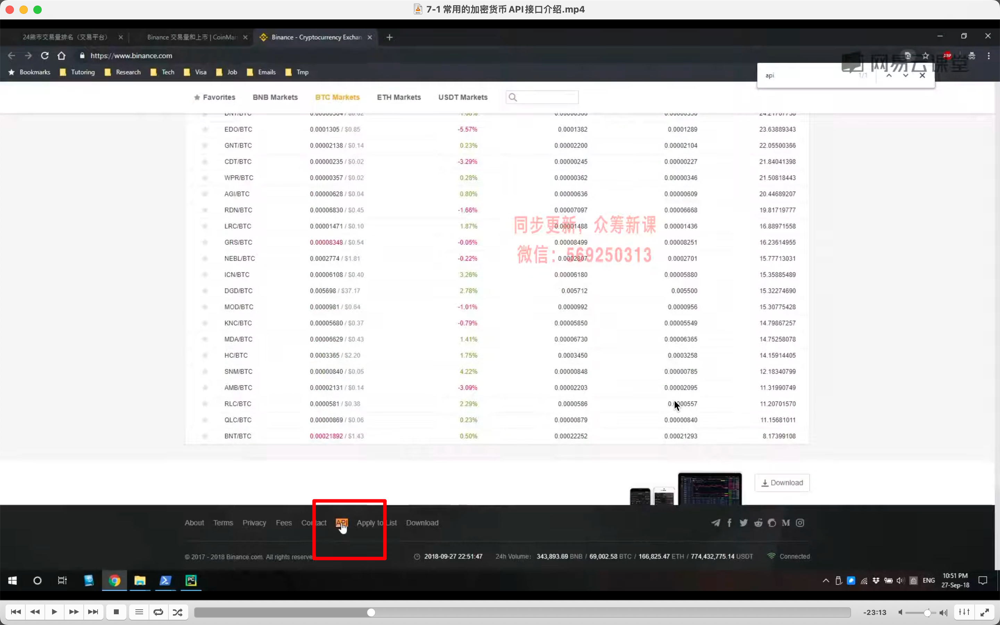
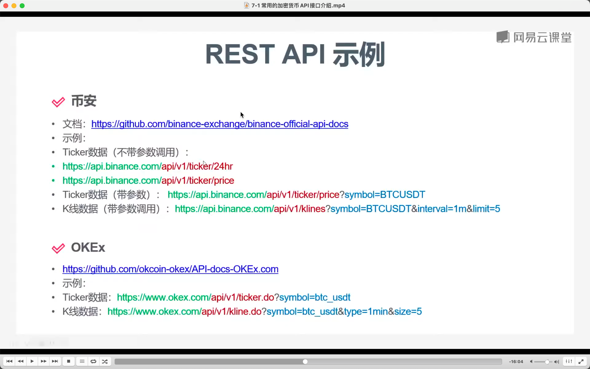
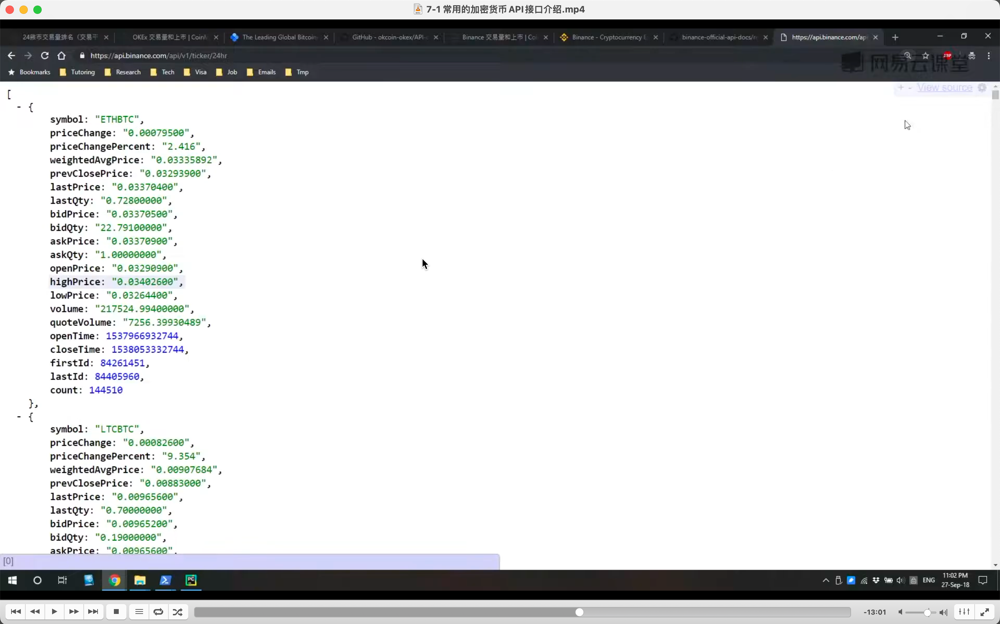
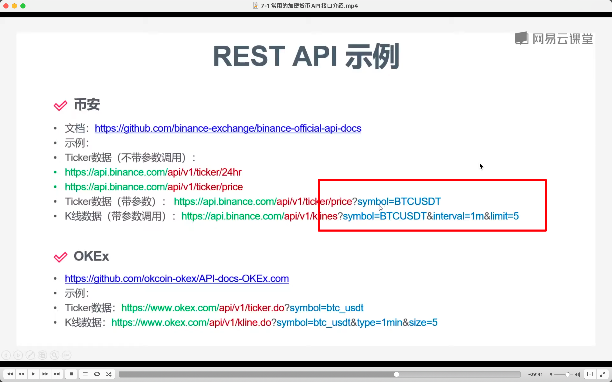

  
https://www.coinmarketcap.com

  
截图无效，实际地址  
https://www.binance.com/zh-CN/binance-api
https://github.com/binance/binance-spot-api-docs

  
api 接口释义

  
api 接口类型，rest api，websocket api。

  
rest api 示例

  
调用效果（视频地址可能已过期），安装 jsonview 插件才能出现这样的效果。  
add,目前 24h ticker 地址为 api.binance.com/api/v3/ticker/24hr  
瞬时价格 api：
api.binance.com/api/v3/ticker/price

  
加上?symbol=BTCUSDT 等，能过滤交易

  
k 线 api，教复杂，看视频。
