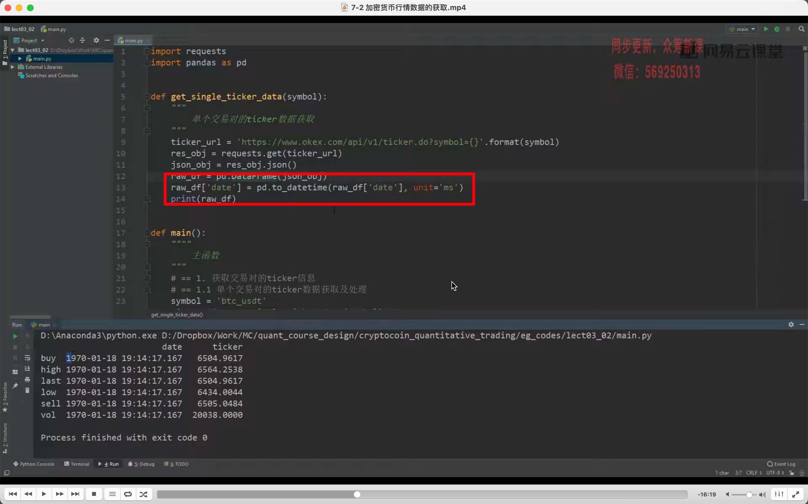
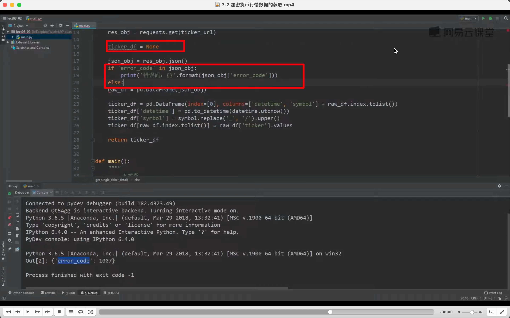
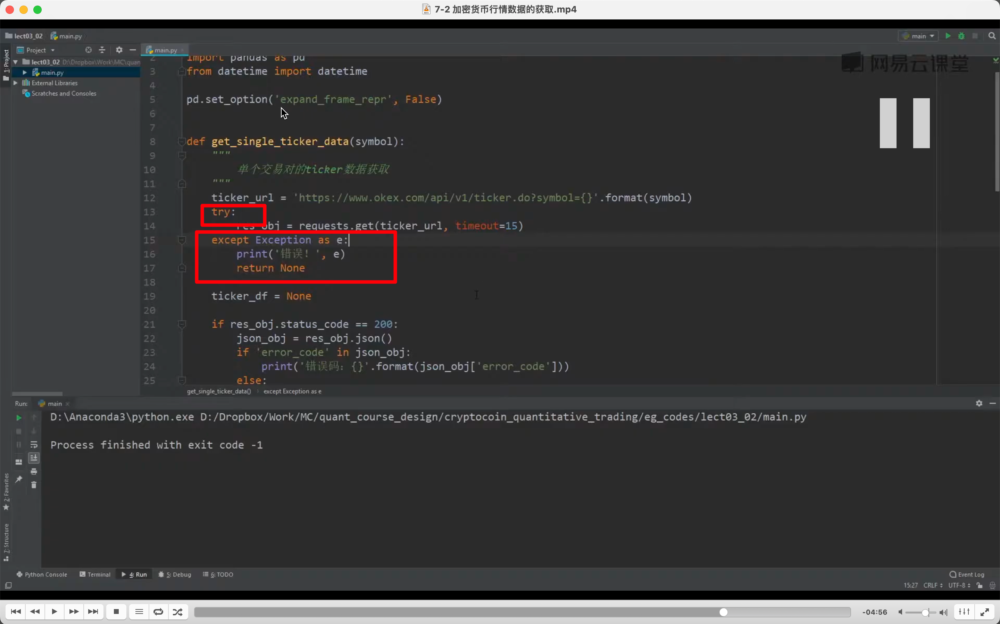
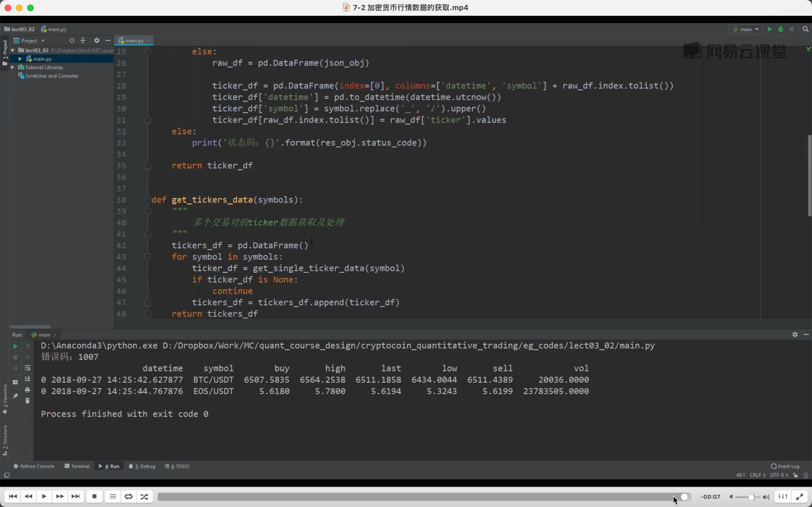

  
初始代码  

转换为可识别代码，但年代有误。

  
转换为了正常时间。此时为获取到一个 ticker 单个交易对的 ticker 数据。还需做些处理来获取多个 ticker。

  
此时获得了一个交易对的瞬时数据。

  
再上图基础上判断是否有 bug，如 symbol 写错了。

  
1，增加设置 timeout  
2，状态码是 200 时才执行后面的。

  
判断断网等错误发生？

  
  
  
  
加入了获取多个，ticker，现在是最终代码。
