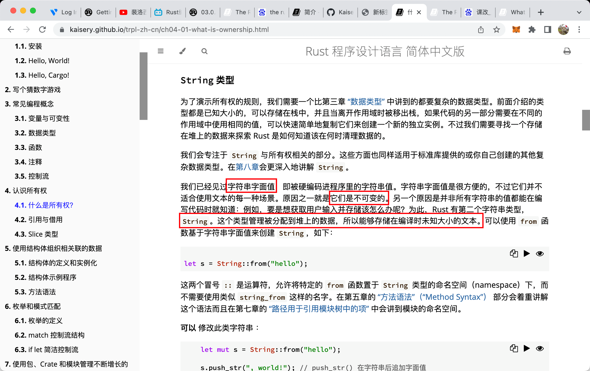
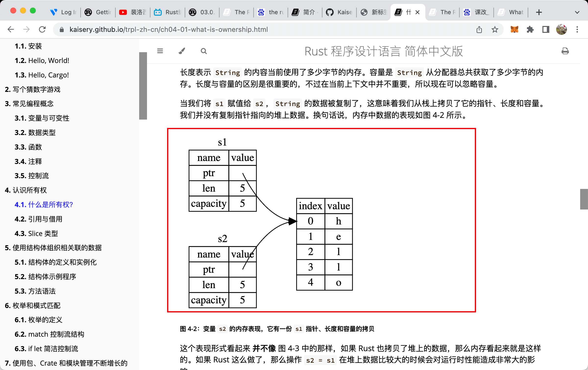

  
栈，堆，stack heap，解释

  
  
字符串 String 和 字符串字面值 string literal （可能之前的 char 就属于 string literal）  
前置不固定大小，放堆里。后者固定大小，放栈里。

  
string 堆，的复制形式

  
默认的堆的复制其实更像是移动，前一个值会变得无效。

  
给函数传参也有同样特性，堆栈不同        

