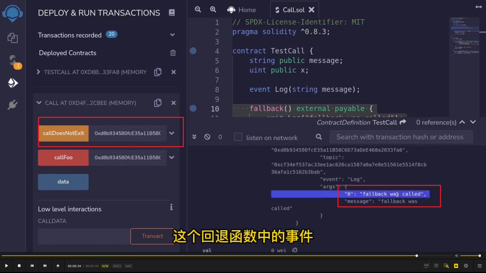
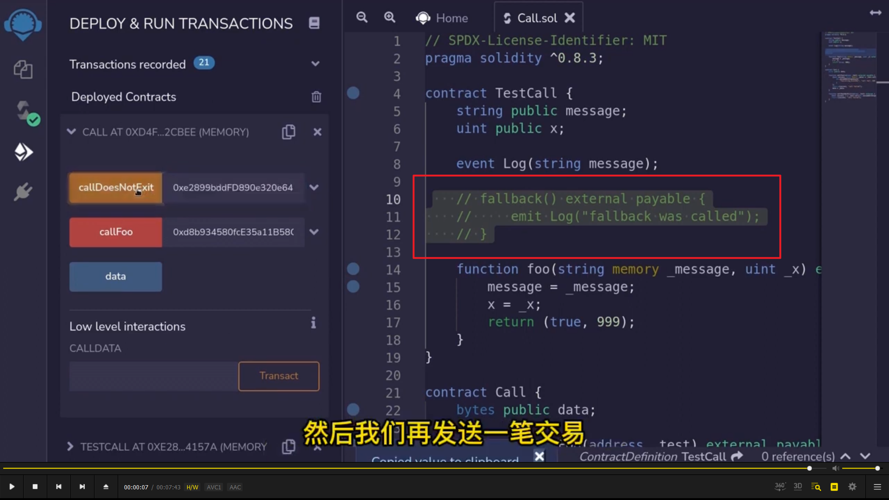

      
  
低级调用另一个合约的方法，call。  
前两节学了接口和通过合约源码调用合约，这节学习用 call 方法调用。  
1，写入调用哪个合约函数，必须采用 abi 编码的形式传递进来，函数名称加参数以字符串形式传入。参数名和存储位置都不需要写。字符串里就是函数的签名。  
2，把参数传递进去。  
3，这样的调用方法有两个返回值。第一个返回布尔值，标记调用是否成功。第二个返回是 data，是 bytes 类型，用来装载 foo 函数所有返回值。  
4，确认返回的布尔值是否成功，如果失败则给个报错。  
5，呼叫 foo 同时带入一个主币数量，value 代表这次调用可以带一些主币，111 单位是 wei。gas 代码这次调用带多少 gas。  
6，状态变量，用于装载返回的 data 数据。  
7，因为这次调用发送了主币，而合约本身没有主币，所以要把主币同时传递进去，才能发送给 foo 这个函数。

  
以上已经写好了一个低级调用。这里做个尝试，通过低级调用去调用测试合约中不存在的函数。会进入回退函数，触发 log 事件，记录回退函数被触发了。

  
  
5000gas 修改两个变量值是不够的，所以调用失败。删掉 gas，代表 gas 无限制。并且左侧写入 111wei。再呼叫就成功了。

  
调用不存在函数的效果。并没有交易失败，因为有回退函数。

  
删掉回退函数，则调用不存在函数会交易失败。
