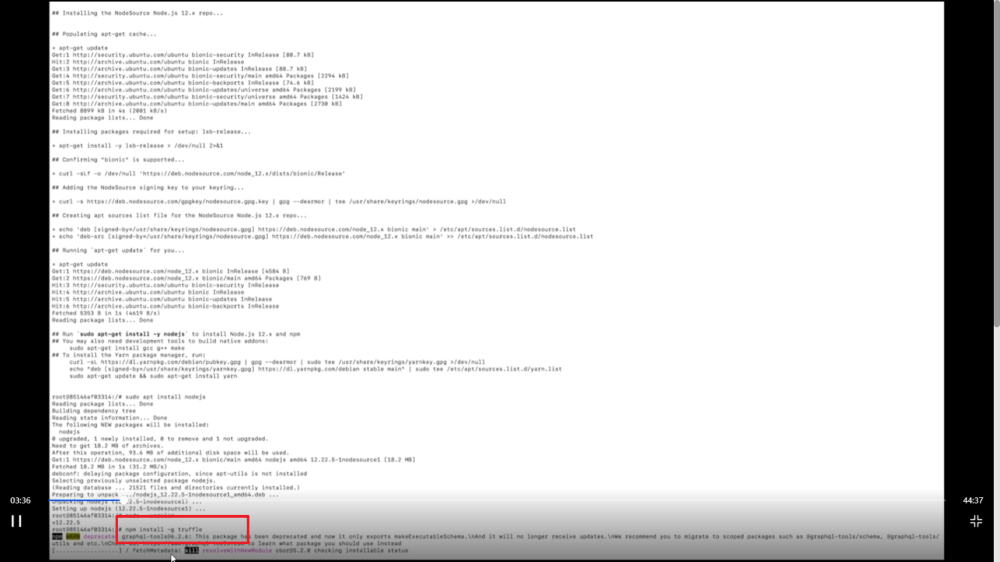
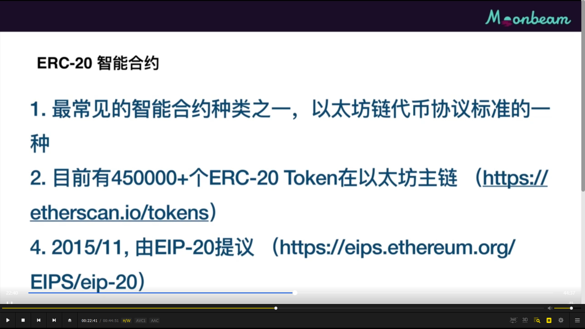
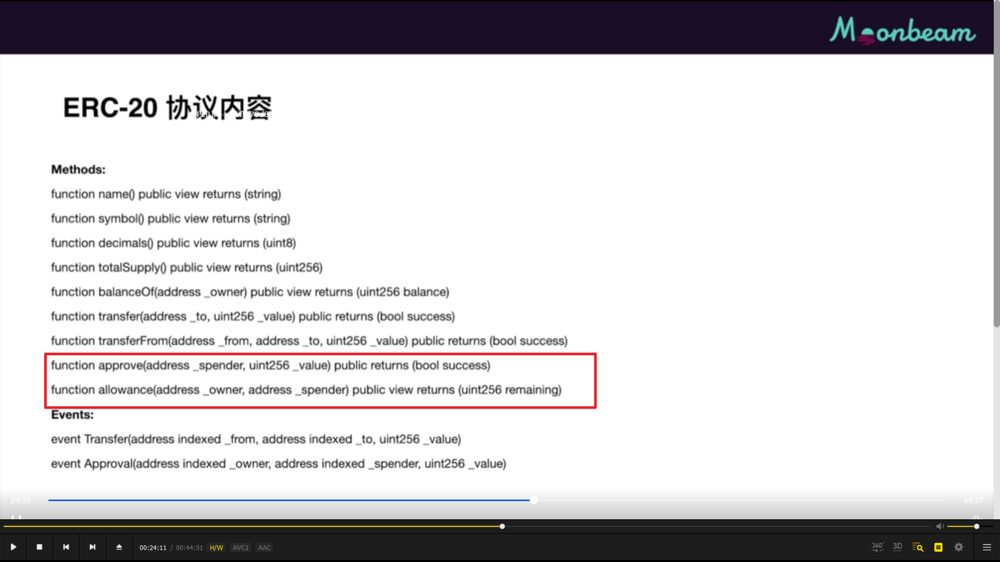

truffle 介绍，类似 hardhat，ganache 模拟链，drizzle 是 dapp ui 工具

## ======

  
  
搭建环境，图一视频教程不全，大致按照图二脚本处理 （add，最终有报错，放弃搭建本地环境）

```
docker --version
docker search ubuntu
docker pull ubuntu:18.04
docker image ls
docker run -t -d --name ubuntu_lesson2 ubuntu:18.04
docker container ls
docker exec -it ubuntu_lesson2 /bin/bash
```

---

---

  
安装 nodejs，注意是为 docker 里的 ubuntu 安装，所以即使 win10 已经安装这里还得安装

但还需提前准备 ubuntu 环境，不然无法用 curl 安装 nodejs 等

```
apt-get install sudo; apt install curl ; apt install git

```

然后再安装 nodejs

```
## 拉起nodejs源码
curl -sL https://deb.nodesource.com/setup_12.x | sudo -E bash -
## 安装
sudo apt-get install -y nodejs
```

## ======

  
参考课程脚本：https://github.com/hyd628/moonbeam-intro-course-scripts （以上笔记未参考此脚本）
安装 truffle

```
chmod 777 /root/.config  （教程没有，自己找到的解决方案，如不输入会报错）
npm install -g truffle
truffle version
```

还是有报错，放弃搭建本地环境

## ======

  
智能合约介绍

## ======

  
  
erc20 介绍  
approve，允许另一个地址花掉自己一定额度的 erc20，此地址一般是智能合约

## ======

  
moonbeam 本地节点获取测试币，导入开发账号即可。

## ======

  
专门的测试网 moonbase alpha 获取测试币方法。
