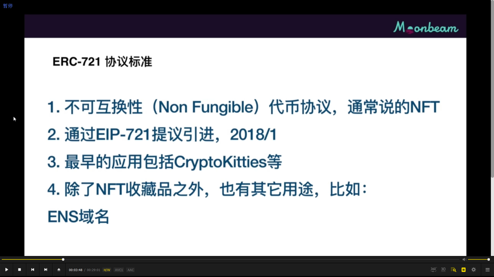
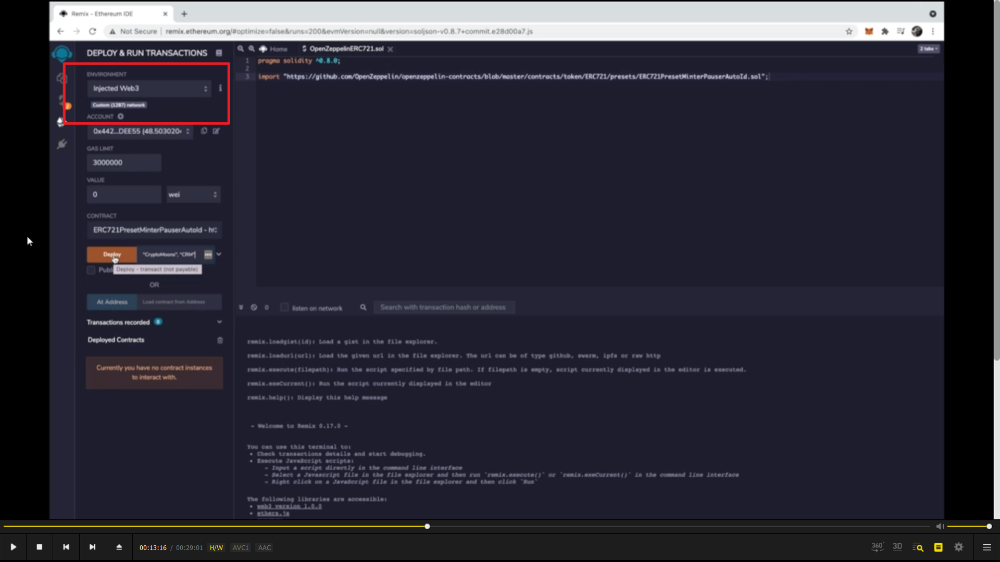
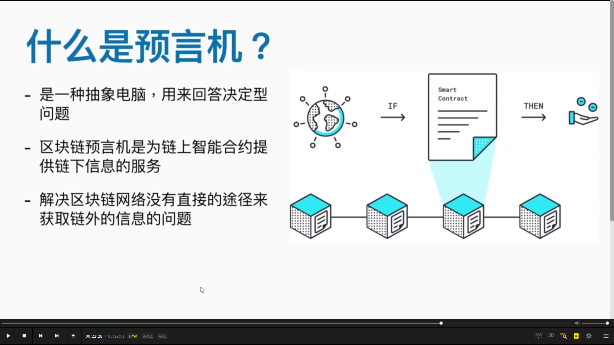
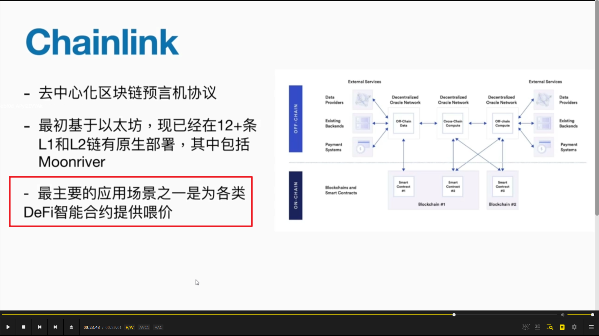

  
本课内容

---

---

  

erc721 协议

  
编译合约时，依赖的合约也跟着一起编译

---

---

  
部署合约到 moonbeam，注意选择 web3，并在 metamask 里指定 moonbeam 测试网

---

---

  
blockscout，兼容所有 evm 链的浏览器  
https://moonbase-blockscout.testnet.moonbeam.network/

---

---

  
  
预言机，以及最主流的预言机 chainlink

---

---

合约喂价基本原理

---

---

  
合约喂价实操

---

---
