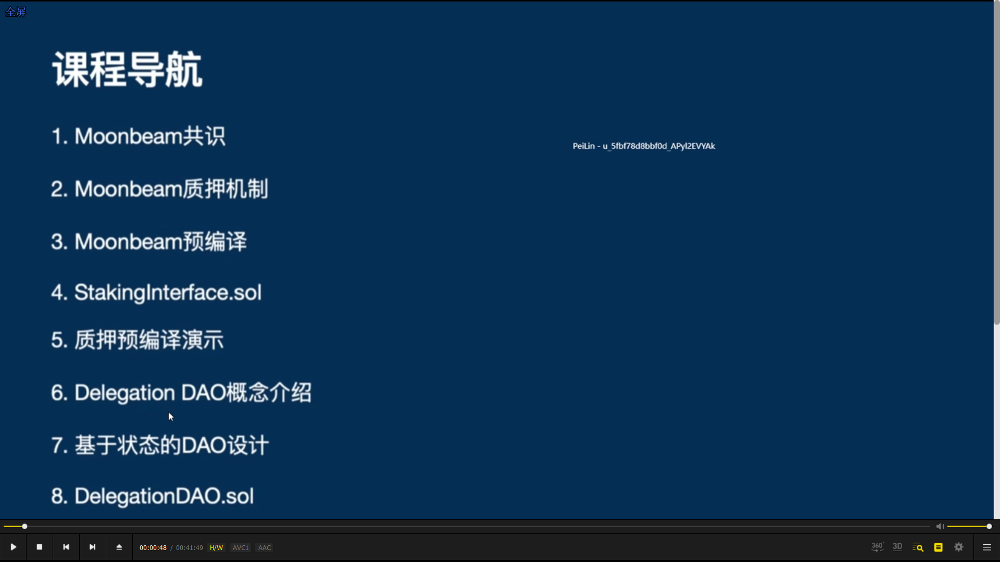

  
导航

---

---

  
moonbeam 共识

---

---

  
moonbeam staking

---

---

  
委托和撤销

---

---

预编译，它跳过 evm，在 substrate runtime 中执行

---

---

  
moonbeam 拥有的预编译

---

---
      
stakingInterface.sol，质押预编译的智能合约的接口。定义我们如何通过 solidity 来与质押的 pallet 进行交互。
