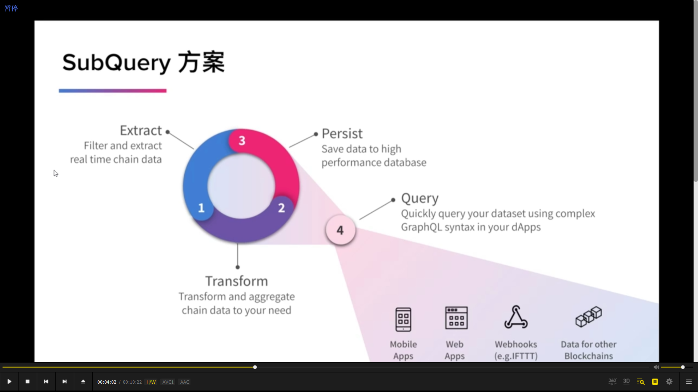
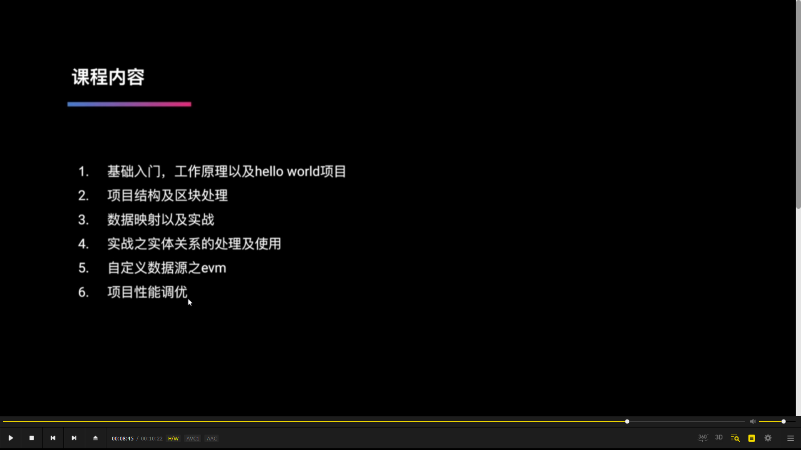
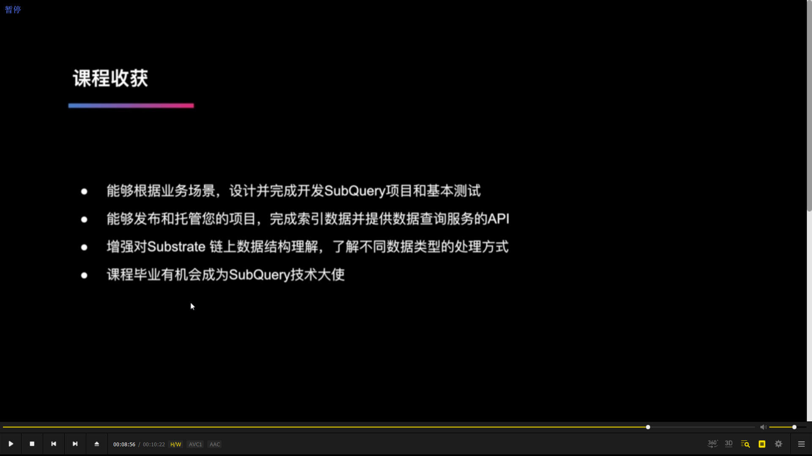

  
  
遇到的问题和 subquery 的解决方案

  
抽象 subquery 的方案，  
1，线上数据提取和过滤  
2，数据转换和聚合变成所需数据形式  
3，将转换好的数据存储在高性能数据库中  
4，在自己的 dapp 中根据 subquery 提供的 graphql 的 api 使用 graphql 语句进行高效和组合查询。

  
课前准备

  
  
课程内容和收获
