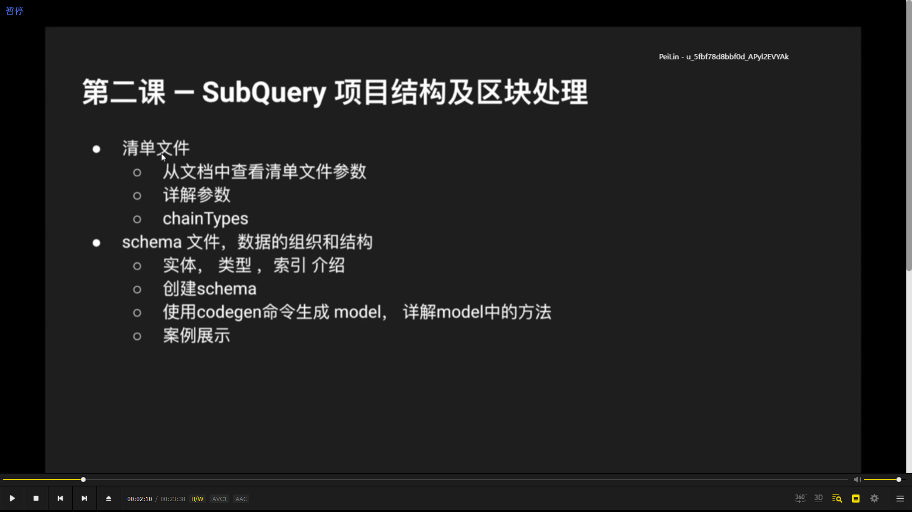
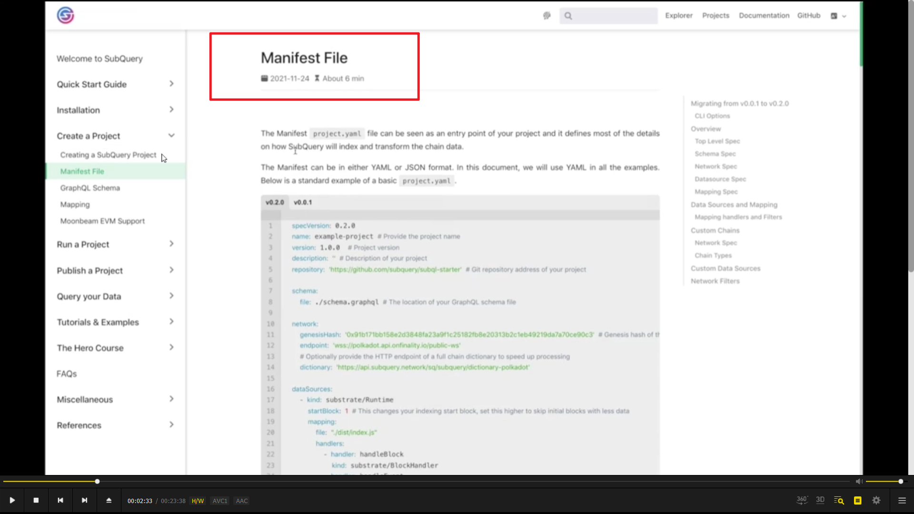
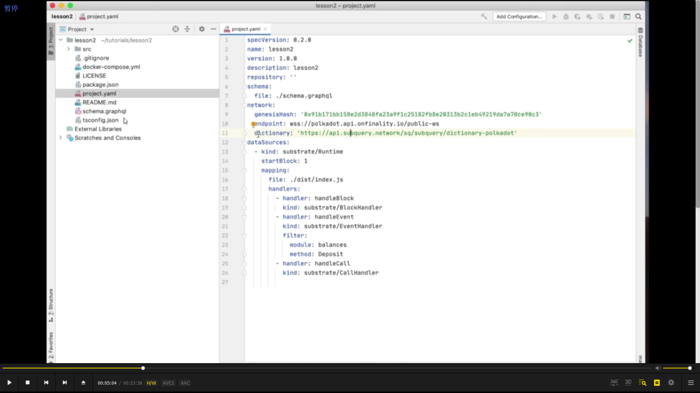
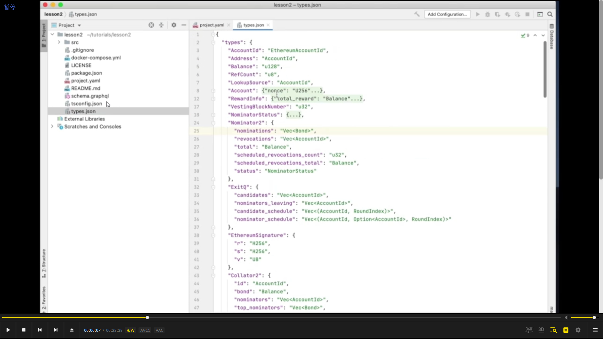
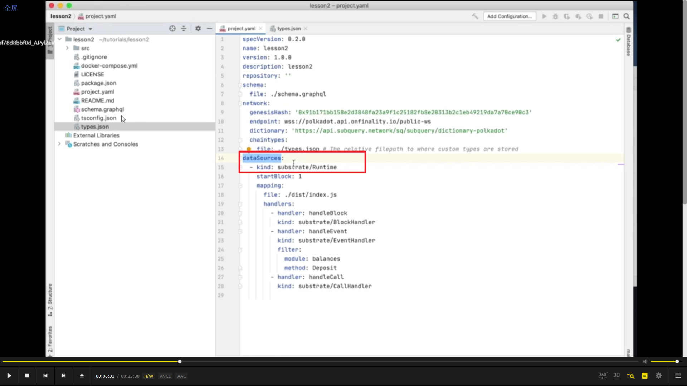
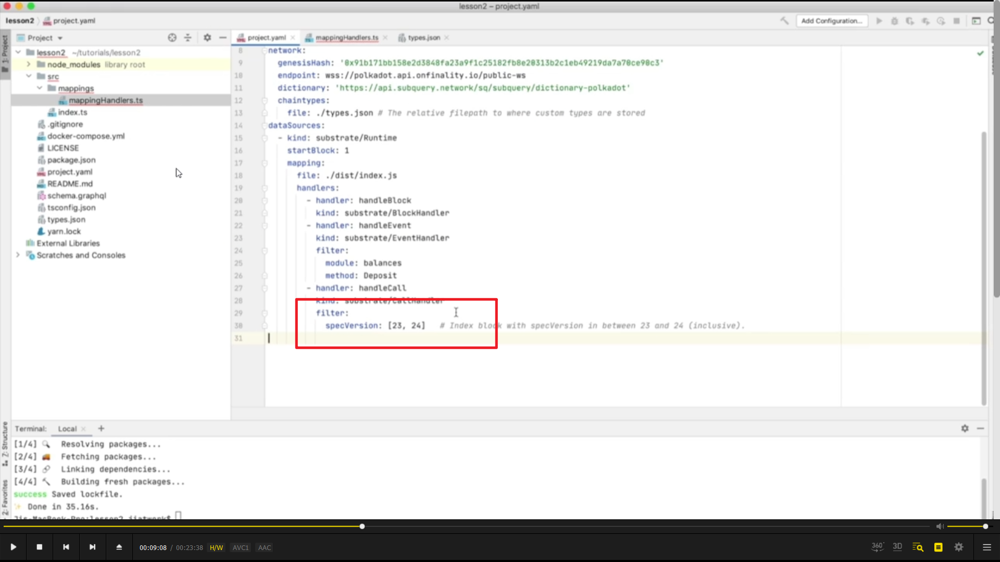
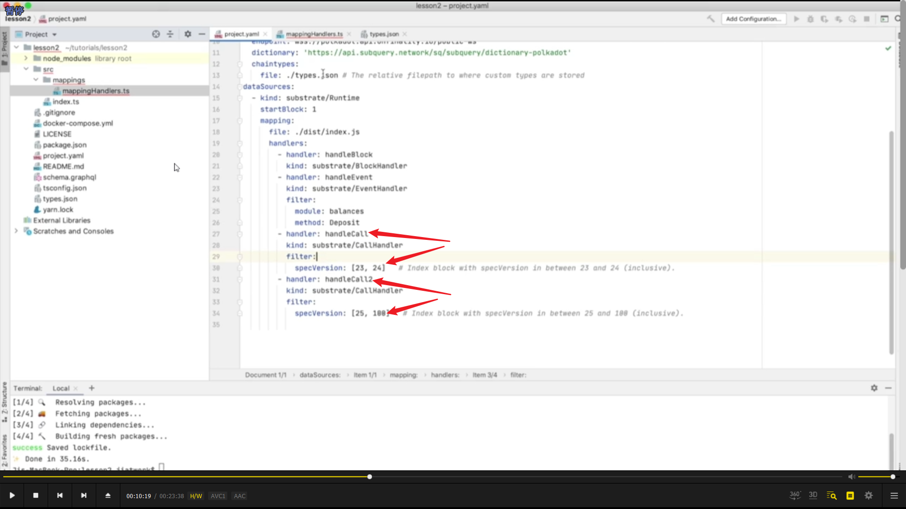

  
第二课主要内容

视频较久，更新文档见此：https://shimo.im/docs/5bqnrKYBgOH7BQqy/read

  
https://doc.subquery.network/build/manifest.html#  
清单文件英文名 mainfest file。在此处指 project.yaml。也可以看作 config 文件，是项目入口。  
定义了 subquery 将如何索引或转换链上数据的大部分内容。

  
subquery node 启动时，会对比 genesishash 和 endpoint 确定是否一致，如不一致就抛错。  
dictionary 是为了加快引索速度，可以把它视为一个独立的 subquery 项目，预先爬取了整个网络的数据。如果用 query 查询它，就能快速得到某类型的 event 或 extrinsic 存在于哪些区块中，因此 subquery node 就不用去获得每个区块的信息，而只抓取有影响的区块。

  
  
为了支持 polkadotapi 去解析第三方 chain 类型。支持传入第三方 chain 类型文件，此文件可以通过 json 和 yaml？两种形式传入

  
datasources 是指你想如何处理你获取到的链上数据，支持默认的有 substrateruntime 和自定义类型的 datasource，包括 evm 和其它？？？  
今天主要讲默认 runtime 的处理，自定义的需要关注以后进阶课程。

  
startblock, handle.

  
mapping 里与上图所示相对应

  
filter, specversion specversion 不同，type 会不同

  
不同 version，用不同的 handler。

  
  
上节课中有说，原理是 subqlnode 通过 polkadotapi 在 chain 上获取原始数据，但大多情况下这些数据无法在项目中直接使用。根据业务需求，设置实体样式，方便储存数据，所以使用了 graphql schema 标准。后续还有很多内容，需要时看视频。       

yarn codegen生成
