## 221022

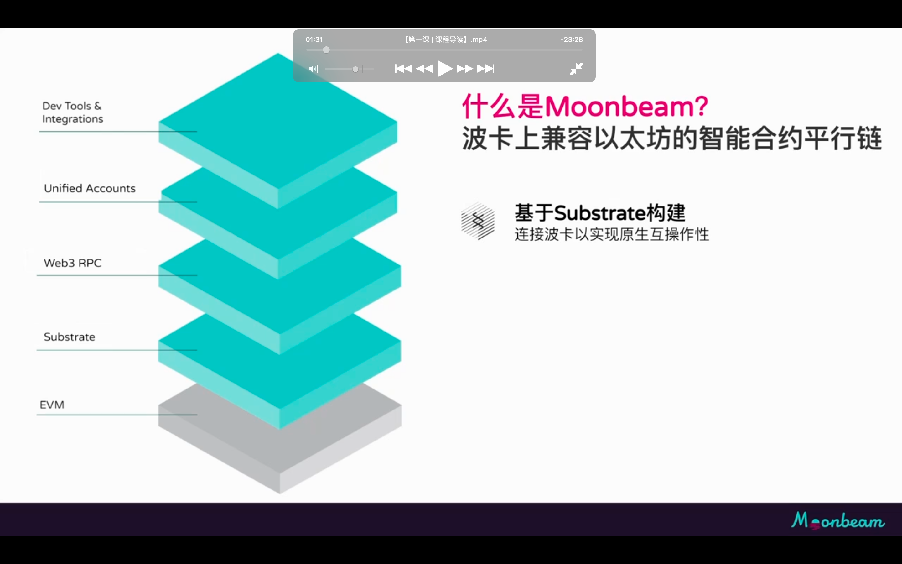</img>  
moonbeam 完全兼容以太坊同时具有 substrate 功能，如可升级运行时和 pallet，中继链共享安全性，xcm 跨链

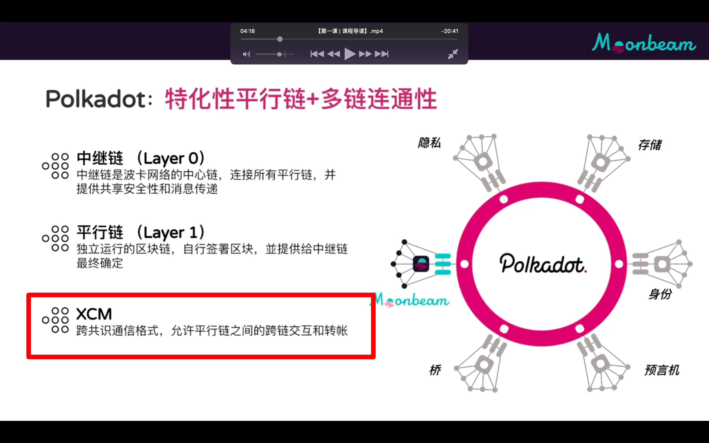</img>  
xcm

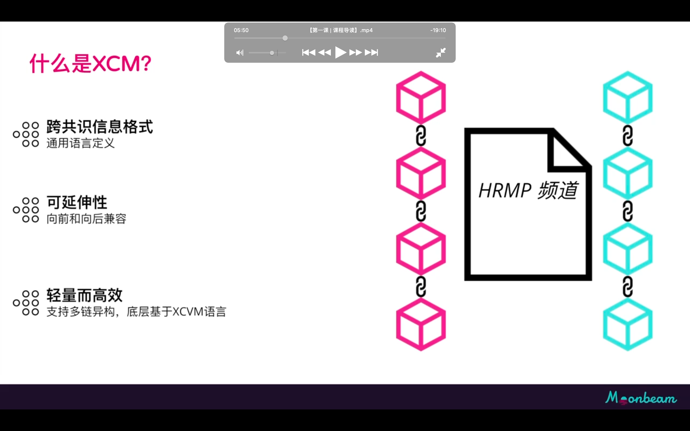</img>  
让不同格式的链传递互操作信息，类似银行系统的 swift，底层是 xcvm 语言

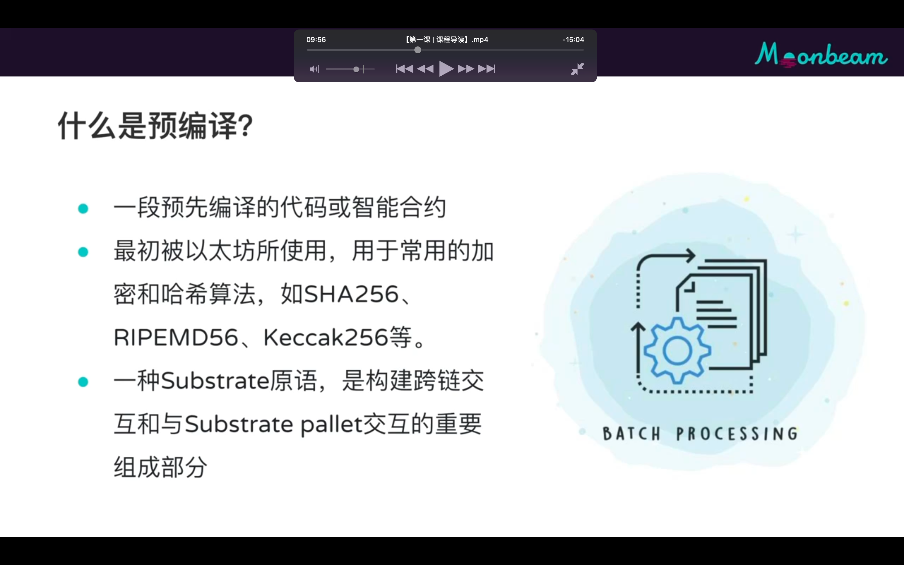</img>  
moonbeam 预编译不会在 evm 里执行，而是在本地节点substrate运行时里执行，执行完后把结果返回给evm的预编译接口调用者

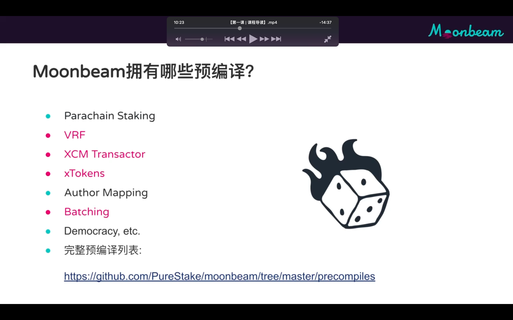</img>  
aaap

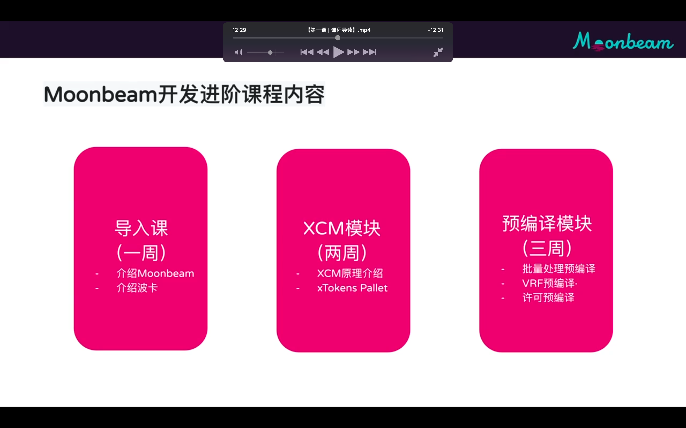</img>  
aaap

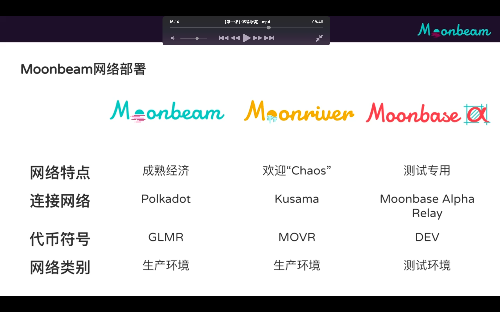</img>  
aaap

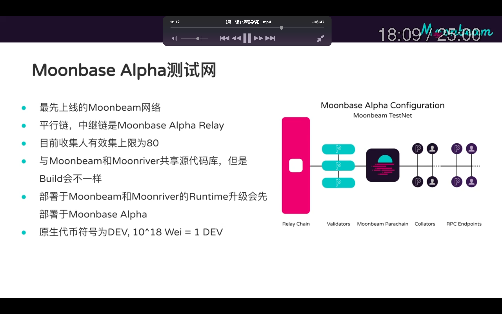</img>  
aaap

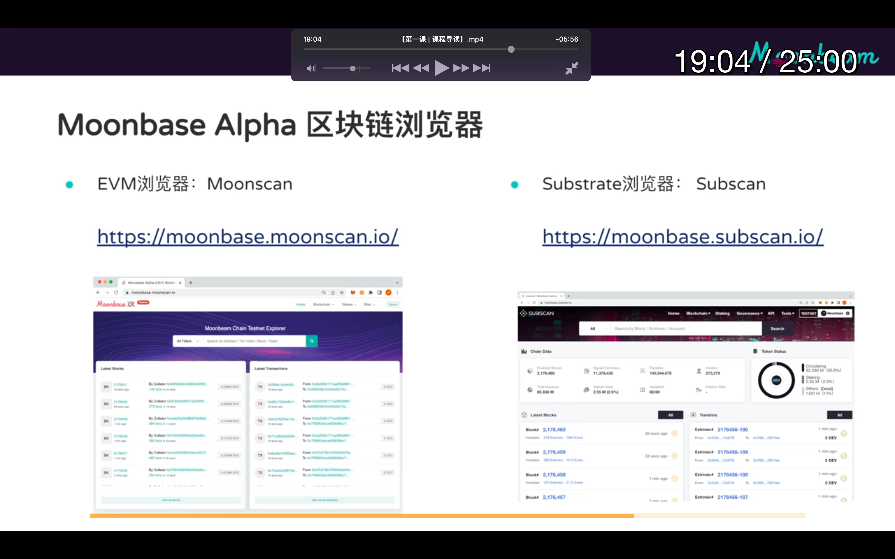</img>  
aaap

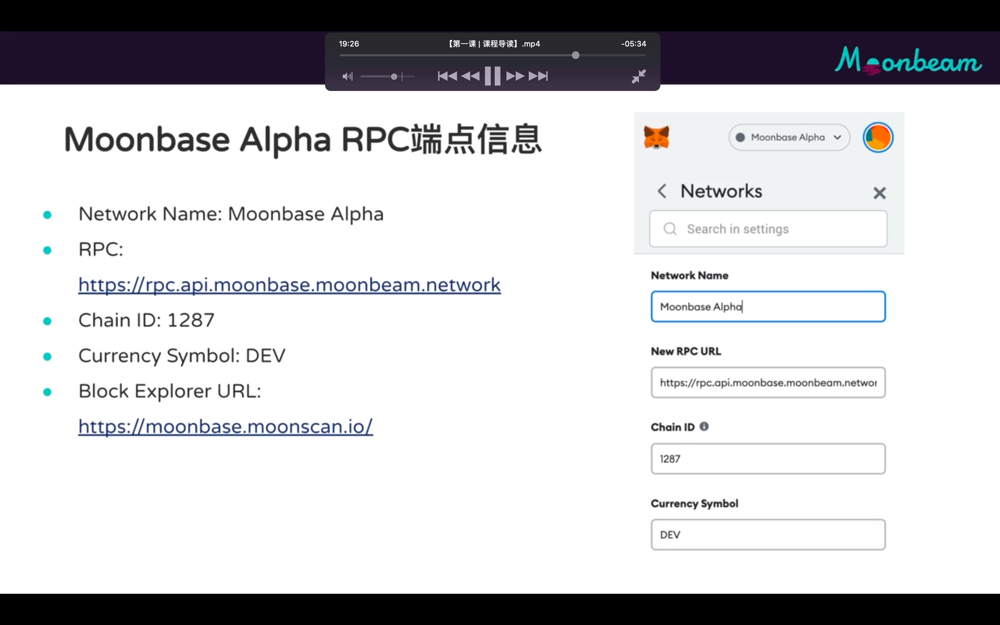</img>  
aaap

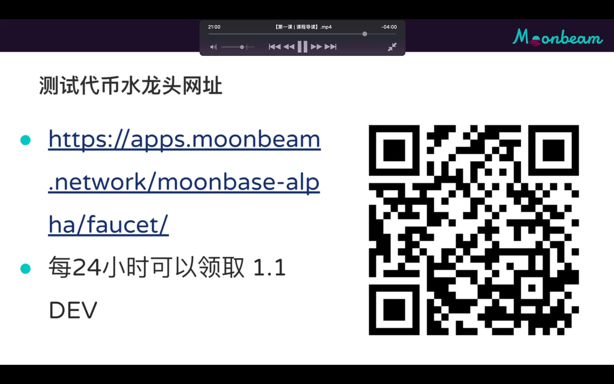</img>  
aaap

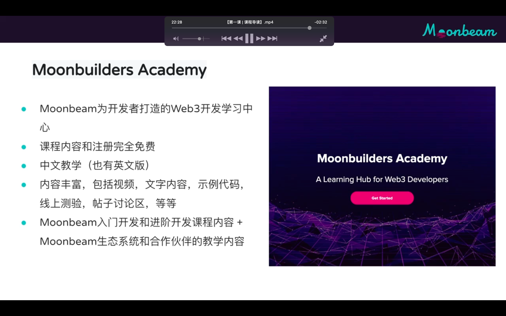</img>  
aaap

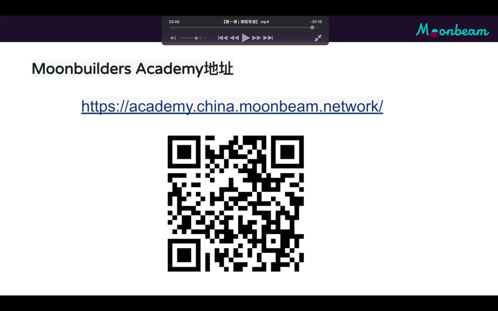</img>  
aaap

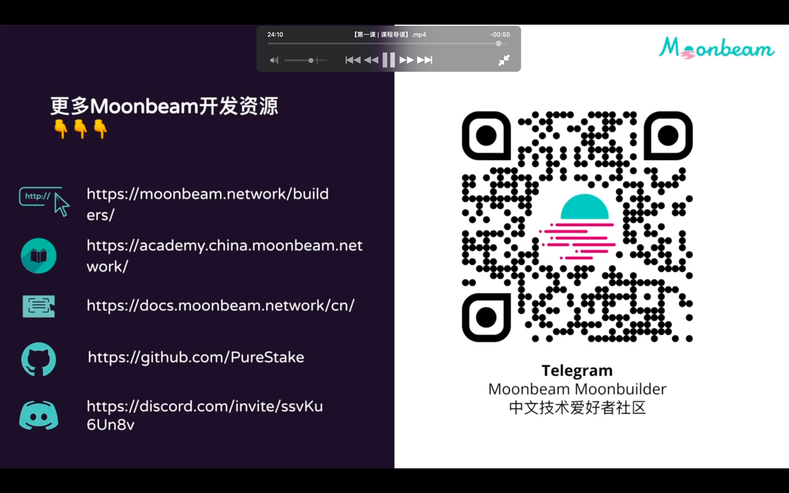</img>  
aaap

