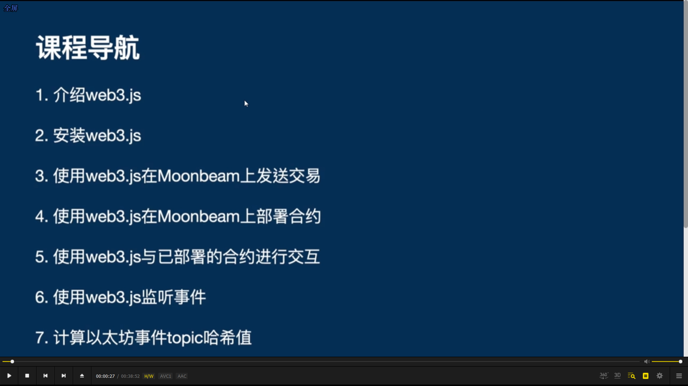

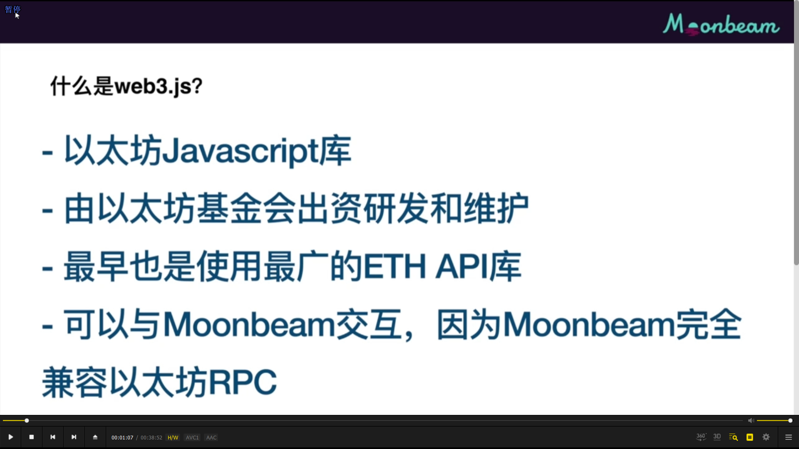

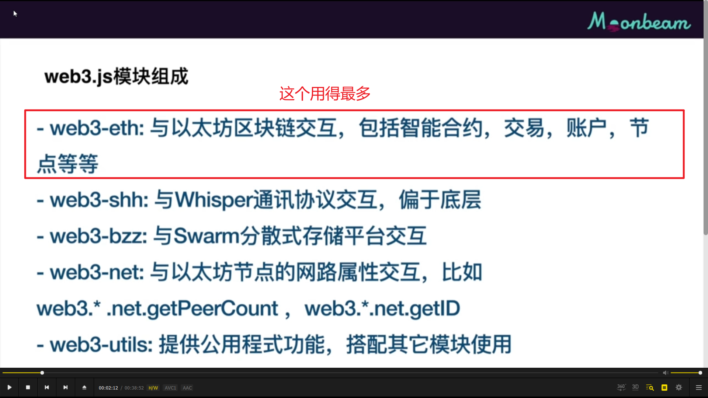

本课内容

课程脚本：
https://github.com/hyd628/moonbeam-intro-course-scripts

---

---

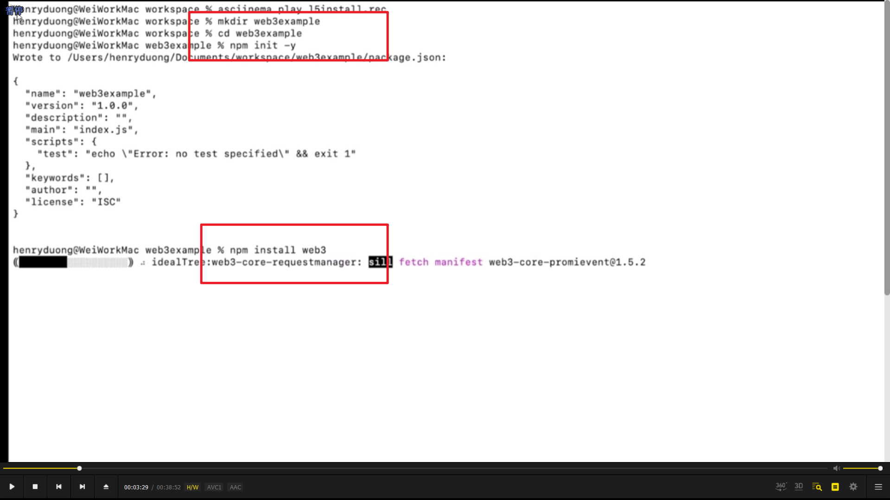  
安装 web3

---

---

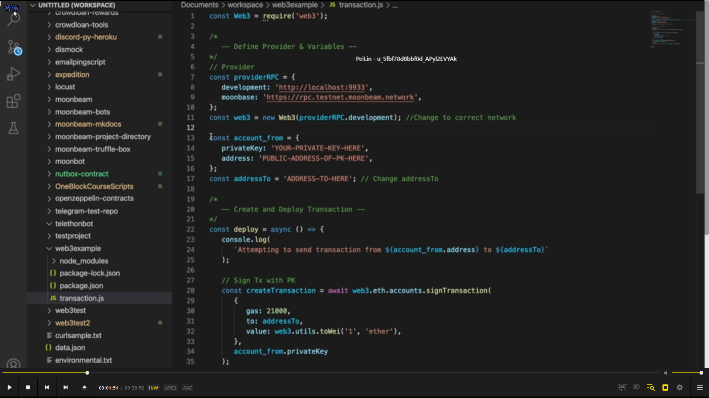  
新建 transaction.js 文件，代码解释看视频

---

---

  
回到上节课目录，用 truffle 启动一个 docker moonbeam 节点。docker logs ID 查看运行状态

---

---

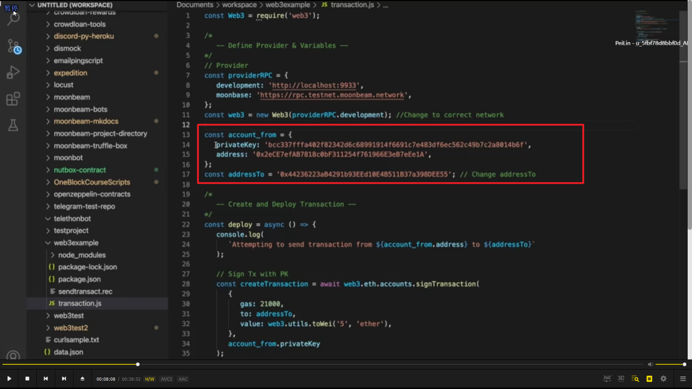  
设置发款账户私钥和地址，以及收款账户地址。

---

---

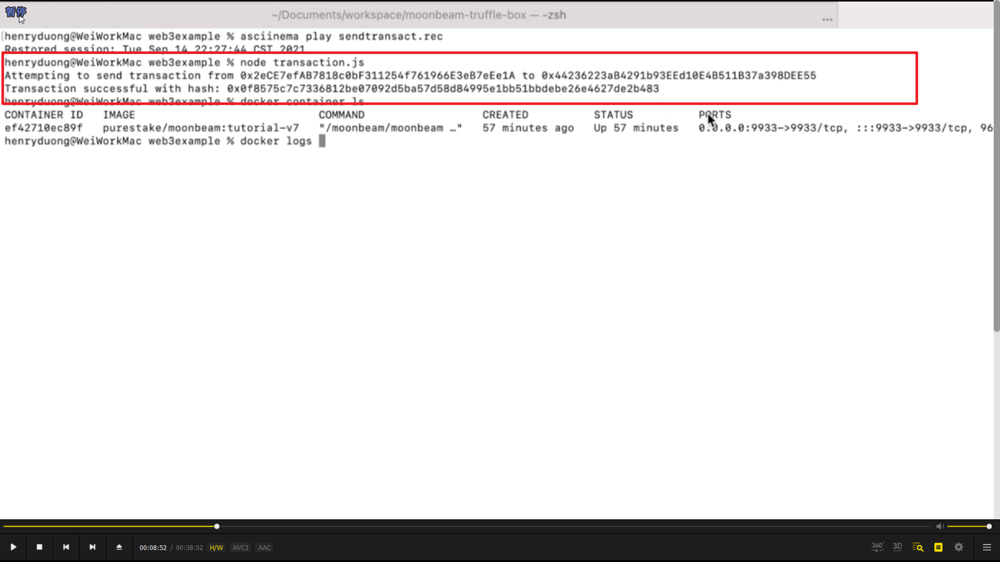  
执行，看到结果。

---

---

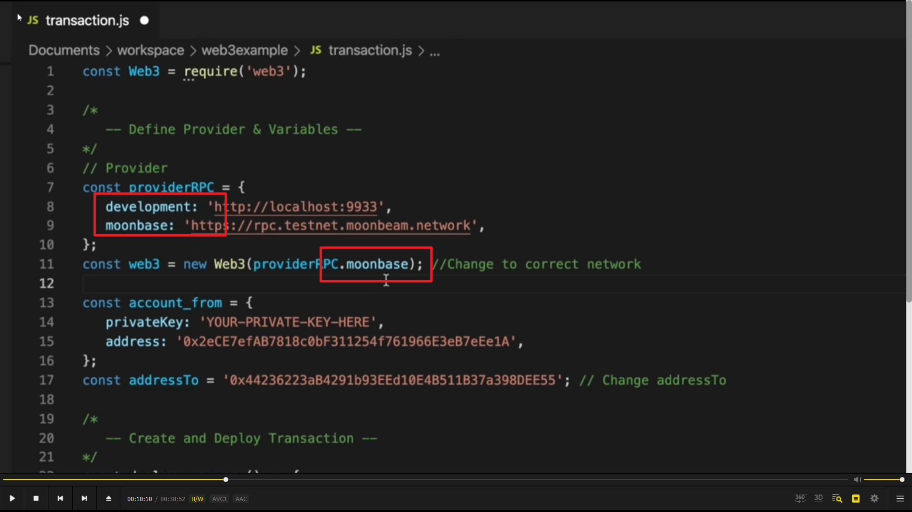  
本地链和测试链只用替换这里就行

---

---

npm install solc@0.8.0

部署智能合约 solc=solidity compiler.

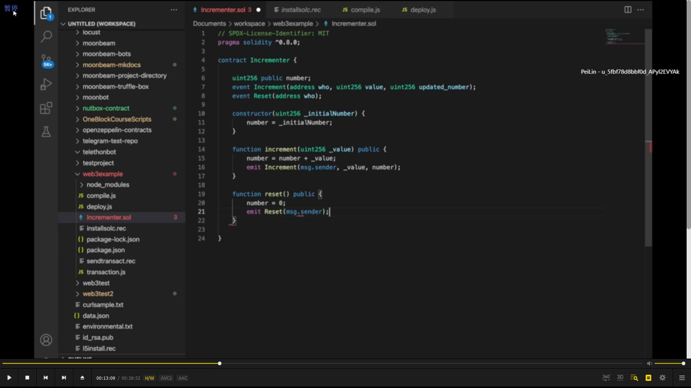  
智能合约代码

  
编译文件，compiler.js

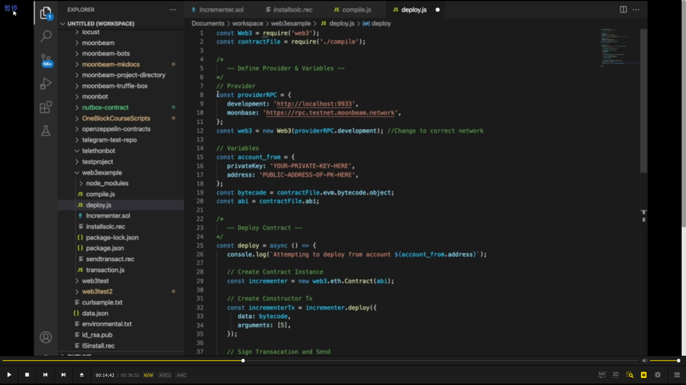  
部署文件，deploy.js

之后 node deploy.js 部署

---

---

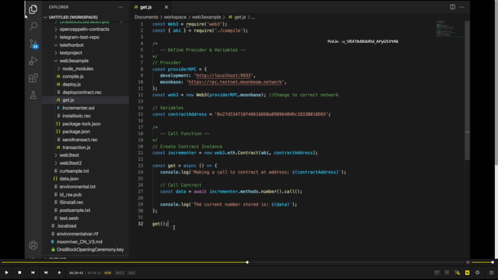

使用 web3，读取智能合约

---

---

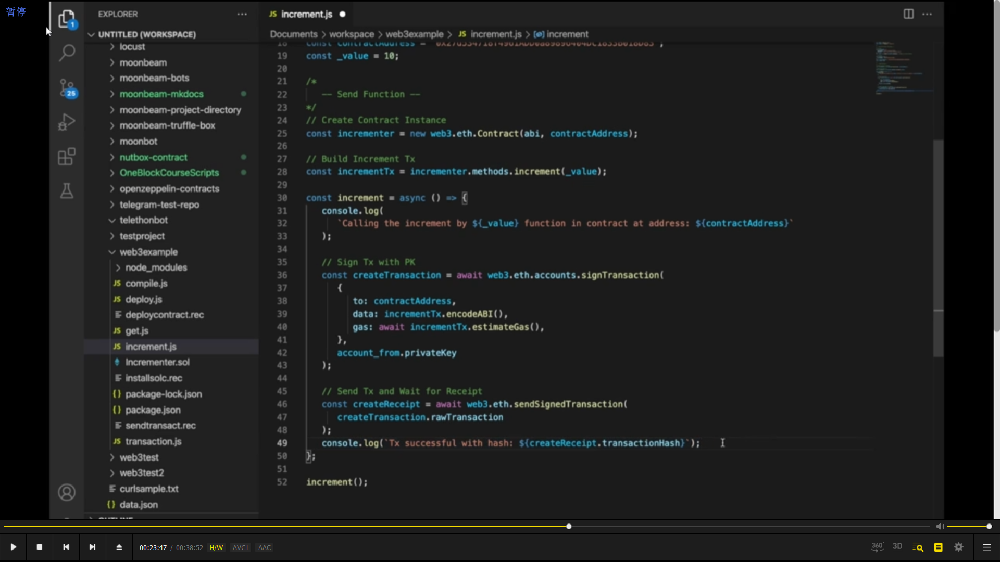  
web3，修改合约数据

---

---

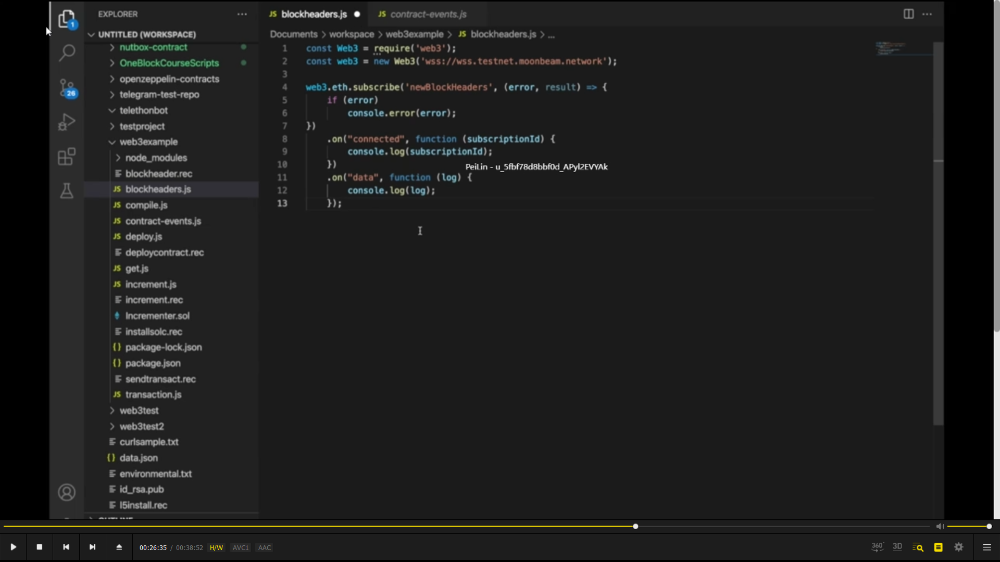  
web3，监听事件

---

---

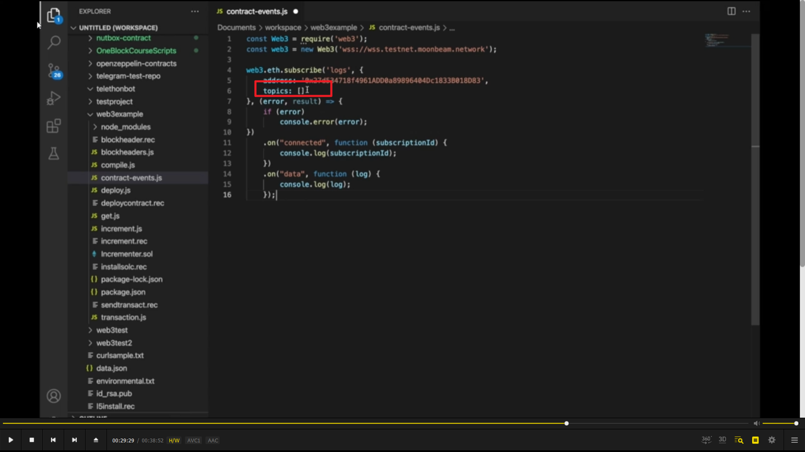  
wb3，监听智能合约事件。topics 接空数组代表监听所有事件，如果只监听某事件，则需提供 event hash。

---

---

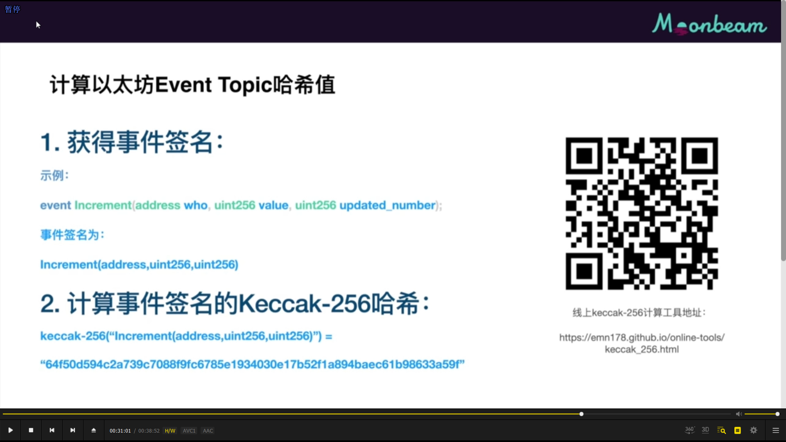

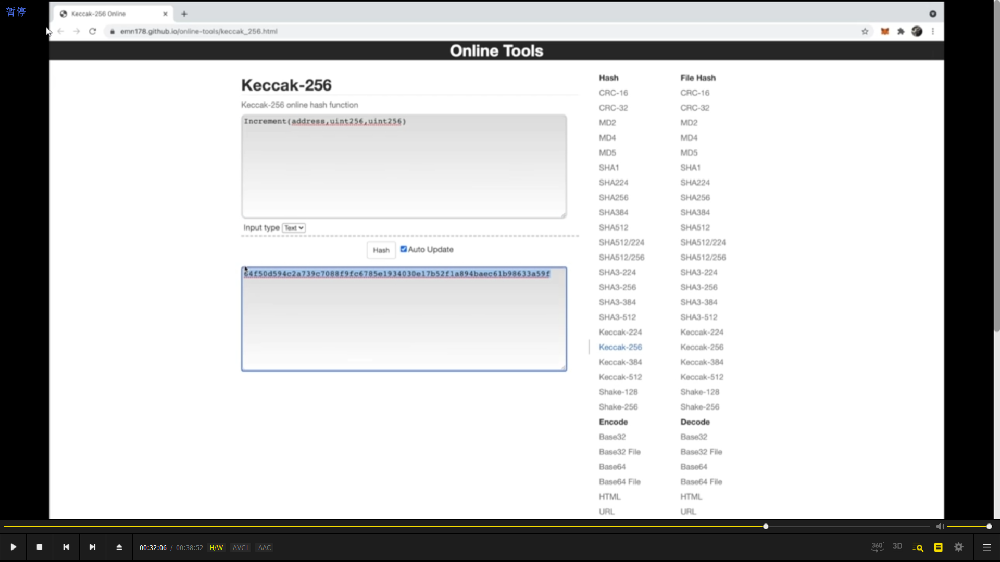

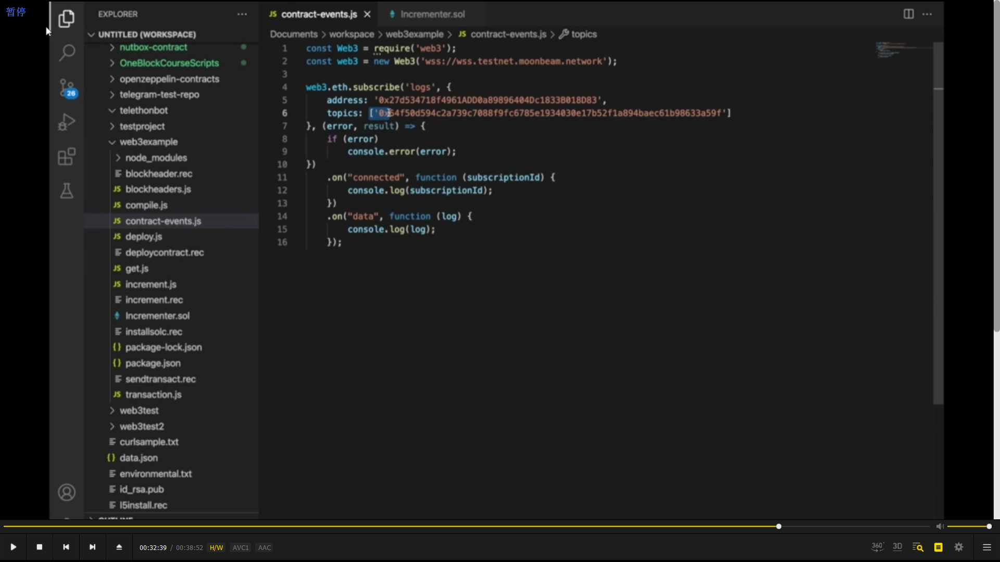
得到 event hash 的方法

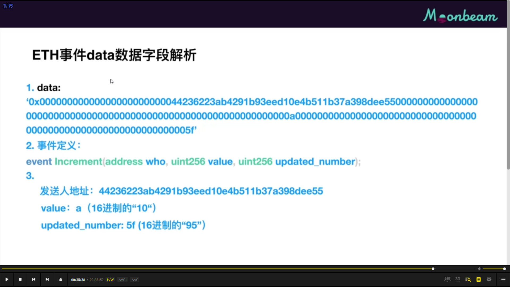  
事件里的参数隐藏在 data 字段里。

  
常见错误
