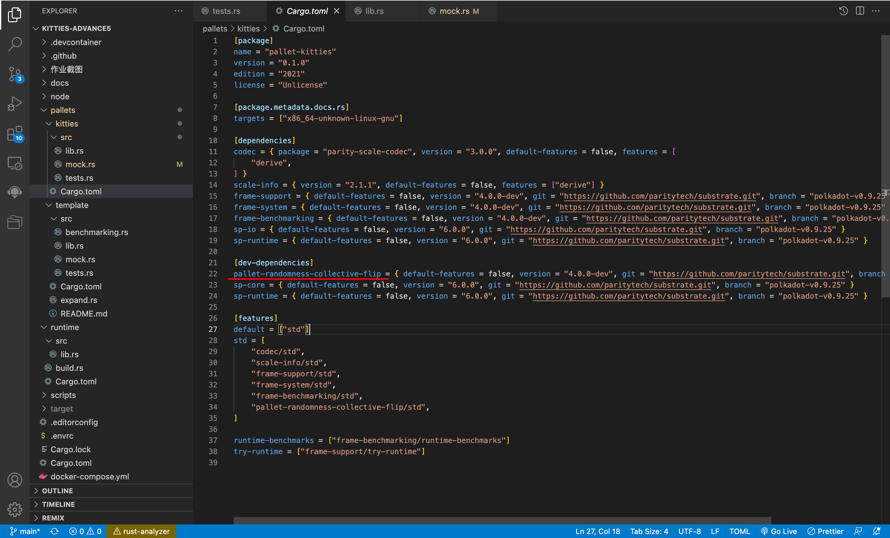

## 2022/08/10

  
不以 self 为第一参数的关联函数不是方法。

  
panic 更趋向程序错误而不是使用错误，所以如果给用户看的话，最好用 result 而不是 panic

  
unwrap_or_else  
ooop

### rust vscode 格式化

rust 安装了 rust-analyzer 后可能仍无法用 ctrl s 格式化，则按 alt shift s，会出现配置 rust 格式化语言的选项，会自动在 settings.json 中添加

```

"[rust]": {
"editor.defaultFormatter": "rust-lang.rust-analyzer"
},

```

之后就可以 ctrl s 格式化了

## 2022/08/11

  
方法里的&self 实际是 self:&Self 的语法糖。所以似乎里面用 self 或&self 都行。

## 0812

  
ooop  
  
add，注意这里 impl 定义方法时用的是 self 而不是&self，其实 self 也是可以用的，只是用得少，不是不能用。

  
范型 impl 时，不仅可以\<T>还可以类似\<f32>这样针对具体类型

## 220901

### rust 的 from 和 into

  
https://www.cnblogs.com/jiangbo4444/p/15626930.html  
基础类型可以通过 as 关键字进行转换，如果是自定义类型，则通过 From 和 Into 进行转换。  
如 impl from for Atype, 则 Atype::from(Btype) = x，x 也为 Atype。  
如果实现了 From，则自动获得了 Into，不过需要手动指明类型。  
let x: Atype = Btype.into();

## 220902

### StorageMap

  
--=
  
视频介绍

StorageMap 源码

````

/// A type that allow to store value for given key. Allowing to insert/remove/iterate on values.
///
/// Each value is stored at:
/// ```nocompile
/// Twox128(Prefix::pallet_prefix())
/// 		++ Twox128(Prefix::STORAGE_PREFIX)
/// 		++ Hasher1(encode(key))
/// ```
///
/// # Warning
///
/// If the keys are not trusted (e.g. can be set by a user), a cryptographic `hasher` such as
/// `blake2_128_concat` must be used.  Otherwise, other values in storage can be compromised.
pub struct StorageMap<
	Prefix,
	Hasher,
	Key,
	Value,
	QueryKind = OptionQuery,
	OnEmpty = GetDefault,
	MaxValues = GetDefault,
>(core::marker::PhantomData<(Prefix, Hasher, Key, Value, QueryKind, OnEmpty, MaxValues)>);

````

StorageMap 后面没接花括号是因为它是元组结构体，尖括号里是范型。而 PhantomData 是幽灵数据。因为结构体声明了泛型，但是结构体元素没用到泛型会报错的。所以结构体里的元素用 幽灵数据 。防止结构体编译报错。具体原理以后再学 lllf。

### rust 版本相关


https://www.jianshu.com/p/46006286ba93

Rust 发布的工具链包括了 stable、beta 和 nightly 三种不同版本。 nightly 是最激进的版本，包含了大量（可能不稳定）的新/高级特性。stable 版本目前可能还不支持一些高级特性。beta 介于两者之间。

因为 Rust 的更新速度很快，支持的版本很多，有时新版本是不会完美兼容旧版本的，同时还支持多平台交叉编译。所以就有了 rustup 这个 Rust 工具链的管理工具。

使用 rustup 安装 Rust 时，主要安装了：

rustc - 编译器。
rust-std - 标准库。
cargo - 包管理工具。
rust-doc - 说明文档。

更新工具链

rustup update

更新 rustup 本身

rustup self update

安装最新的 nightly 版本

rustup install nightly

指定版本

rustup install nightly-2018-07-18

指定默认使用的版本

rustup default nightly

add  
rustup show 查看当前使用的版本。
rustup check 查看当前版本和最新版本

### rust 缓存相关，cache，.cargo, Blocking waiting for file lock


https://zhuanlan.zhihu.com/p/471229377

### map_err

此方法仅作用于 Result 类型，并允许将失败的值从 E 转换为其他类型的 H，但仅当值为 Err 值时才有效。map_err 不兼容于 Option 类型，因为使用 None 执行任何操作都是无意义的。

应用场景应该是如果结果为 OK，则直接使用它的值，不做更多处理。而如果 err 了，不报错，而是返回另一个值时用到这个。

### 不显示节点输出，而是将输出存在一个文件上。

./target/release/node-template --dev 2>&1 | tee /filepath/output.log 用这条命令来跑，输出日志都在 output.log 文件里了，想找什么在里面找就行了。

### add220910 substrate 中，mock.rs 文件可能类似于 runtime/librs，是用来模拟 runtime 的。所以它们很多代码类似。比如都要 impl pallet_name::Config for Runtime/Test

### add220910 assert_noop!

Evaluate an expression, assert it returns an expected Err value and that runtime storage has not been mutated (i.e. expression is a no-operation).
计算一个表达式，断言它返回一个预期的 Err 值，并且运行时存储没有被改变(即表达式是一个无操作)。
断言表达式是无效操作，没改变链上存储。

## 220913

### 关于 kitties-advance5 中的 pallet-randomness-collective-flip


如图，在 pallet/cargotoml 中它是放在 dev-dependencies 里的。因为 kitties/lib 里只是定义了 randomeness，实际上没有用到它来实现 randomness，而是在 runtime/lib 需要 pallet-randomness-collective-flip 来具体实现 type randomness。所以 pallet-randomness-collective-flip 放在了 runtime/cargotoml 里的 dependencies 里，而放在 kitties/cargotoml 里的 dev-dependencies 原因是 mock.rs 需要用到它。

### 官网文档似乎很多搜索不准确，可能是版本的问题，最好直接在本地 substrate 库里搜 name = "create-name"
