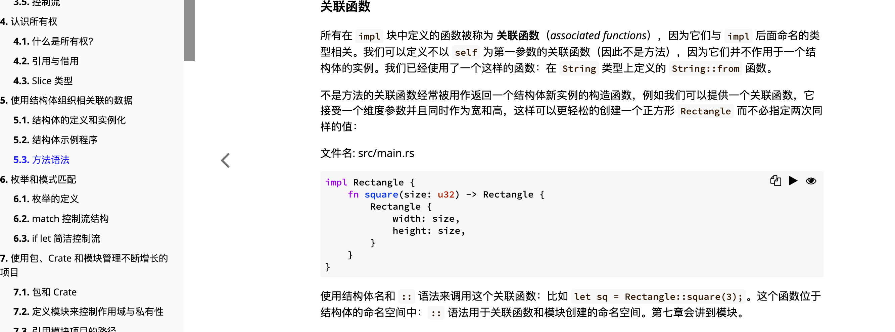
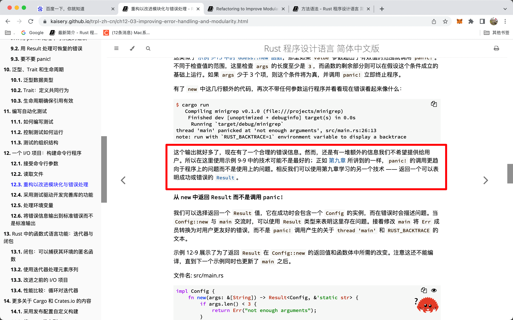
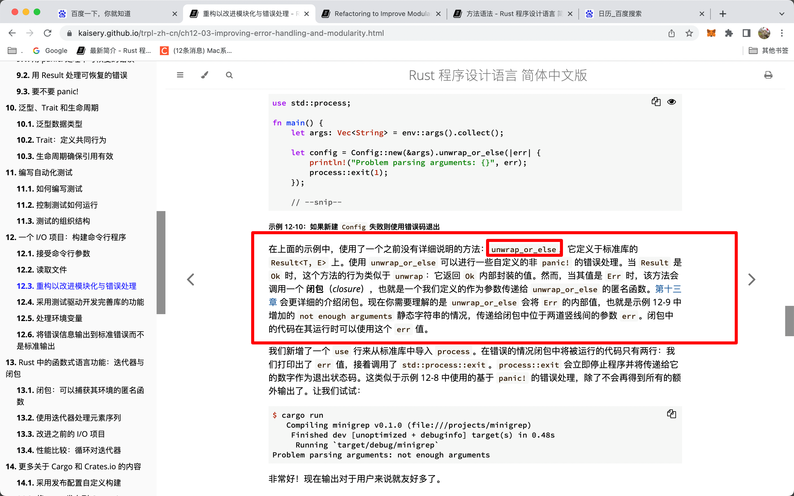

## 2022/08/10

  
不以 self 为第一参数的关联函数不是方法。

  
panic 更趋向程序错误而不是使用错误，所以如果给用户看的话，最好用 result 而不是 panic

  
unwrap_or_else  
ooop

### rust vscode 格式化

rust 安装了 rust-analyzer 后可能仍无法用 ctrl s 格式化，则按 alt shift s，会出现配置 rust 格式化语言的选项，会自动在 settings.json 中添加

```

"[rust]": {
"editor.defaultFormatter": "rust-lang.rust-analyzer"
},

```

之后就可以 ctrl s 格式化了
