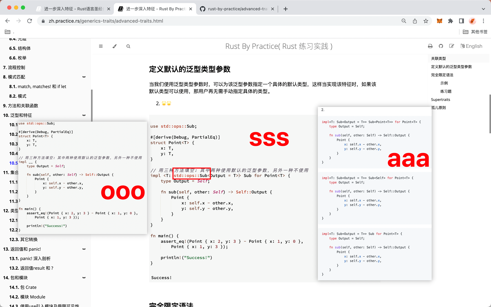
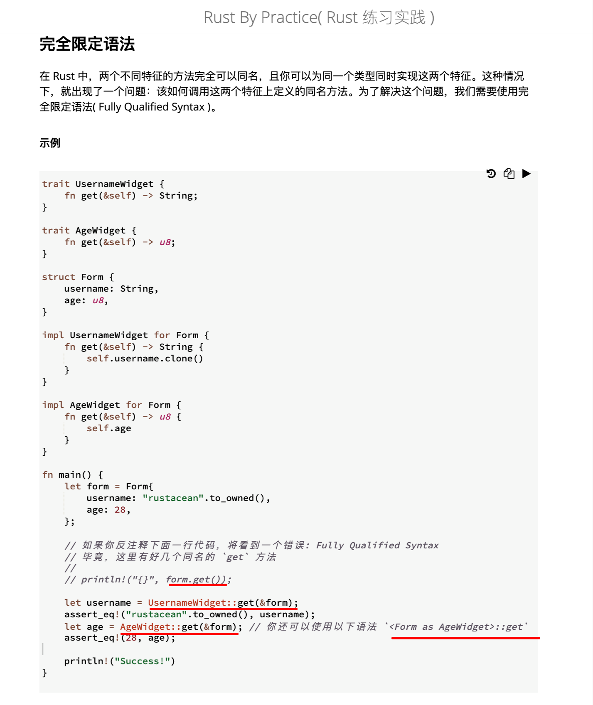
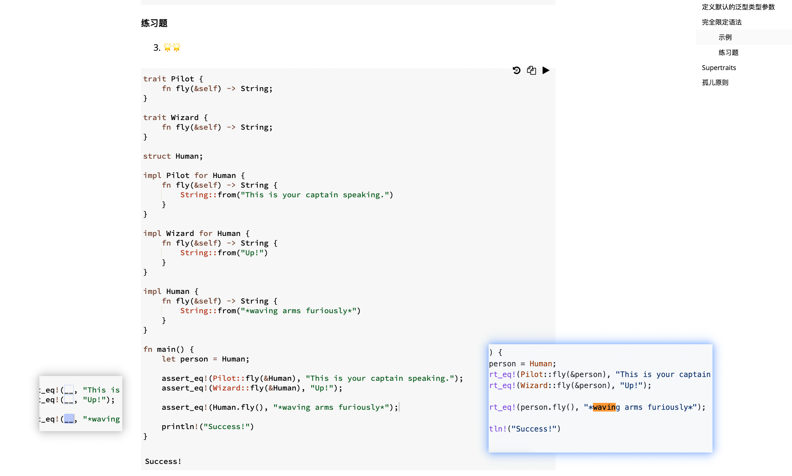
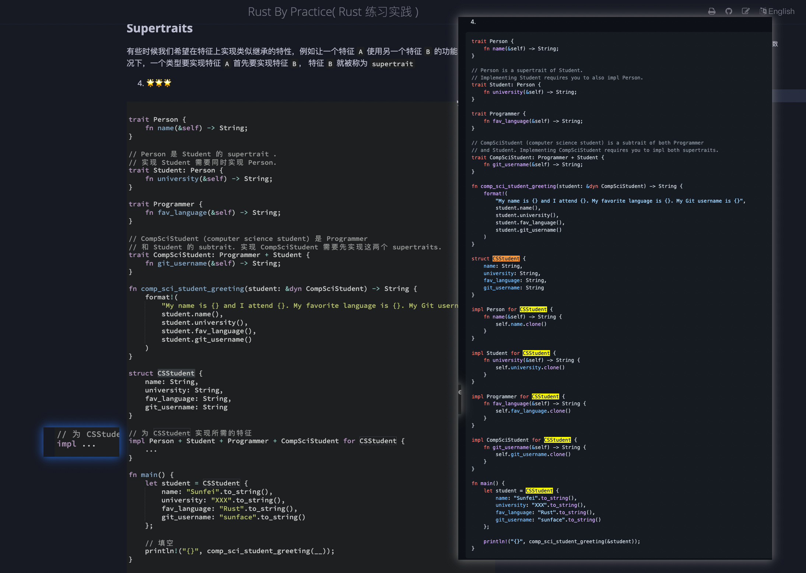
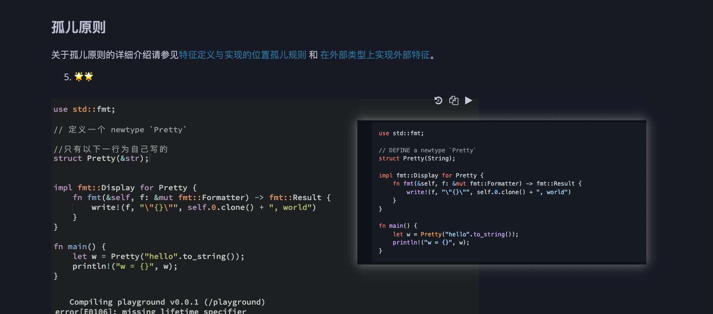

## 20815

https://zh.practice.rs/generics-traits/advanced-traits.html

  
1，形参可以用下划线写，另外好像下划线的参数编译时未使用也不会报错。  
2，有关联类型的 trait，定义里需要加&self 才能拿到  
3，两种形式都行  
4，既然定义里关联类型已有 A，B。范型里就不能再写 A，B 了。  
dddn

## 20816

  
目前只能根据报错修改得到正确答案，但不知道很多细节为什么要那么写，lllf。  
add220825，类似 10.3 的：看 trait mut 定义：https://doc.rust-lang.org/std/ops/trait.Mul.html ，Output 为此 trait 的关联类型，这里将它指定为 T，如不指定，则返回值类型为关联类型（报错里说的 associated type），与要求的 T 类型不服。

# 之后内容暂略，先多熟悉其它内容。

## 220825

  
完全限定语法示例，注意写法。

  
dddn
完全限定语法习题，注意这里该用实例 person，而不是结构体 Human，虽然不知什么原因，编译没报错 lllf。

  
dddn
supertraits, 注意为类型实现 trait 时，只能一个一个 trait 来。

  
dddn  
方法正确，但疏忽了所以错误。"hello"虽是&str，但"hello".to_string()已经是 String。
add220825,孤儿规则，其实就是将某类型放在一个元组结构体里，名义上是为此元组结构体实现方法，但实际上通过 self.0 找到了元组结构体里的这个目标类型来实现方法。从而绕开孤儿原则达到了目标。
