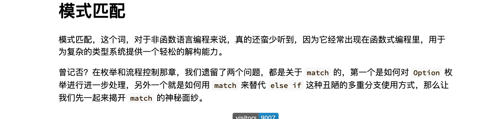
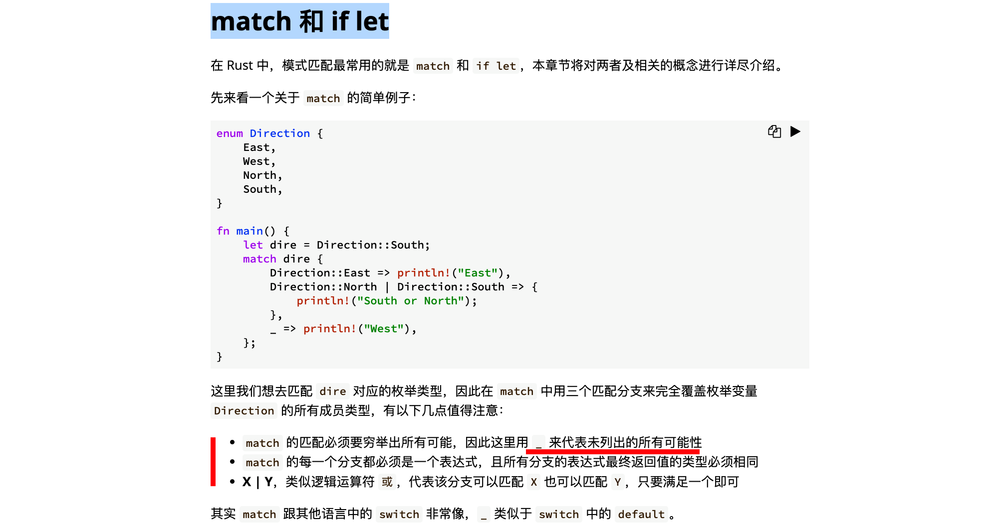
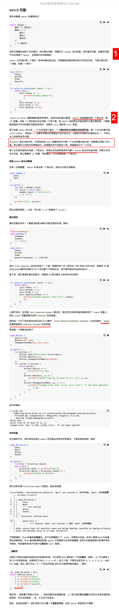
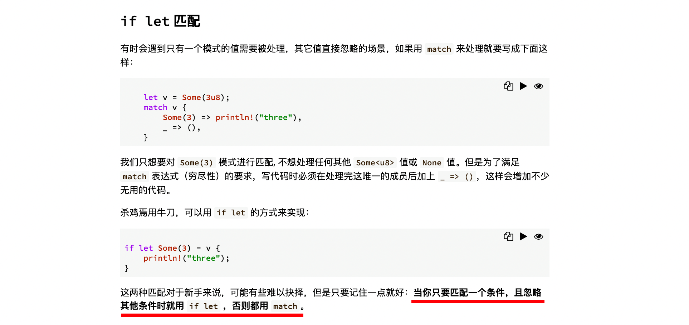
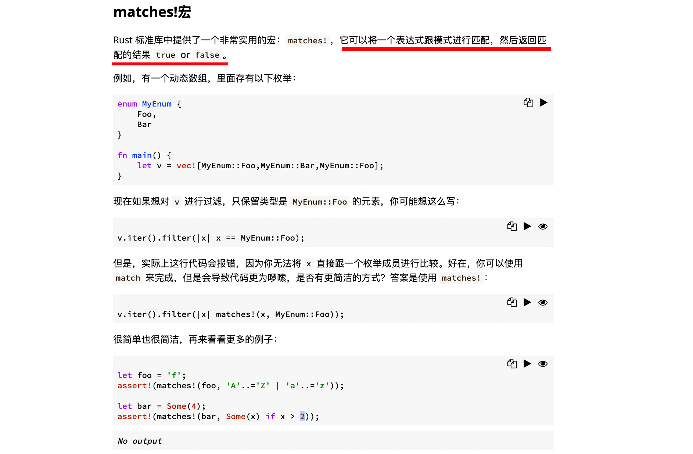
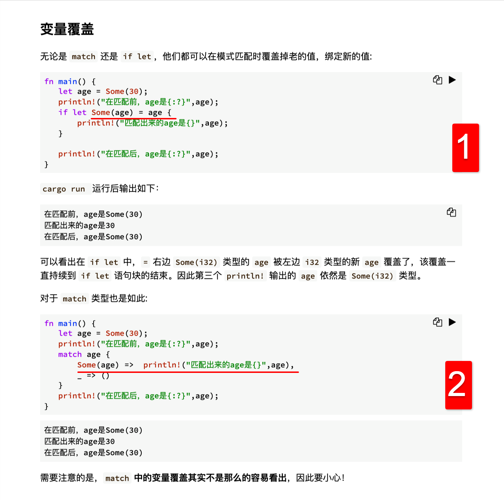

## 20818

  
模式匹配

  
match 和 if let

  
match 匹配  
1，模式匹配 lllf  
2，应该是指 coin，单个变量也是表达式。

  
if let 匹配

  
matches!宏，看例子就好理解了。

  
变量覆盖  
1，这里 some(age) = age 而 age 又是 some(30)，所以后面要打印的 age 就是 30 了。但只在这一部分生效，之后 age 仍是 some（30）。
2，同上，总结就是需要注意某个分支里是否包含有被 match 的部分，如果有，就要注意可能会产生变量覆盖。
