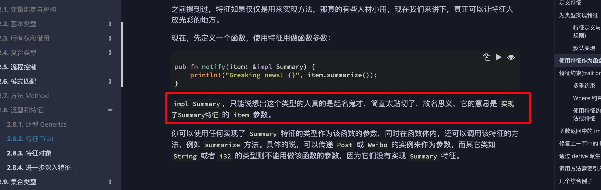
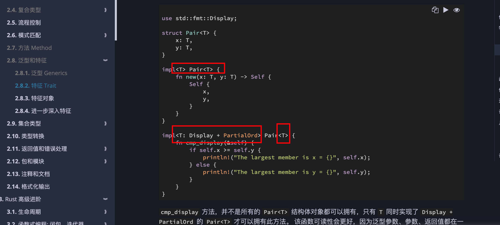
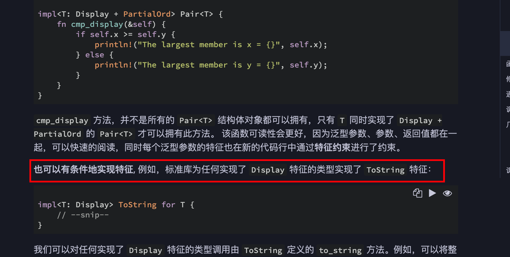
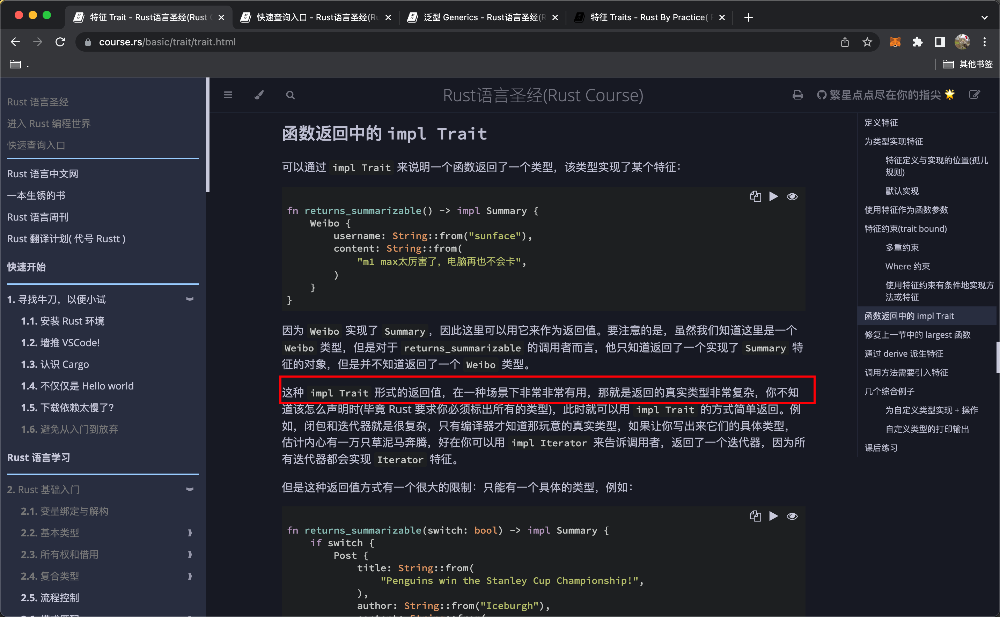
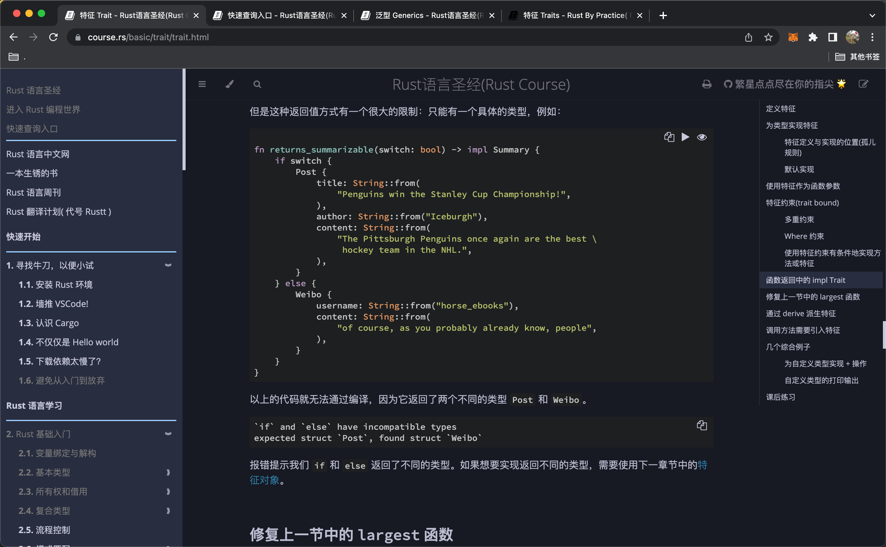

  
其实是 pub fn notify\<T: Summary>(item: &T) 的语法糖

  
引入某特征而没使用，可能是为了使用此特征的方法。

  
impl 后跟详细限定 Display + PartialOrd，类型名后只用接 T 就行了。上方之所以 impl 后也是 T，是因为并没有对 T 做任何限定

  
注意，impl something for 是为类型实现某特征，而不加 for 是为类型实现方法。？？？？

  
ooop
add，注意前者是有条件的（结构体参数满足某些特征时）为结构体实现方法，后者是为已经有了某些特征的类型增加特征。

### 0813

  

返回值指定 impl Trait，但只能有一种类型，rrr
