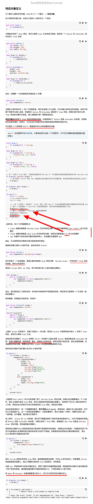
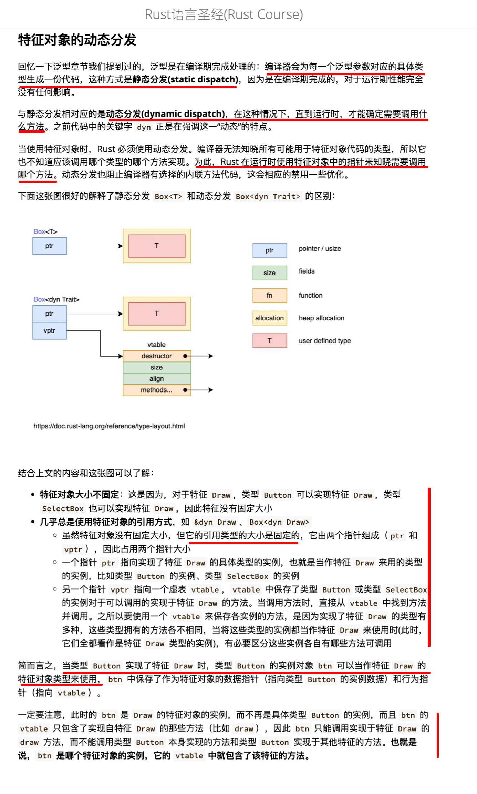
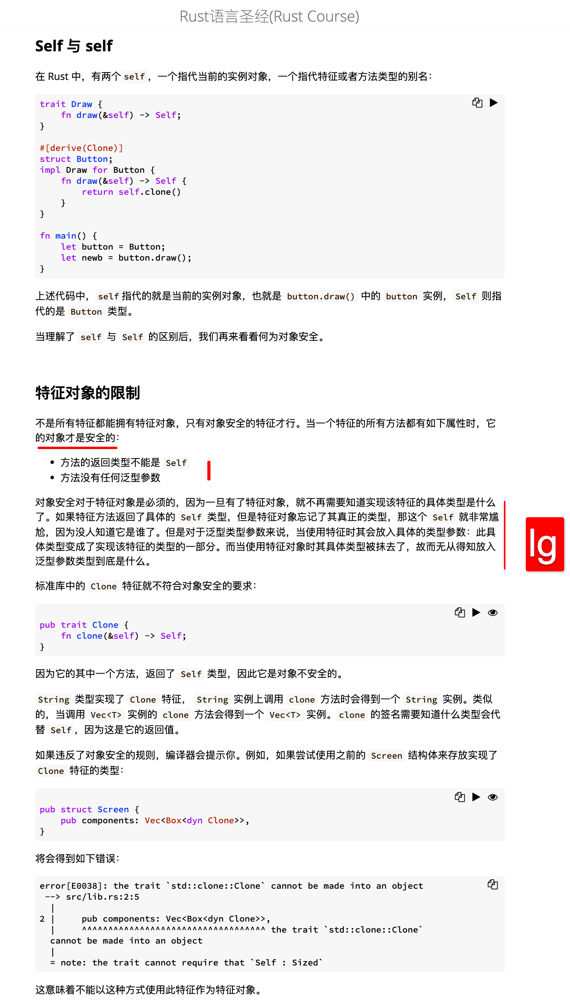

  
示例代码，不用看注释，看了注释反而不容易理解。  
dyn 时 dynamic 的缩写，代表参数类型是动态的

教程不太好，直接看 ByPractice 10.4

## add220825 省略了部分内容，只做关键部分笔记



```
注意，定义用： Box<dyn Draw>，实际使用时要用Box::new(something)，不能单独用something。或定义用&dyn Draw,使用时用&something.
```

  
特征对象的动态分发

  
Self 与 self，特征对象的限制 lllg
