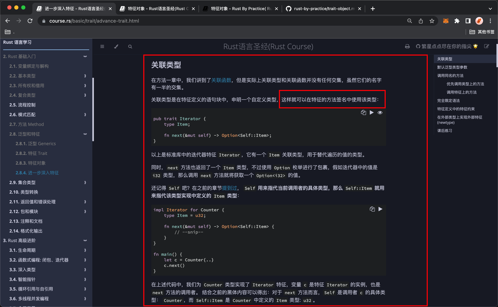
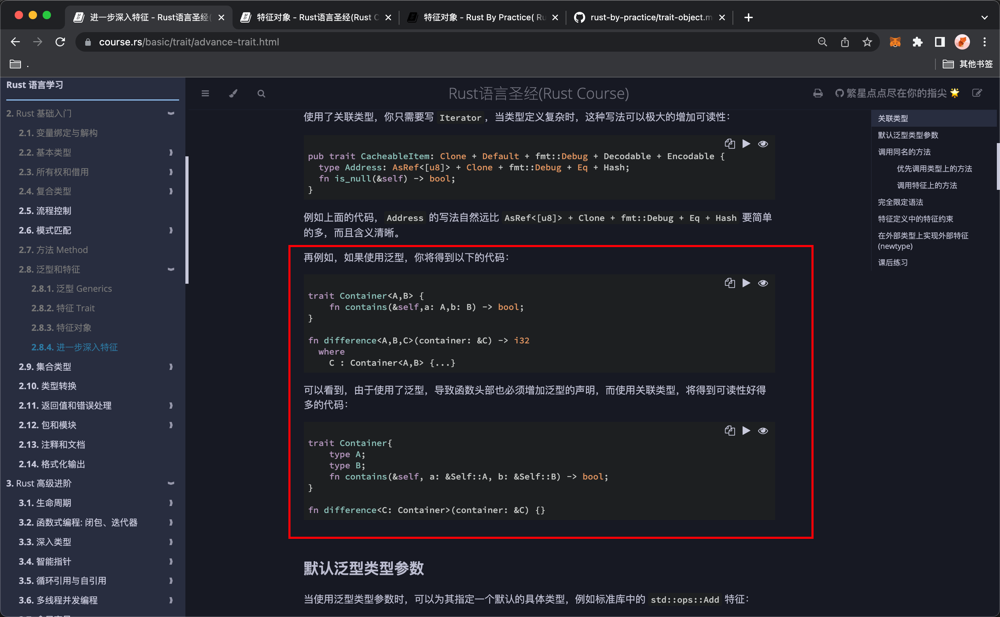
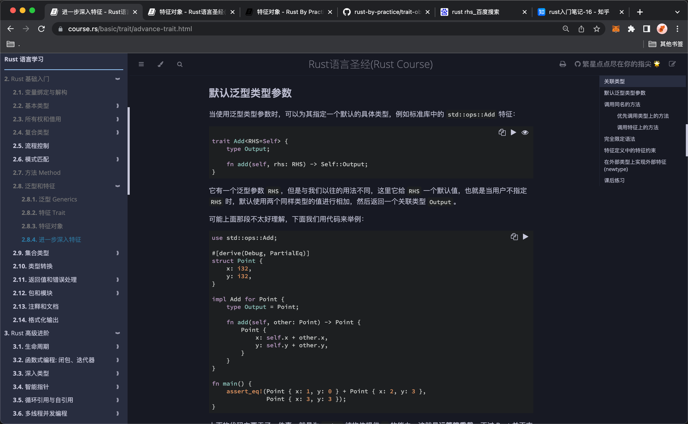
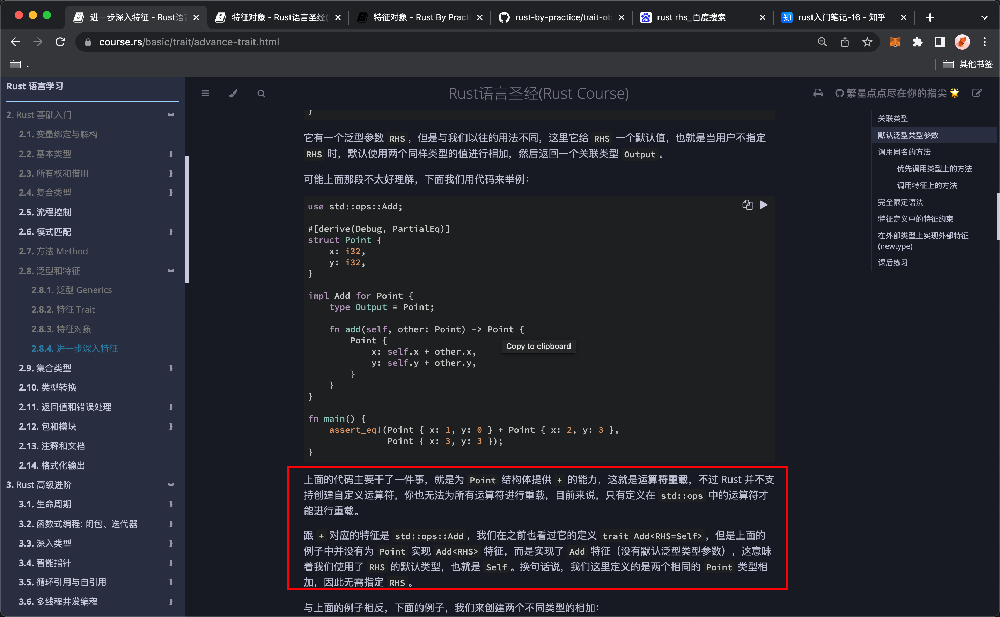
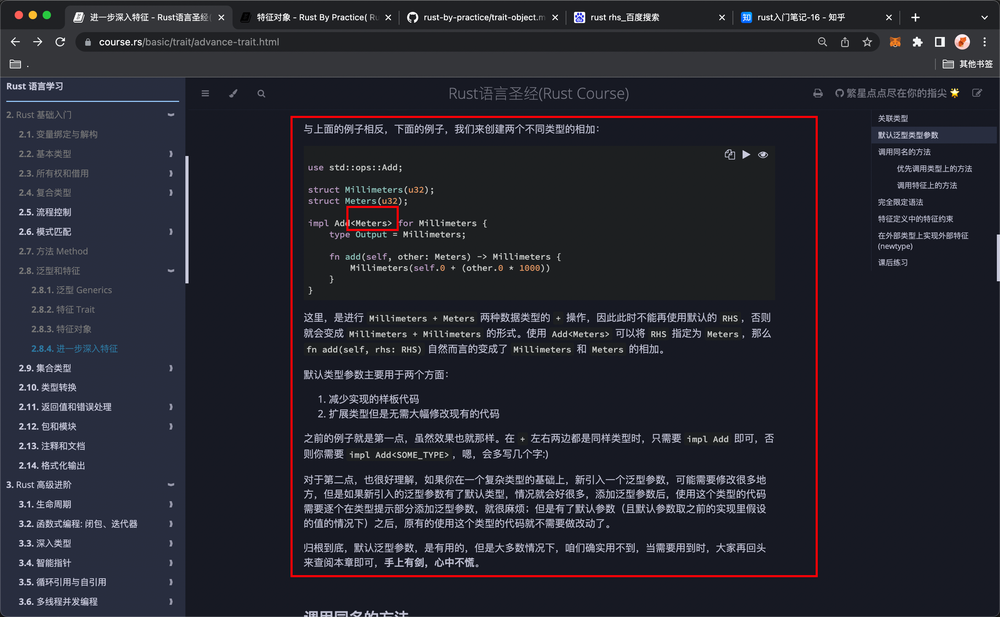
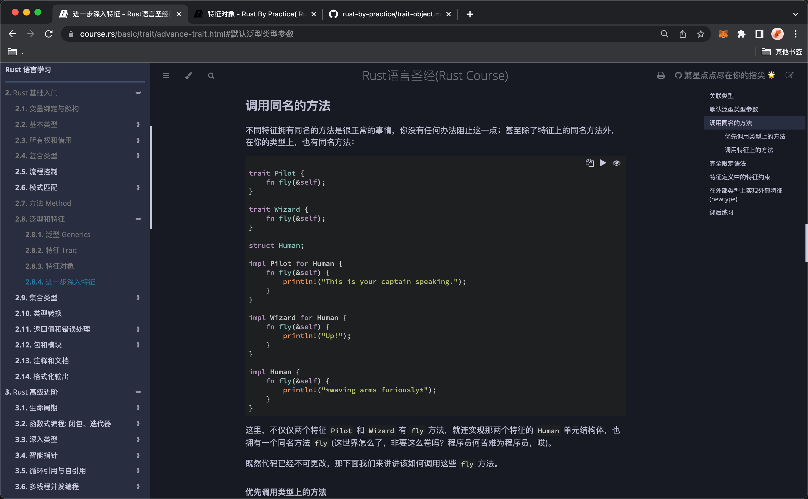
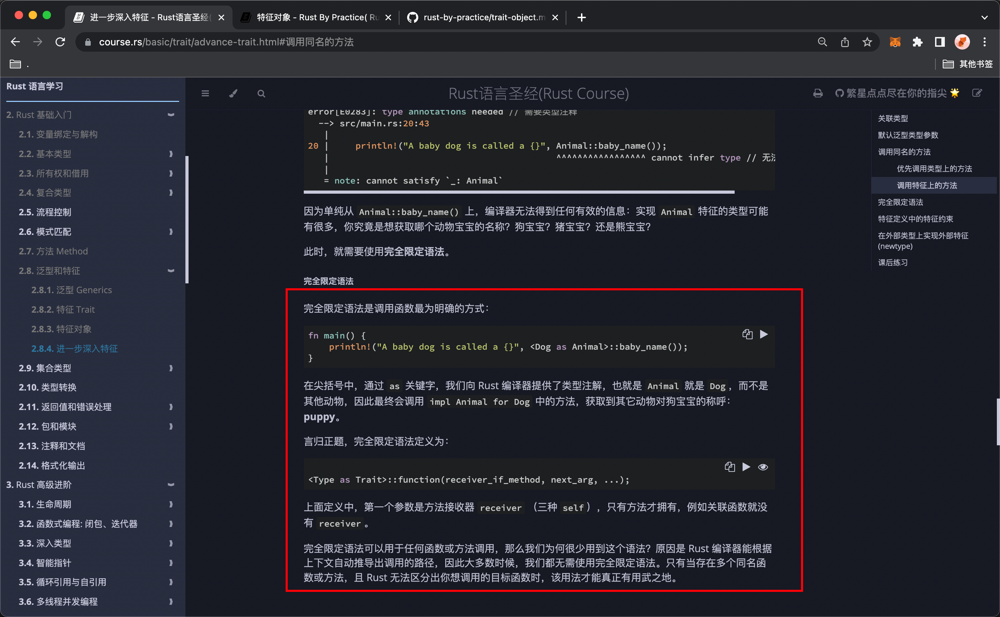
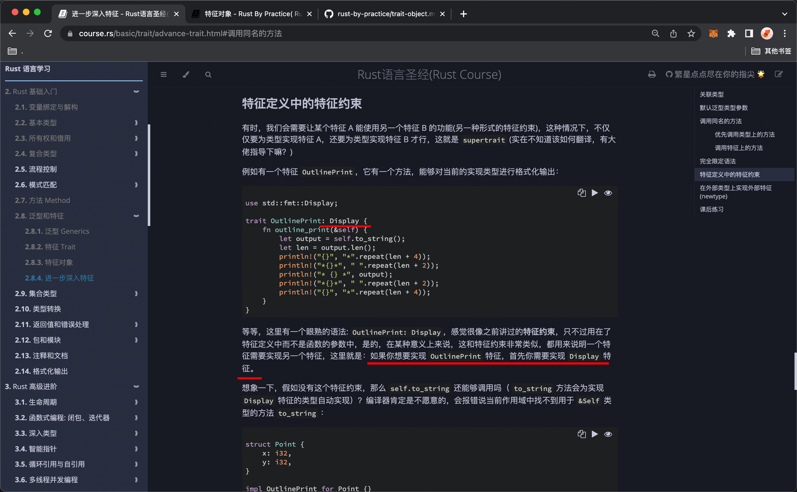
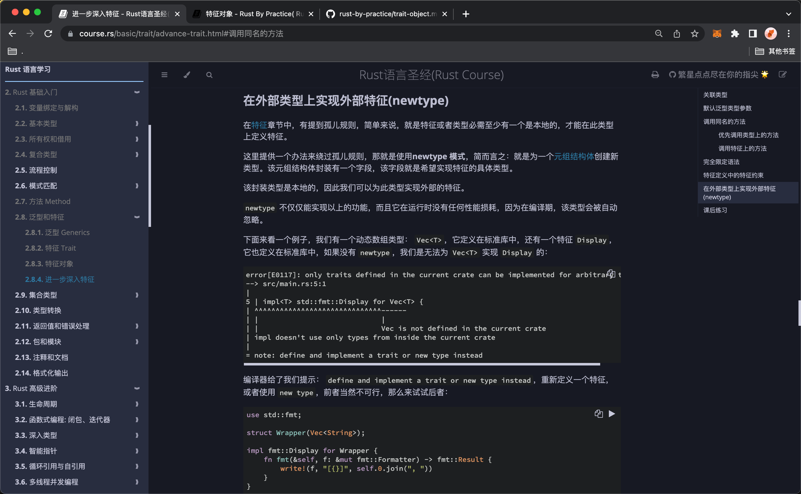
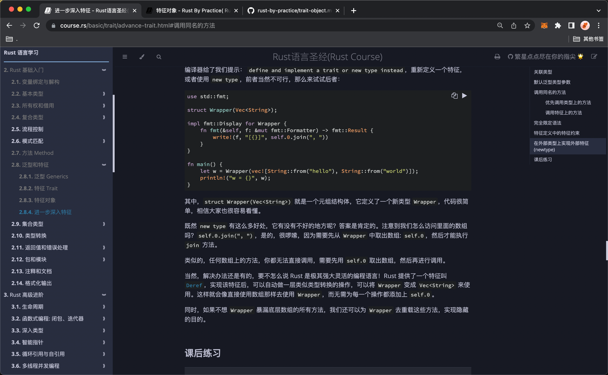

## 20814

## 关联类型

  
关联类型示例

  
范型和关联函数写法对比。

## 默认泛型类型参数

  
--=  
  
--=  


```
//标准库中的Add
pub trait Add<Rhs = Self> {
    type Output;

    fn add(self, rhs: Rhs) -> Self::Output;
}
```

默认泛型类型参数是 self，可省略不写，但一些情况下不能用默认的 self，就需要写了，trait 名尖括号里指定类型名。

## 调用同名的方法

  
--=  


iiic
调用同名方法，优先调用类型上的方法，后特性里定义的方法。  
完全限定语法，需要时再学。

```
<Type as Trait>::function(receiver_if_method, next_arg, ...);
```

## 特征定义中的特征约束

  
iiic
oooe

## 在外部类型上实现外部特征(newtype)

  


为元组结构体创建新类型，关键词 Wrapper？？？，感觉少用，需要时再学。
