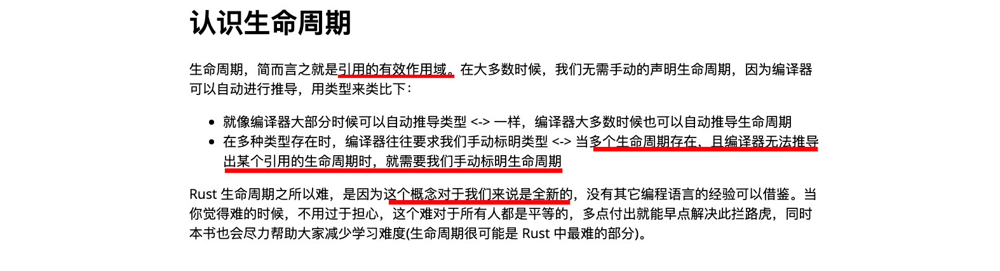
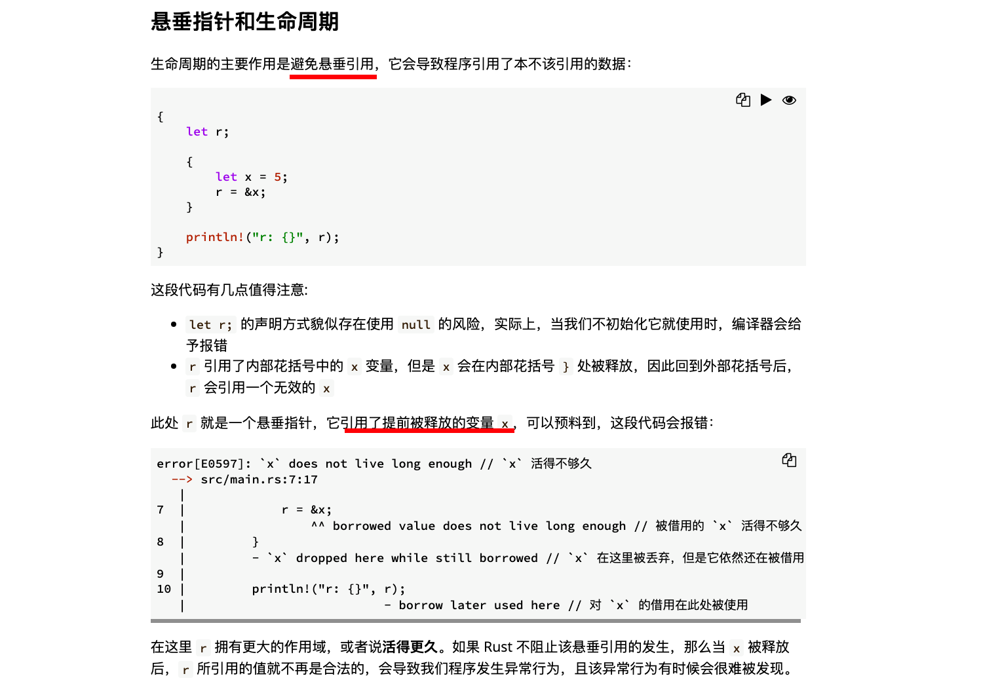
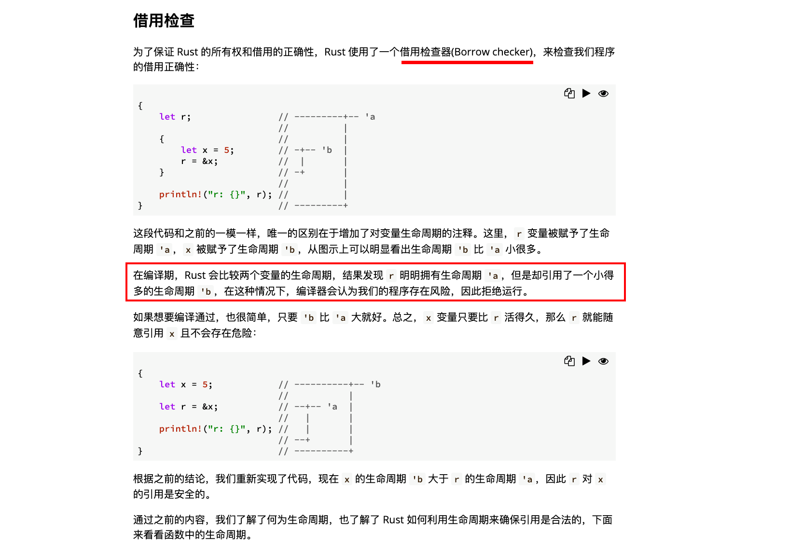
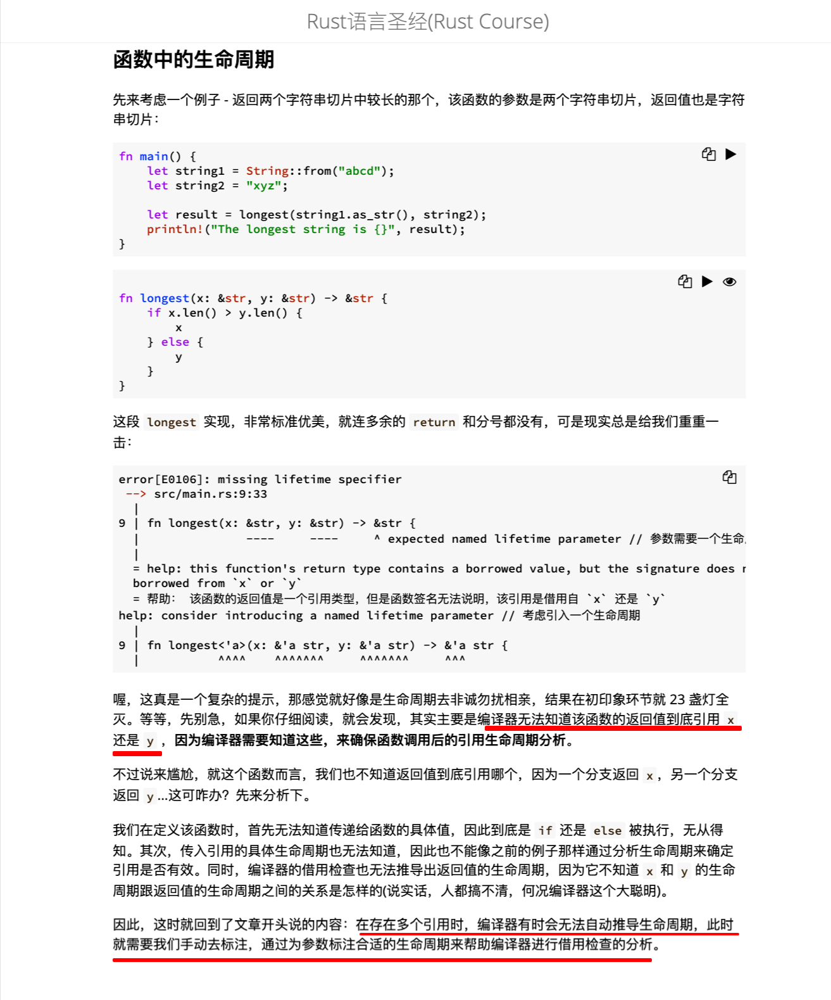
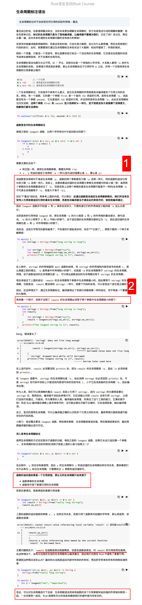
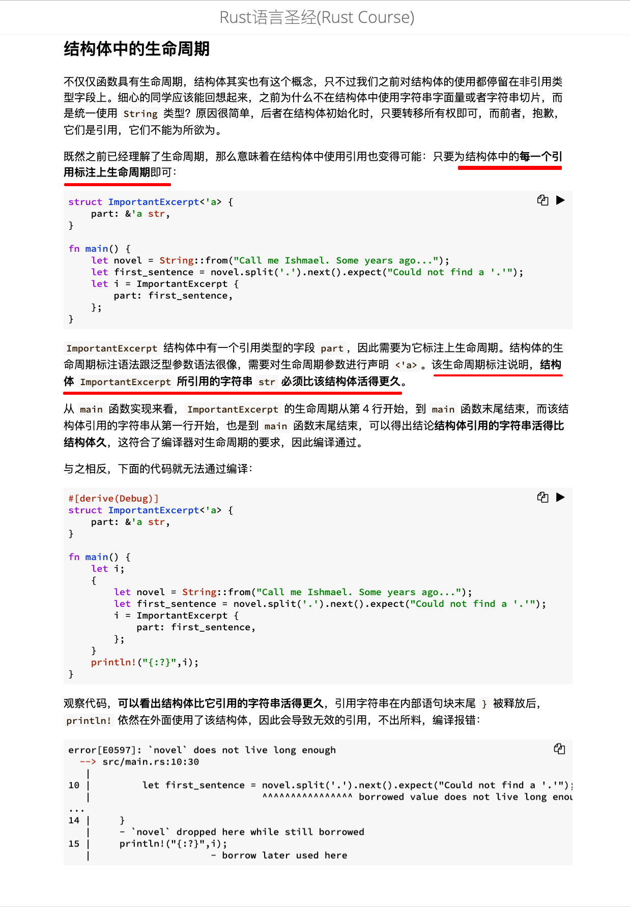
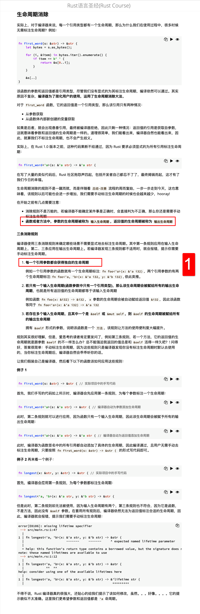
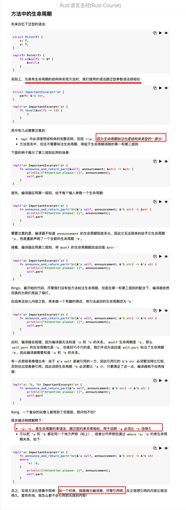
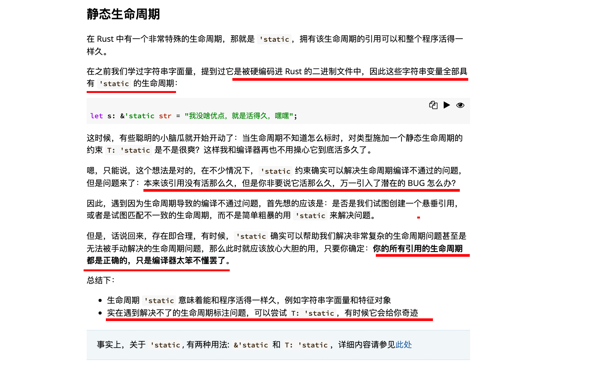
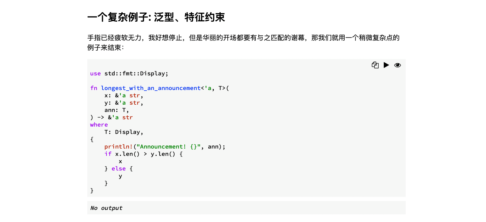

  
前言

  
悬垂指针和生命周期

  
借用检查

  
函数中的生命周期

  
生命周期标注语法  
1，mmmi  
2，这里可能教程省略了函数定义部分的代码，所以看不到‘a。

  
结构体中的生命周期

  
生命周期消除  
1，消除规则 1 并不是满足了就没问题了，而是满足了编译器就会默认给不同参数设置默认不同的周期，之后仍可能遇到问题报错，如例子 2

  
方法中的生命周期

  
静态生命周期

  
一个复杂例子: 泛型、特征约束
结合了泛型、特征约束和生命周期的例子。
