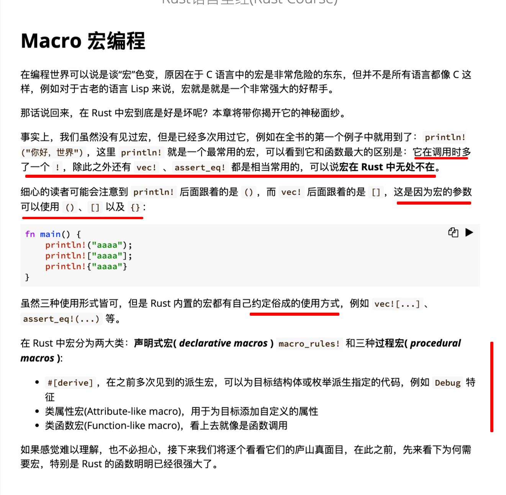
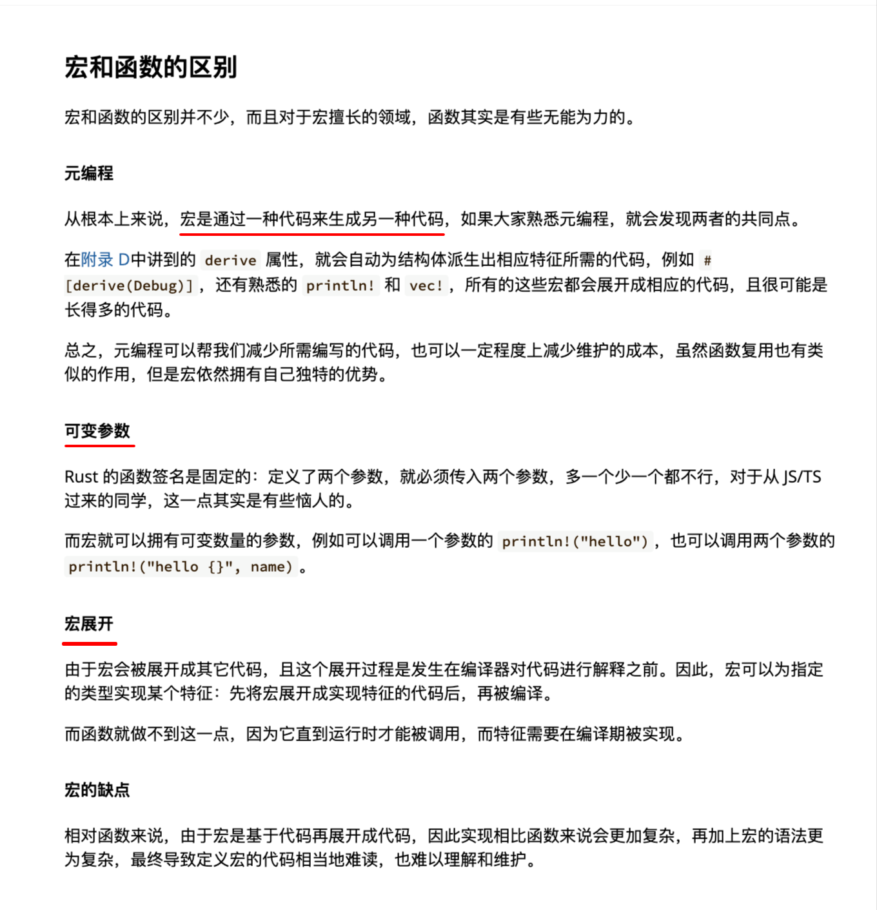
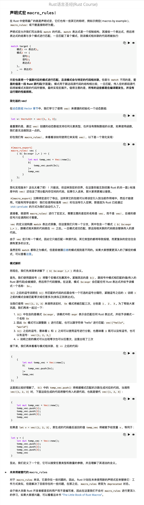
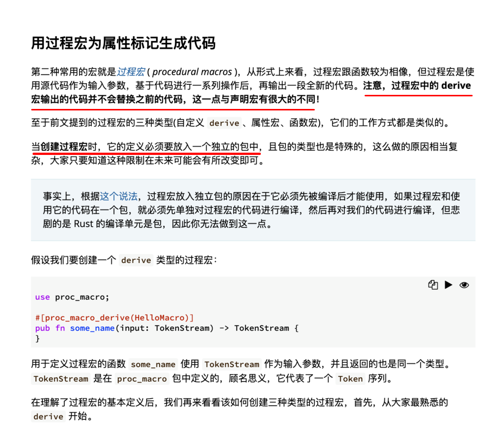
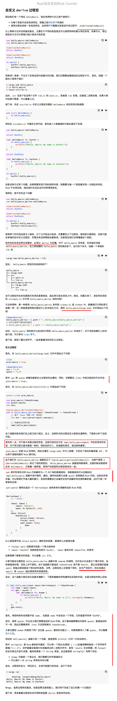
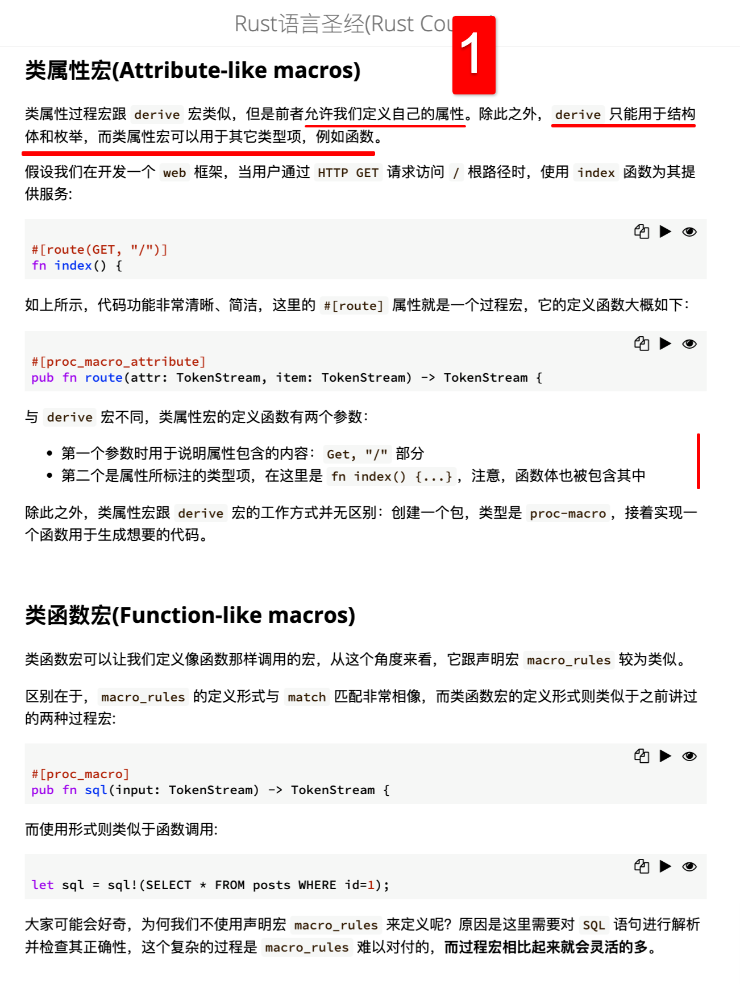

## 220821

  
Macro 宏编程

  
宏和函数的区别

  
声明式宏 macro_rules!  
将被废弃，就不学了  
add，关键词 macro_export macro_rules

  
用过程宏为属性标记生成代码

  
自定义 derive 过程宏

  
类属性宏(Attribute-like macros) N 类函数宏(Function-like macros)  
1，lllf  
这两个宏没有自定义 derive 过程宏讲得细，但三者分别用 proc_macro_derive，proc_macro_attribute，proc_macro 标注？？？？可以用此来区分不同的过程宏  
add220823，除了文中说的 “derive 只能用于结构体和枚举，而类属性宏可以用于其它类型项，例如函数。” 还有一点区别是使用 derive 宏应该必须用 derive 关键字，而类属性宏不用。而类函数宏应该必须用到带感叹号的标志，比如 println!这样。可以用这些来区分三个过程宏。

  
补充学习资料 N 总结
