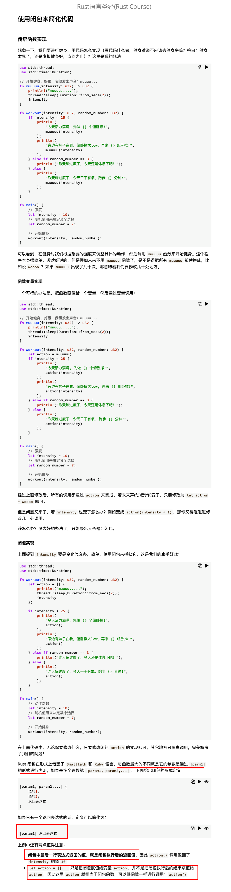
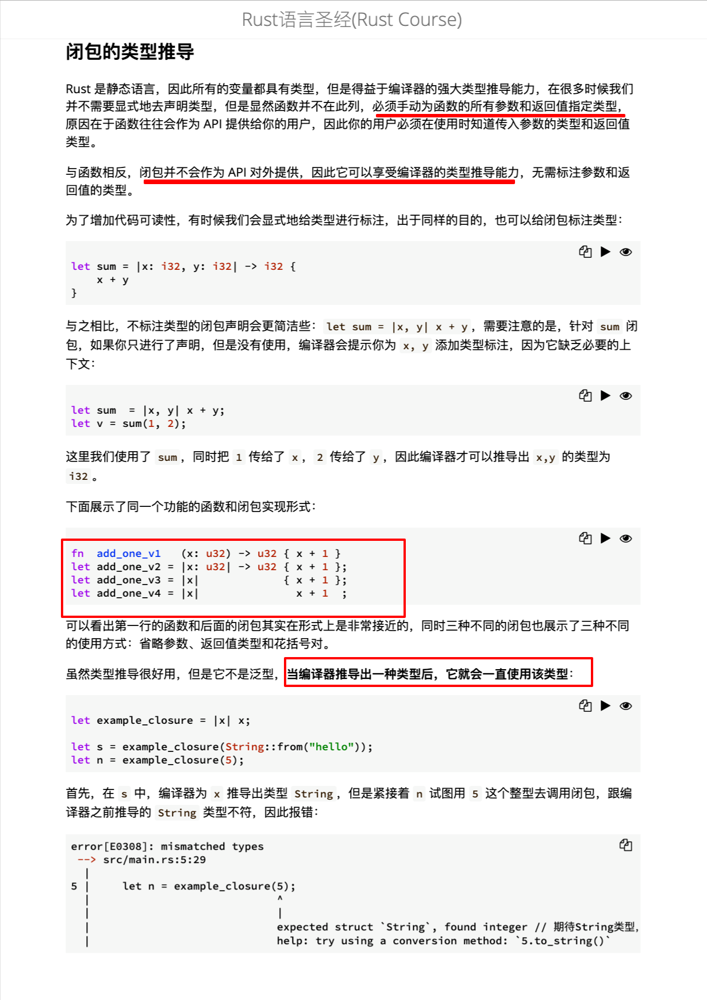

  
3.2 函数式编程

闭包 Closure

  
使用闭包来简化代码

  
闭包的类型推导

  
结构体中的闭包  
llln

捕获作用域中的值  
1，注意这里是判断，而不是赋值  
2，fn_once 是函数，func 是闭包且是此函数的参数，也就是函数体里的 z。func(3)意味着 3==x.len()==3，所以结果是 func(3) = true。  
3，这里应该是两个不同的意思，1 是闭包会拿走被捕获变量的所有权，2 是此闭包被函数调用后自身也会失去所有权？？？？  
4, oooh  
5, 注意 let mut update_string 只是在定义闭包，下面一行才是在使用闭包，str 可能造成误解，其实只是个普通参数可以把它换成其它单词。

较复杂，5 之后的内容以后再看，lllf

  
闭包作为函数返回值
