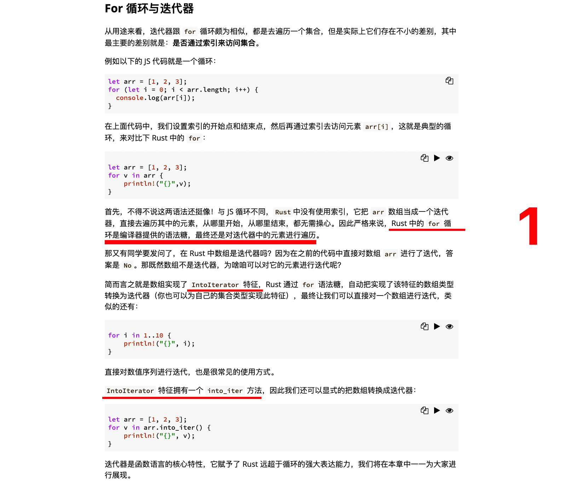
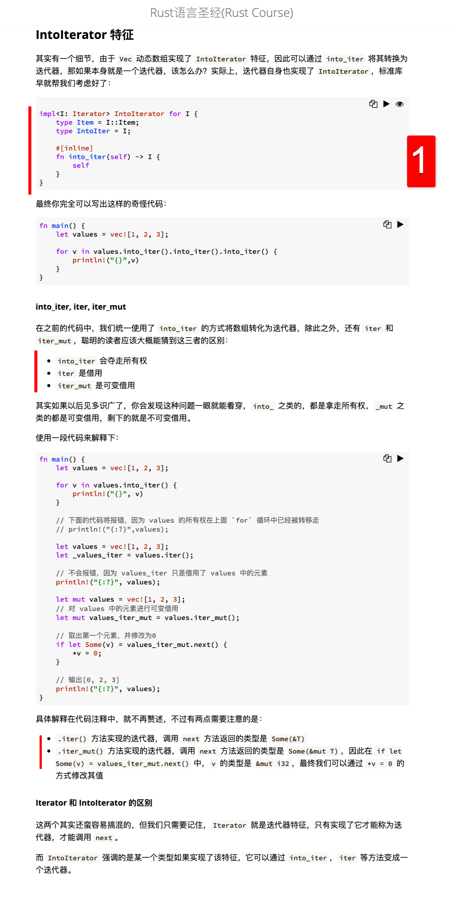
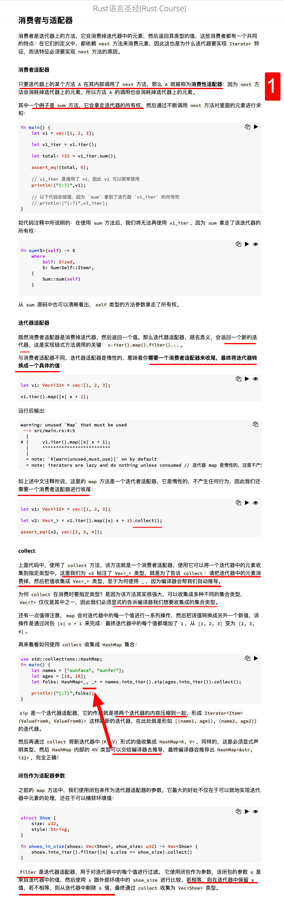
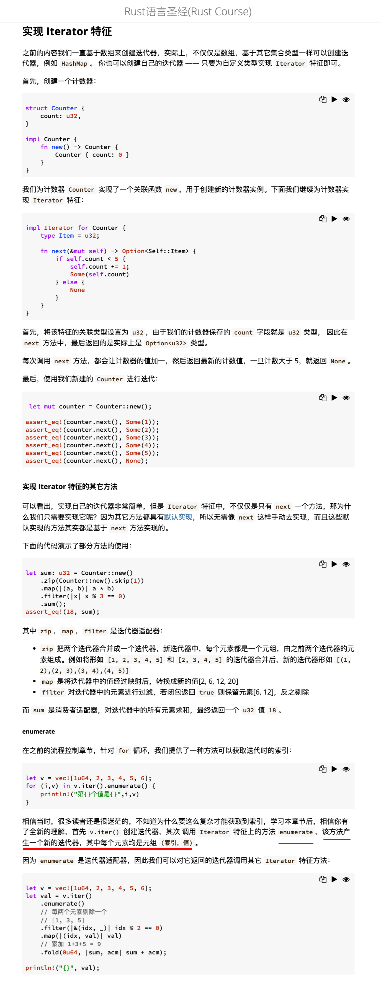
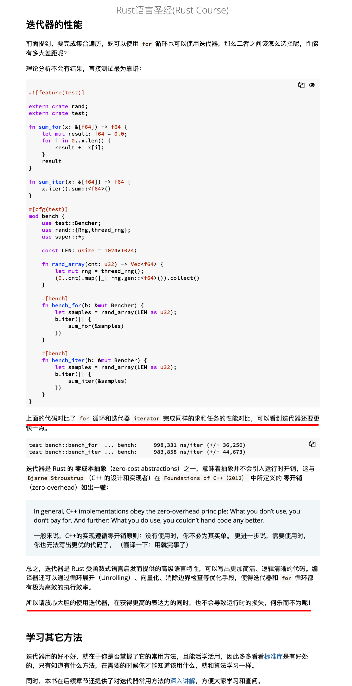

## 20817

  
迭代器 Iterator

For 循环与迭代器  
1，语法糖，可能意味着不像 js 里的 for，而是 for 类似别名实现 trait 里的某些方法。  
2，数组不是迭代器，但因为实现了 intoiterator 特征，可以使用 into_inter 方法转为迭代器，而迭代器里有个 next 方法，就能通过调用 next 方法迭代了。可能上面的 for 语法糖就是调用 next 的一系列操作。

  
惰性初始化

## 20818

  
next 方法  
1，lllf

  
IntoIterator 特征  
1，impl 后看出 I 是 Iterator trait 也就是迭代器，type Item = I::Item 代表此 trait 在此处实现的类型 Item 是 I 这个迭代器 trait 的关联类型 Item。所以此处相当于是为 trait 实现了 trait。？？？？  
add，以上理解部分错误，应该是 I 是实现了 Iterator trait 的类型，这里用到了特征约束，trait bounds。

  
消费者与适配器  
1，A 应该是个跟 next 同级的 trait 内方法

  
实现 Iterator 特征

  
迭代器的性能
