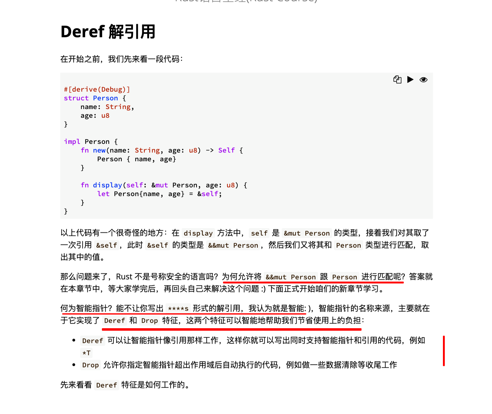
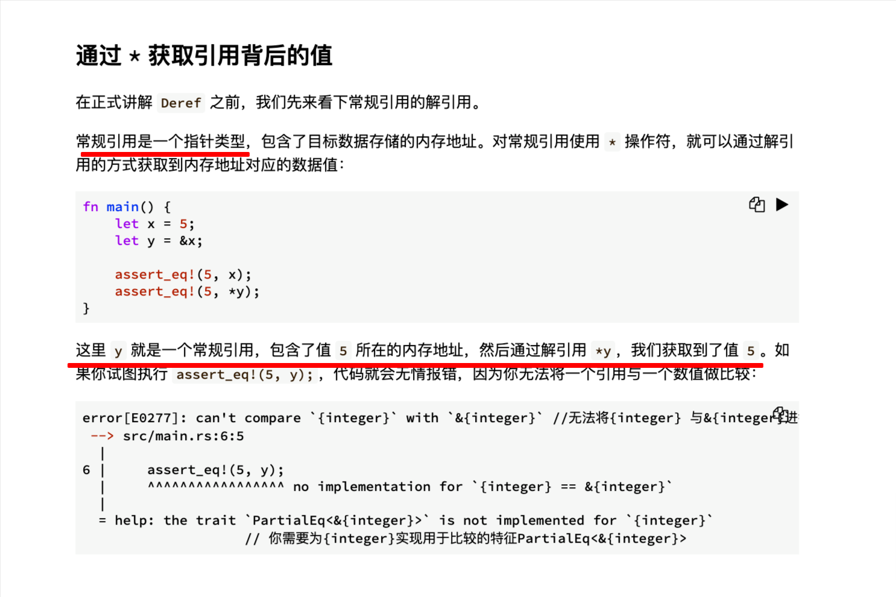
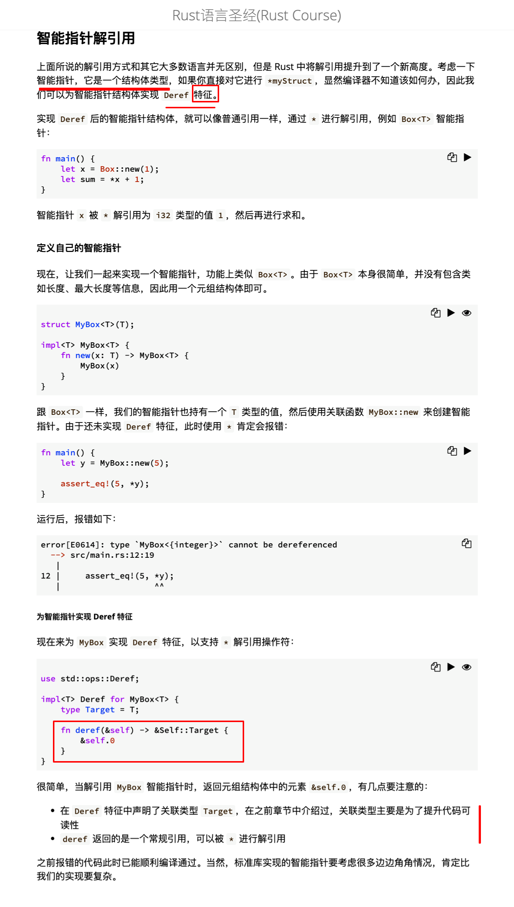
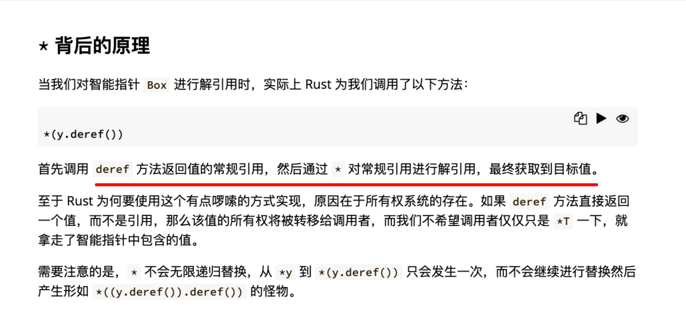
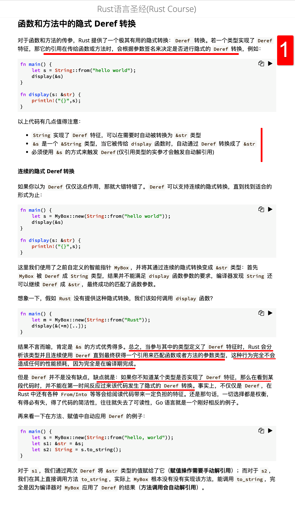
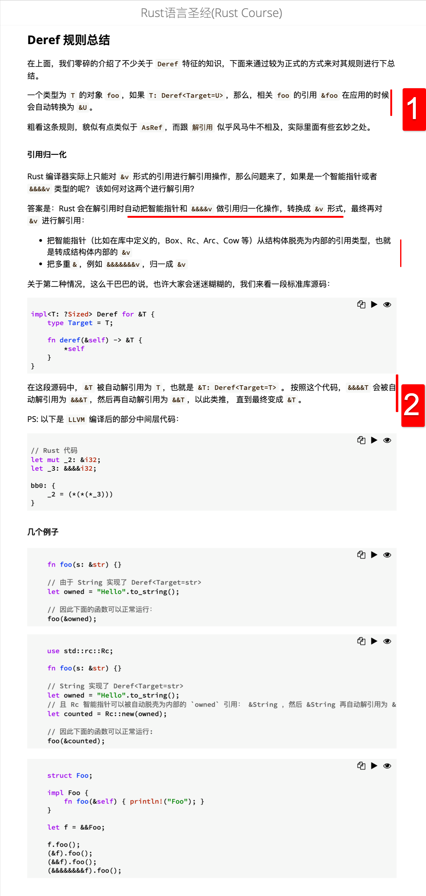
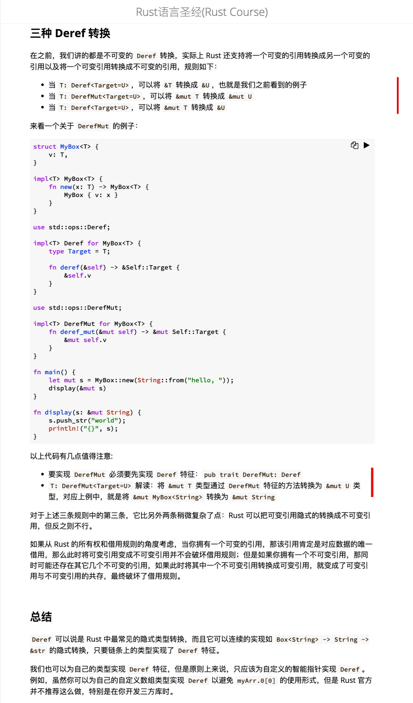

## 220819

  
Deref 解引用

  
通过 \* 获取引用背后的值

  
智能指针解引用  
mmmi

  
\* 背后的原理

  
函数和方法中的隐式 Deref 转换  
1，简单来说，实现了 deref 特征的类型的引用作为实参时可以被自动转换类型。  
add，仍需要加一个&，只是这一个&可能意味着很多次&

  
Deref 规则总结  
1，mmmi  
2,注意，这里说的 &T 被自动解引用为 T，意思应该是只是少了一个&符号，而不是最终为不是引用的 T 了，实际上可能是 &&&&T 变为 &&&T。而最终的返回值实际上仍是个引用&T，只需执行一次解引用就行了。智能转换时可能会执行多次 deref ？？？？

  
三种 Deref 转换  
没完全搞懂，需要时再看 oooh。
