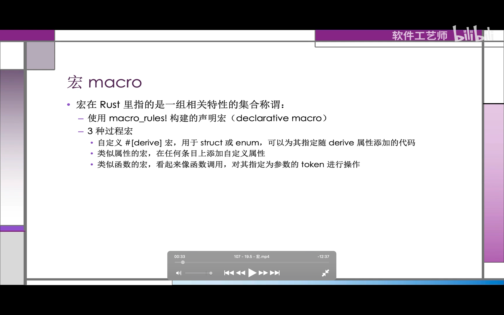
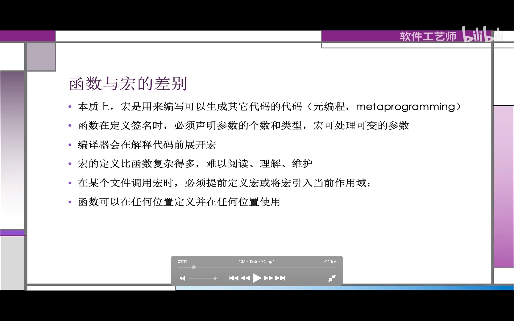
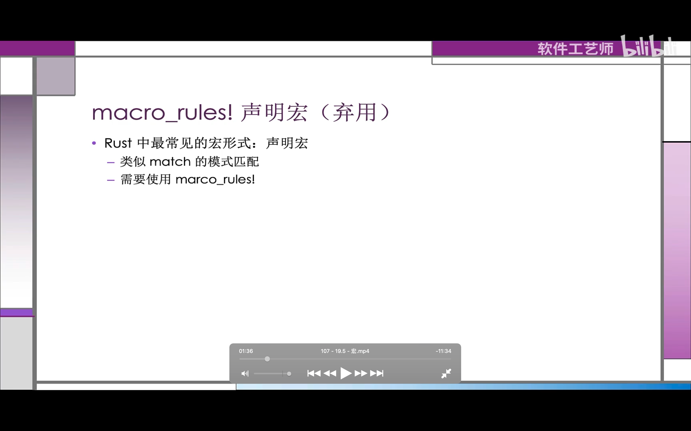
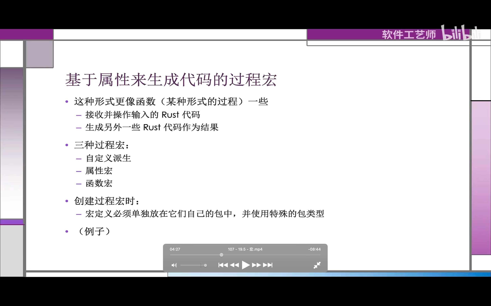
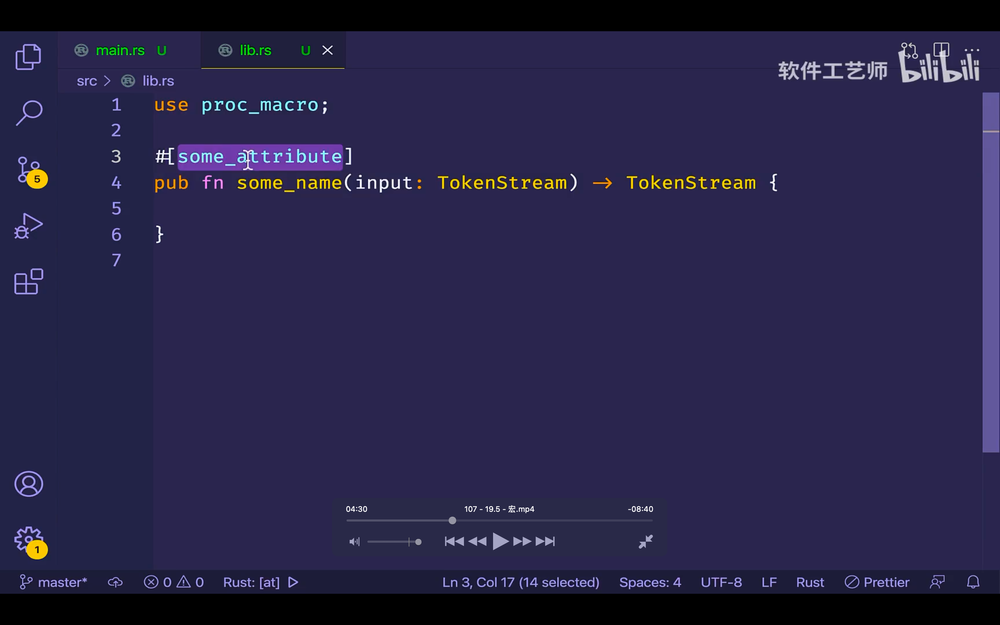
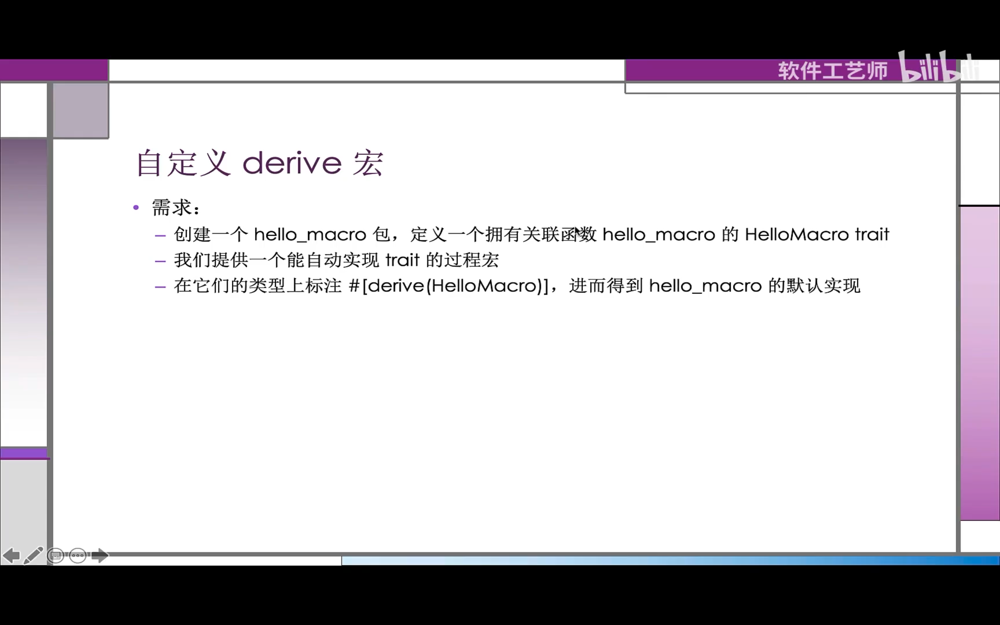
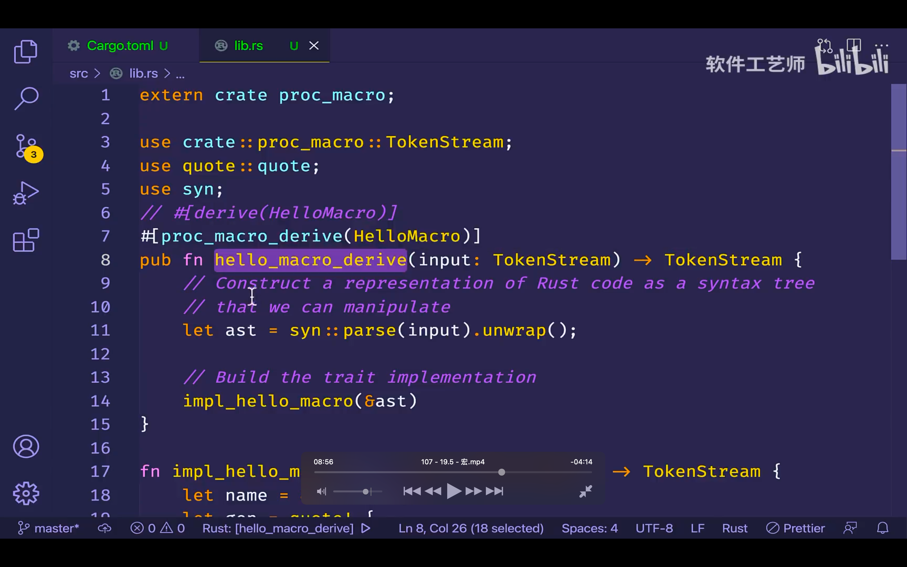
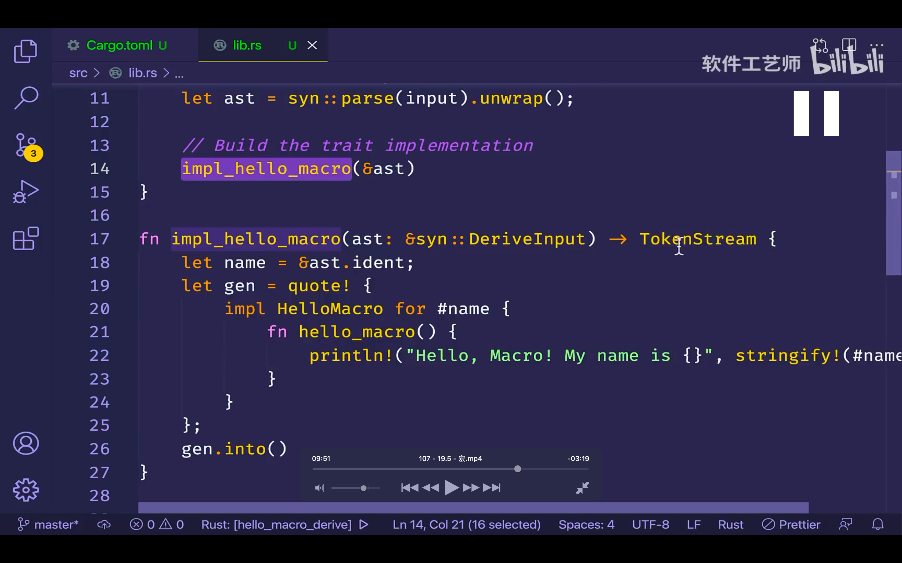
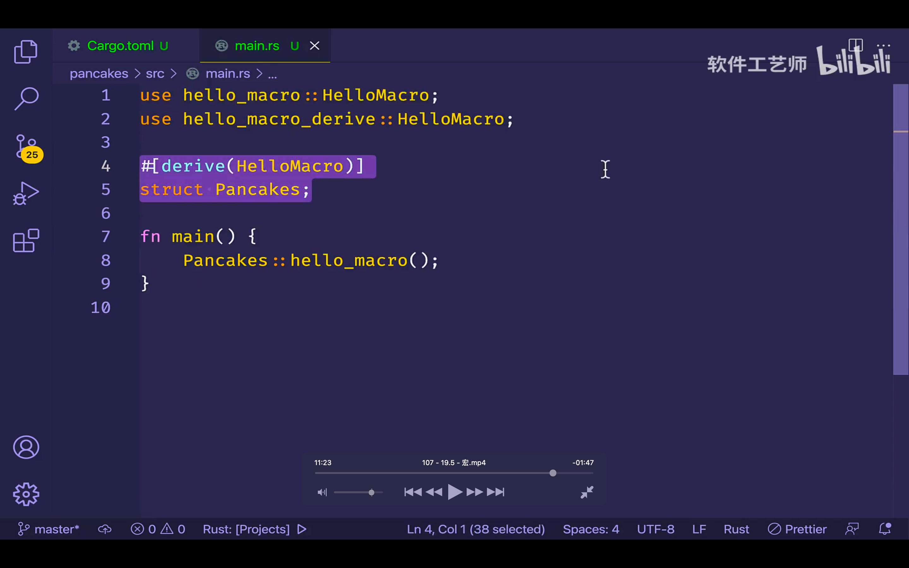
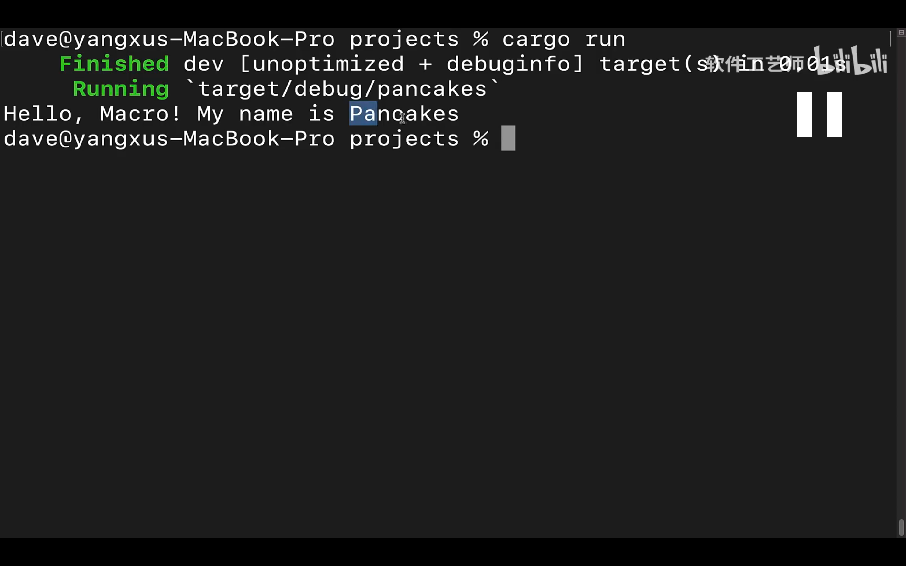

  
oooe

  
oooe

  
声明宏略，因为可能被弃用

oooe

  
mmmi  
需要接受一个 tokenstream 作为输入，一个 tokenstream 作为输出。 tokenstream 类型在 proc_macro 包中定义，表示一段标记序列 lllf。  
过程宏的核心：需要被宏处理的元代码组成了输入的 tokenstream，宏生成的代码组成了输出的 tokenstream。  
函数附带的属性，决定了我们创建的是哪一种过程宏 llln。  
同一包中可以拥有多种不同类型的过程宏。

  
oooe，之后省略部分内容。

  
之前省略部分内容，重点讲这个，因为此包就是一个宏。

proc_macro,借助此包提供的编译器接口从而在代码中读取和操作 rust 代码，因为已经内置在 rust 里，所以不需要添加到 cargotoml 里。

syn，把 rust 代码从字符串转换为可供操作的数据结构。

quote，能将 syn 产生的数据结构重新转换为 rust 代码。

mmmi，用户在某个类型上标注：#[derive(helloMacro)]时，hello_macro_derive 就会自动调用，为什么会被自动调用呢？因为 hello_macro_derive 上标注了#[proc_macro_derive(HelloMacro)]，属性里指定里 HelloMacro trait。

此函数 hello_macro_derive 首先会把 input 的 tokenstream，转化为一个可供解释和操作的数据结构（发挥了 syn 包的作用，即 let ast = syn::parse(input).unwrap();）。

let ast = syn::parse(input).unwrap()，其中 parse 函数接收 tokenstream 作为输入，并返回一个 deviceInput 结构体？？？作为结果。此结构体代表里解析后的 rust 代码，此结构体具体怎么样，不重要，看视频 09:30 左右。

  
 impl_hello_macro 是最终生成 rust 代码的地方，返回一个 tokenstream。以下称 ts。  
 在此函数里，首先获得了一个 ident 结构体，在它里面就有被标注类型的名称，比如刚才的 pancakes。  
 之后 quote！宏允许定义我们希望返回的 rust 代码，即 impl HelloMacro for #name {\*} 代码。  
 quote！宏执行结果是一种编译器无法直接理解的类型，所以还要把结果转换为 ts，即最后调用了 into 方法，它会把上面的代码转换为符合要求的 ts 类型。  
 此外，quote 宏的模版里会把#name 替换为变量 name 里的值，具体看文档。  
stringfy！宏是 rust 内置的，它接收一个表达式，比如 1+2，并在编译时把这个表达式转化成字符串的字面值，即 1+2 字符串，并不计算结果。

  
试试在 hellomacro，hellomacroderive 两个文件夹都没问题，则再继续 cargo new pancakes，注意提前在最外层 cargotoml 里加入 pancakes member。  
此图为 pancake 的 ct 内容。

  
此图为 pancake 的 ms 内容。

  
主目录内 cargo run，运行正确。  
add，需要删掉第一个文件夹中的 mainrs 文件。
