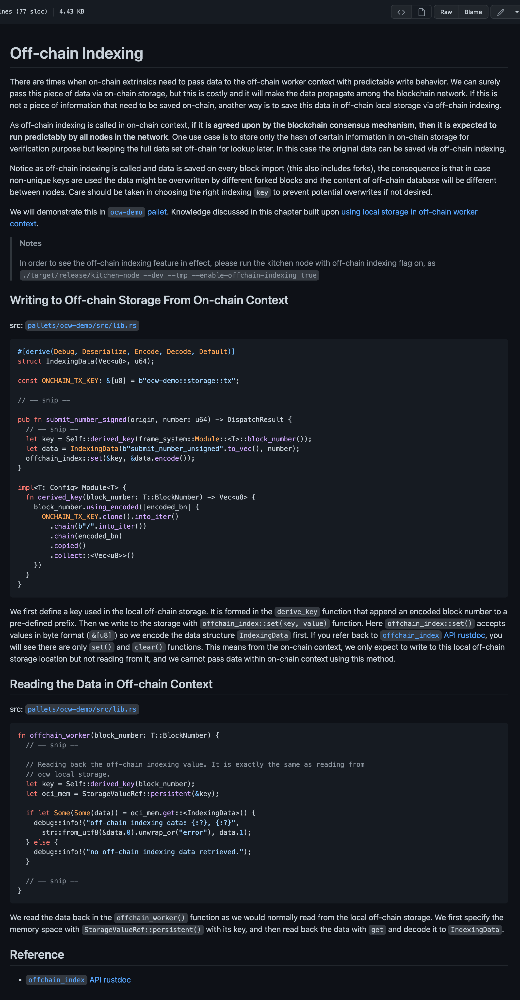
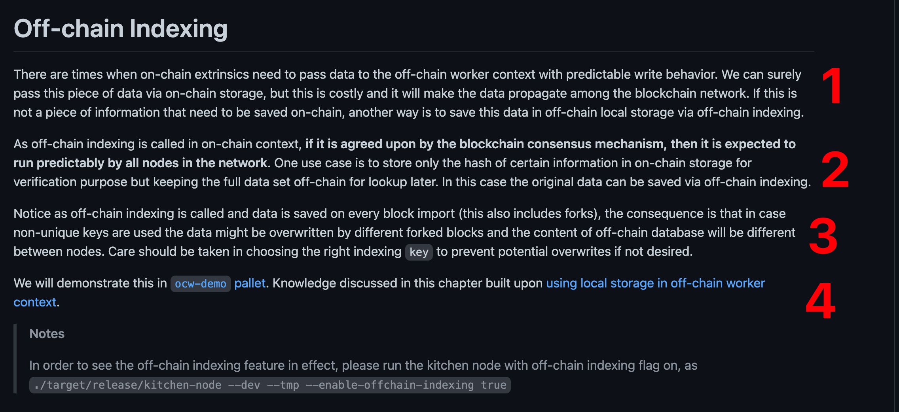
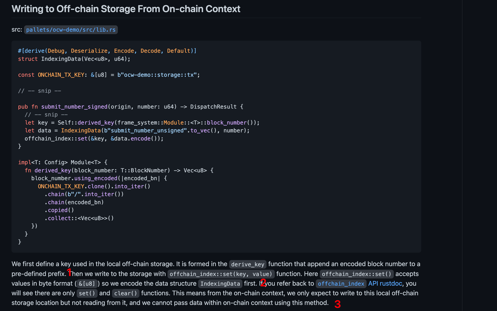
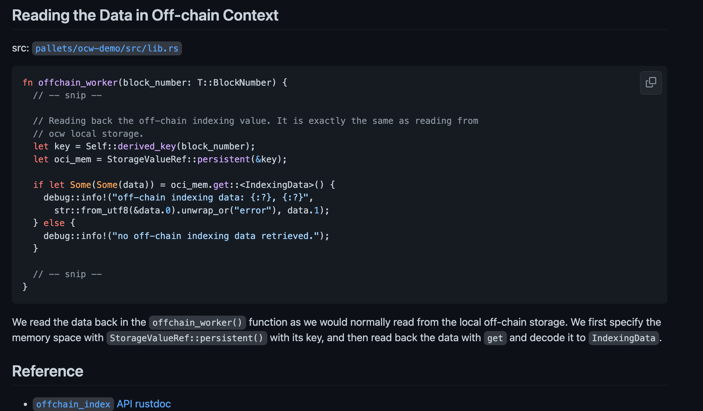

## 220923

https://github.com/JoshOrndorff/recipes/blob/master/text/off-chain-workers/indexing.md

  
总图  
Latest commit 1902f94 on 14 May 2021

  
1，有时候，链上的交易需要通过可预测的写行为将数据传递给 ofw 环境。我们当然可以通过链上存储来传递这段数据，但这是昂贵的，它会使数据在区块链网络之间传播。如果这不是一条需要保存在链上的信息，另一种方法是通过链下索引将该数据保存在链下本地存储中。  
意思是为啥要用 oci

2，由于 oci 是在链上环境中调用的，如果它由区块链共识机制同意，那么它将被网络中的所有节点可预期地运行。一种用例是在链上存储中只存储特定信息的 hash 以进行验证，但在链外保留完整的数据集以供以后查找。在这种情况下，可以通过链下索引保存原始数据。  
意思是 oci 各节点逻辑统一所以和 ocw 不一样？？？？

3，注意，由于 oci 被调用和 data 被存发生在每个 block 引入时(这也包括 fork？？？？)，结果是，如果使用了非唯一键，数据可能会被不同的 fork 块覆盖，链下数据库的内容在节点之间也会不同。在选择正确的索引键时应谨慎，以防止潜在的覆盖(如果不需要的话)。  
意思是 oci 非必要的情况下不要用重复的 key，避免出问题。

4，不用翻译

  
1，意思是用 derived_key 定义一个 key，它使用了 encoded 区块数加一个预定义的前缀作为参数，这样保证了不出现重复 key？？？？
2，offchain_index::set 存入数据，需要 encode 处理  
3，只有 set() and clear() functions。所以在 on-chain context 中，只能写不能读，且此 fn 不能 pass data？？？？。

  
不用翻译
