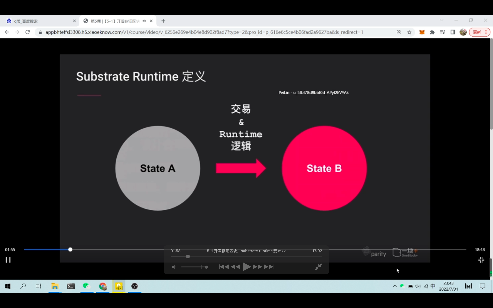
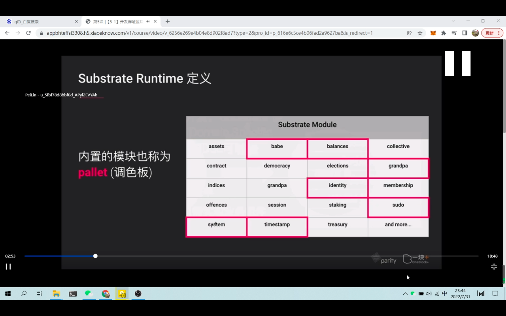
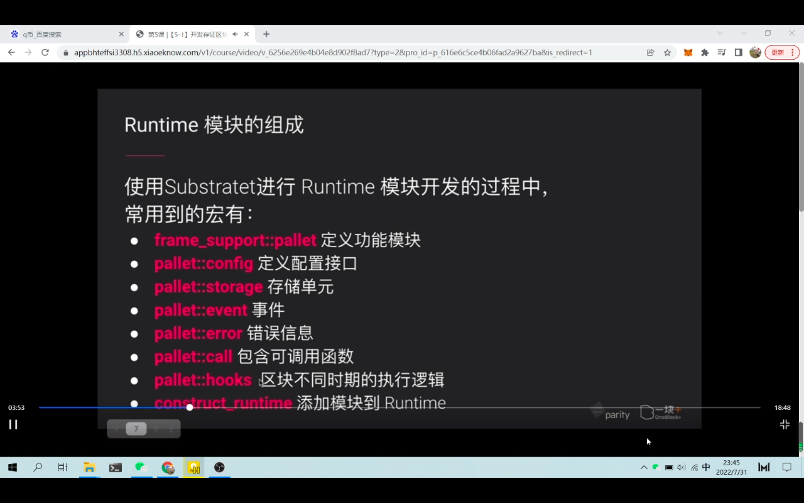
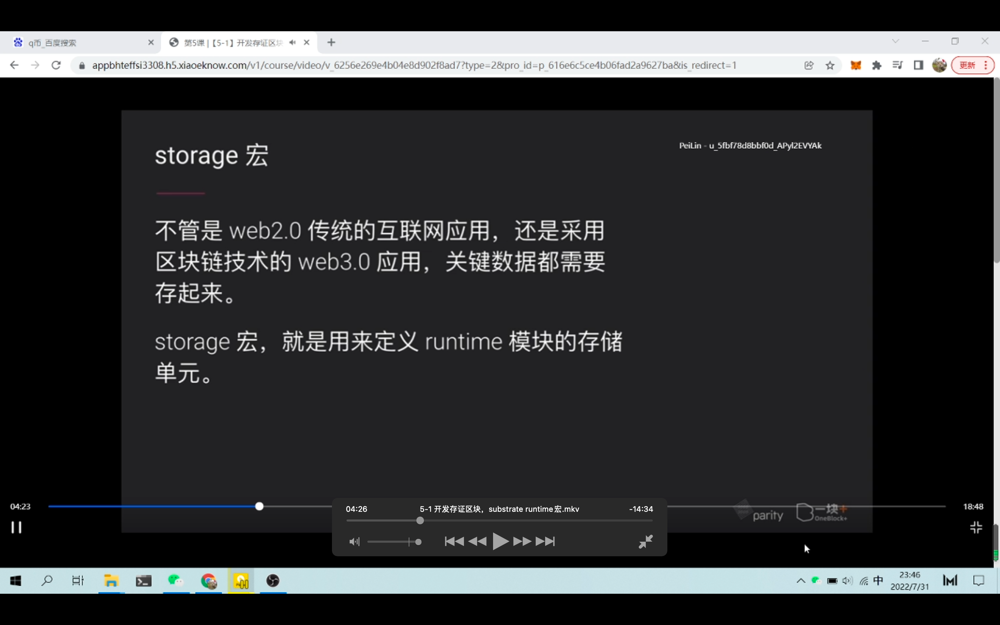
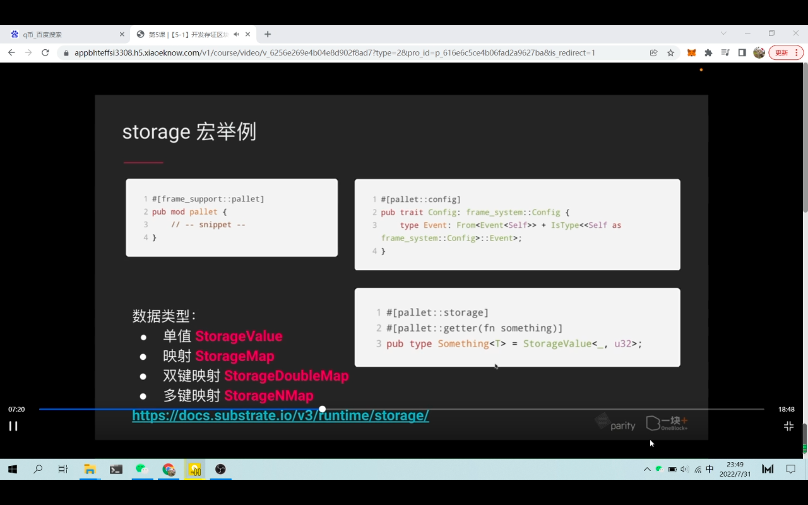
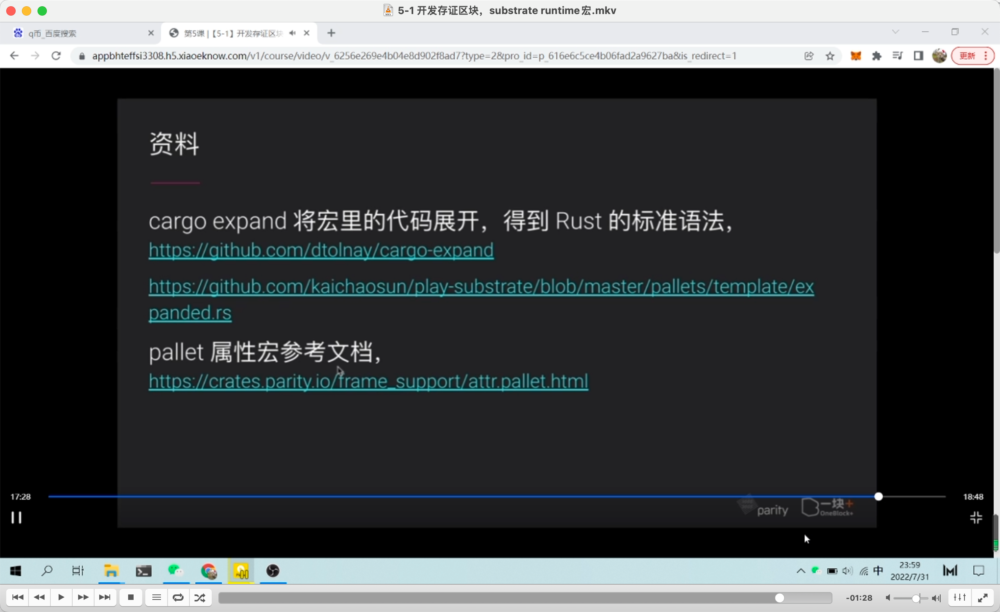
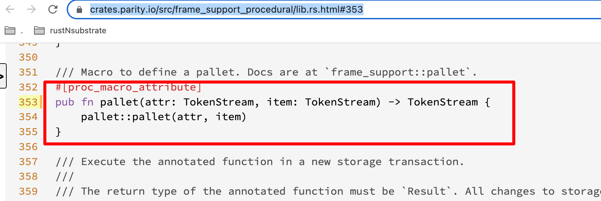
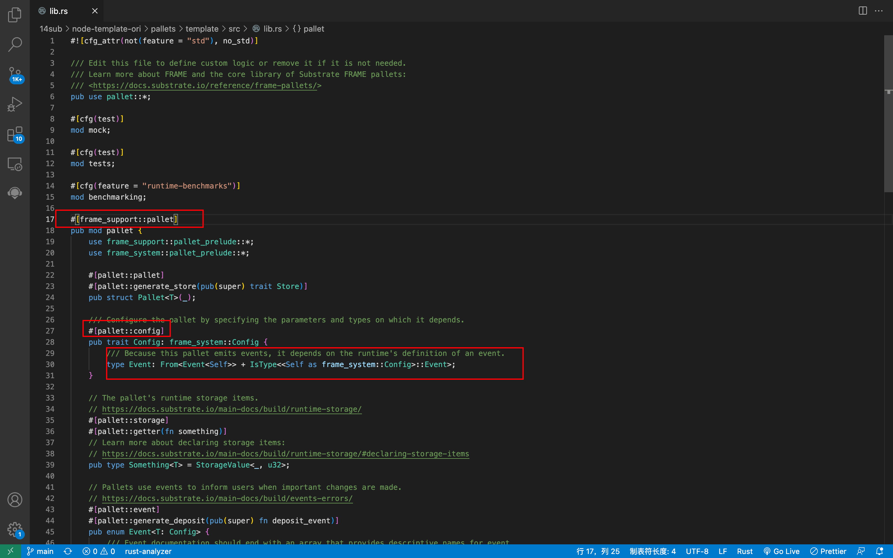
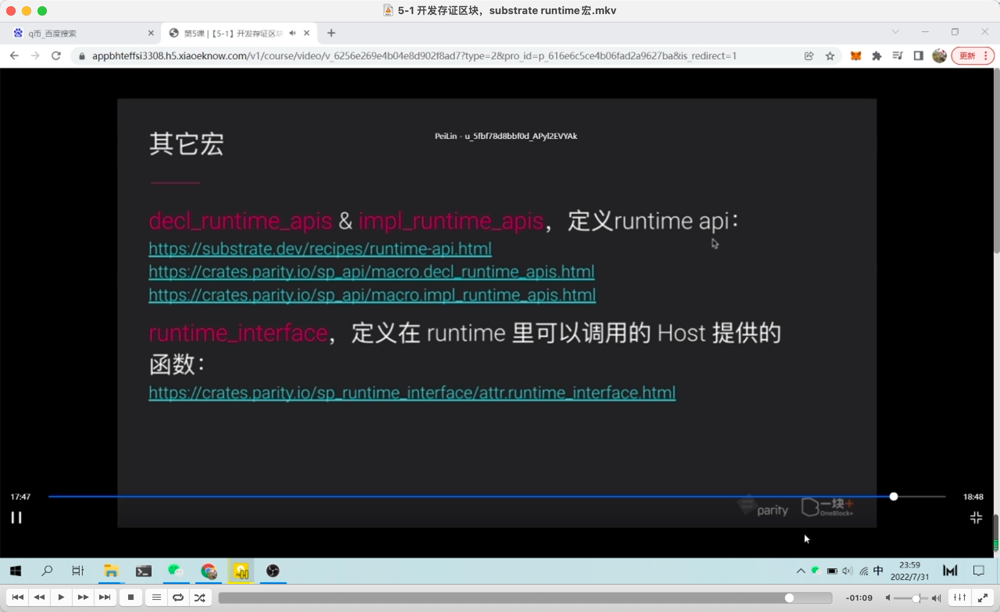

  
区块链里，区块的验证是通过链上逻辑进行校验，substrate 里把这个链上逻辑称为 runtime
a 到 b，通过交易触发，将交易信息应用到 runtime 逻辑层进行状态修改。

  
这些 moudule pallet，组成了 runtime？

  
模块开发常用的宏。

  
storage 宏，定义存储单元


以 storage 宏举例，怎么创建宏  
注意和标准 rust 语法可能不一样。

### 本节内容较多，之后内容暂不做笔记

### 以下是后来新增的笔记

## 220823

### 0400-1700 为各个宏的介绍，由于没有看到具体细节，较难理解，暂时略过，lllf

  
属性宏参考文档等
https://crates.parity.io/frame_support/attr.pallet.html


eee  
https://crates.parity.io/src/frame_support_procedural/lib.rs.html#353  
根据上方文档的 src，可看到 pallet 宏的定义，具体含义仍不清楚，lllf。

  
eee  
node-template 原版 pallet 示例  
可以看出 #[pallet::storage] 等小宏是#[frame_support::pallet]这个大宏的一部分？？？？  
此外类似以下的代码片段，现在看不懂没关系，因为他是更底层定义的，应该是固定不变的。

```
/// Because this pallet emits events, it depends on the runtime's definition of an event.
	type Event: From<Event<Self>> + IsType<<Self as frame_system::Config>::Event>;
```

  
其它宏

