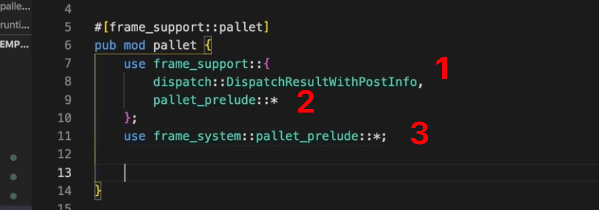

## 220823

  
内容

  
介绍

  
链接

## 220824

  
下载 nodetemplate  
以前是 3.0，最新第九期用这个

  
新建如图内容，lib.rs 暂空，cargotoml 复制粘贴 template 下内容。并作如图修改。

  
这里第九期 4.0 版本实际上已经引入了这个库

  
添加这段标签，意思是编译时使用 std 或者 nostd 两种形式，如果不是 std，则一定是 nostd

  
0700-1711，librs 里写创建和吊销存证的功能模块。mmmi  
以下为详细过程

  
1, 可调用函数的返回结果  
2，runtime 开发常用的宏  
3，系统模块，palletprelude 所需要的数据和类型信息

  
模块配置接口

  
定义一个 pallet 结构体承担功能模块  
generate_store 表示当前模块依赖一些存储单元

定义一个存储单元 proofs，用来存储存正  
key 是 vec《u8》，表示存储的 hash 值

### 之后的内容太多，暂时不做，需要了解时看视频

  
--=  
  
runtime cargotoml 引入以上两个

  
--=  
  
runtime lib 里做以上引入

  
poe lib 里暴露pallet里的功能组件，这样就能在runtime里进行引用       

## 之后还有报错，看视频进行修改即可     

