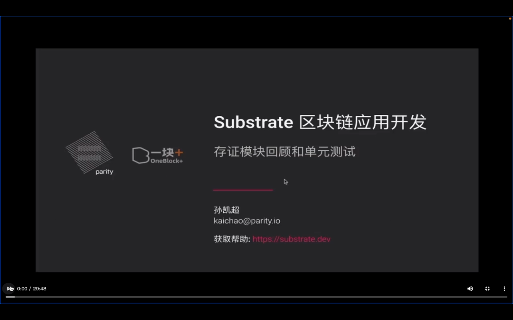
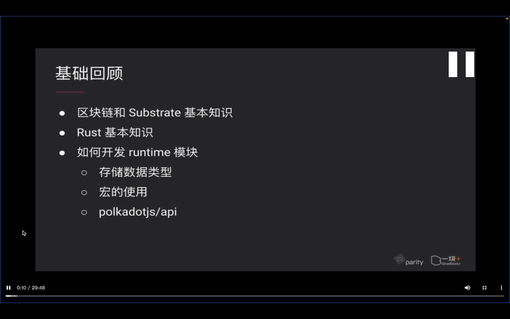
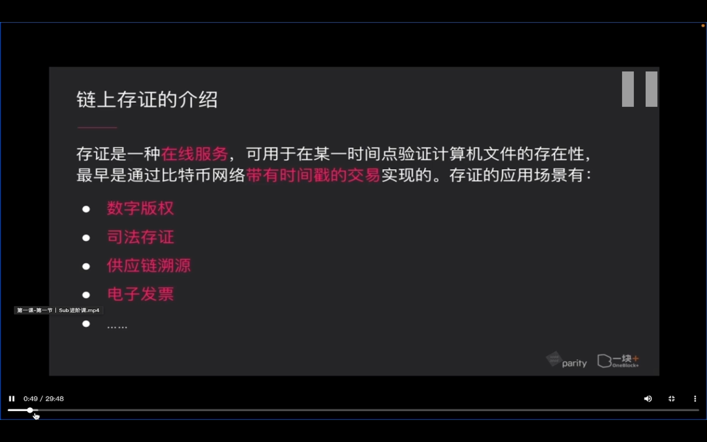
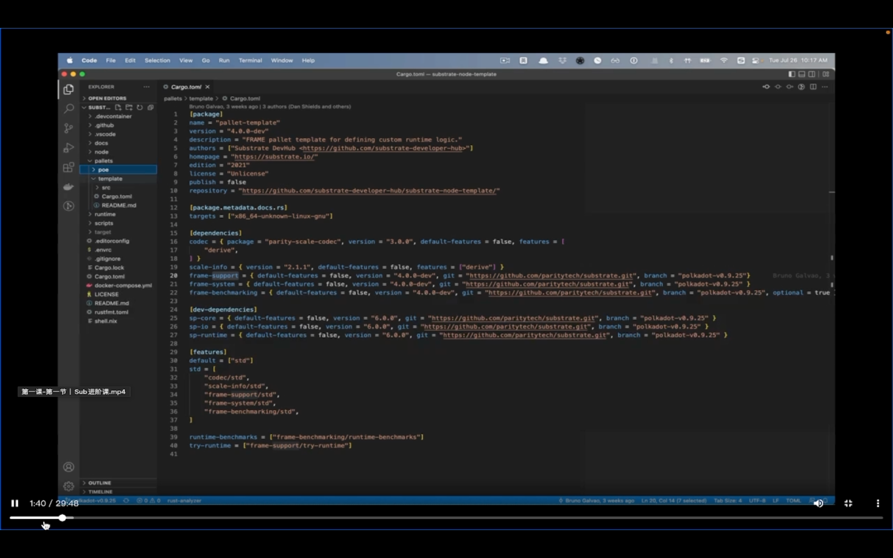
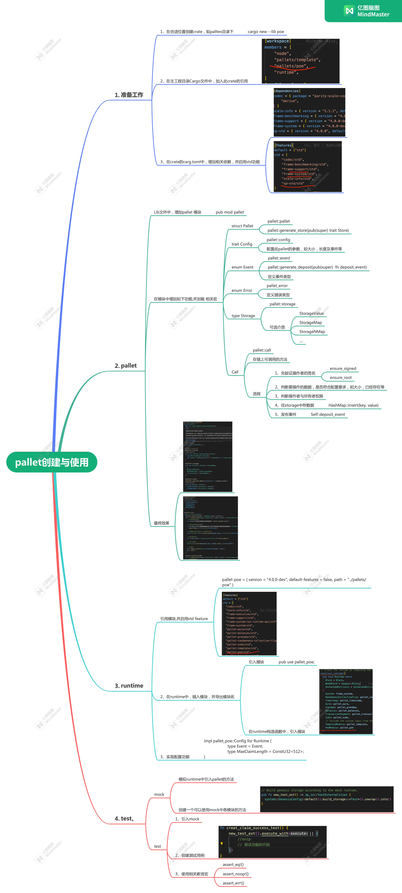

## 220827

  
本节内容  
存正模块回顾和单元测试

  
基础回顾

  
链上存证介绍

此课程代码版本 polkadot0.9.25  
git clone -b polkadot-v0.9.25 --depth 1 https://github.com/substrate-developer-hub/substrate-node-template ./925pokadot-substrate-node-template

## 220829

此课代码与笔记放在了 https://github.com/1in10k-com/substrateOneblockAdvance5poe

## 220902

  
同学做的这节课思维导图
