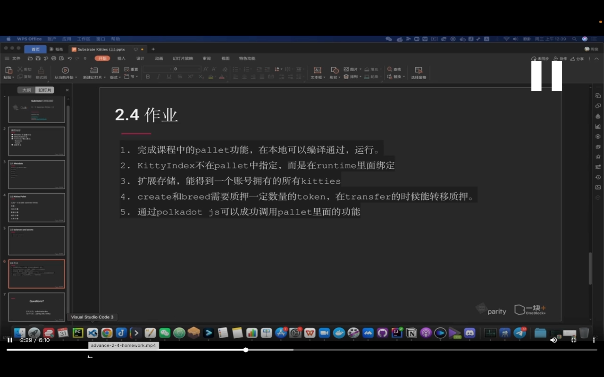
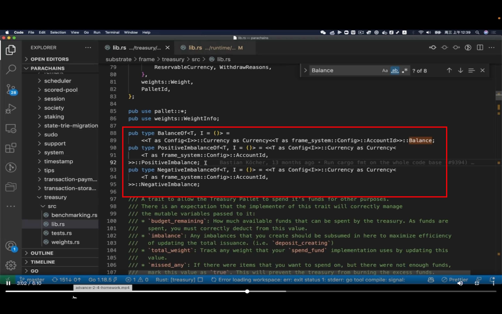
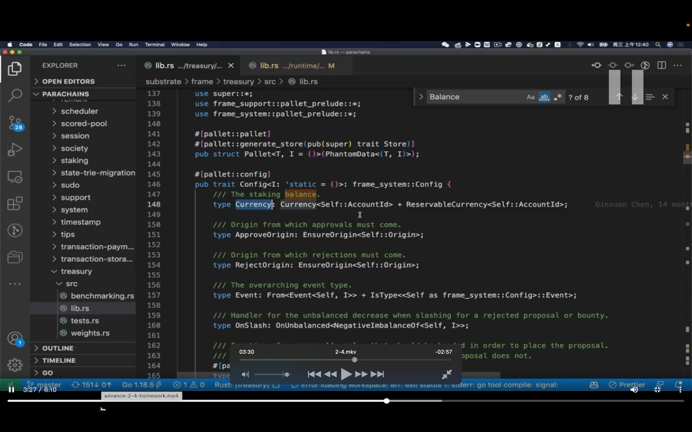
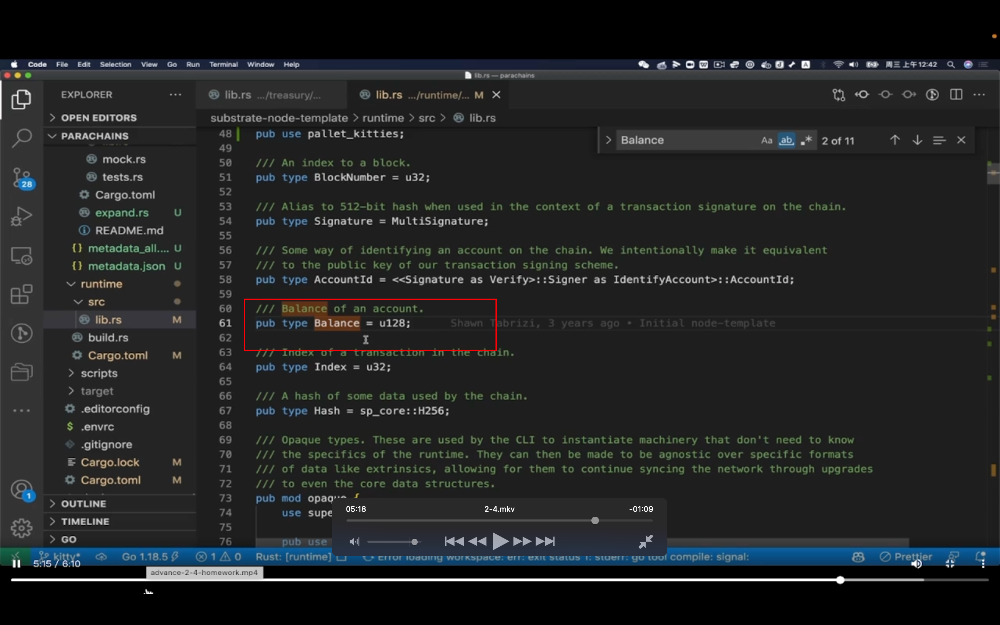

## 220904

  
作业

代码示例中讲一下怎么参考源代码。参考 treasury pallet  
这里是参考 BalanceOf 定义

  
看看这里 currency 怎么和属性绑定的。把 balance 这个 pallet 绑定到这个属性（type Currency）时，就可以调用它相关的方法。

  
这里的意思大概是 type Balance 不写在我们自己的 pallet 里，而写在 runtime 里，这样可以动态绑定（因为链上升级只能升级 runtime 不能升级其它 pallet？？？？ddda）。这期作业第 2 题也是这样的原理，参考这个 balance 来写 kittyindex。
