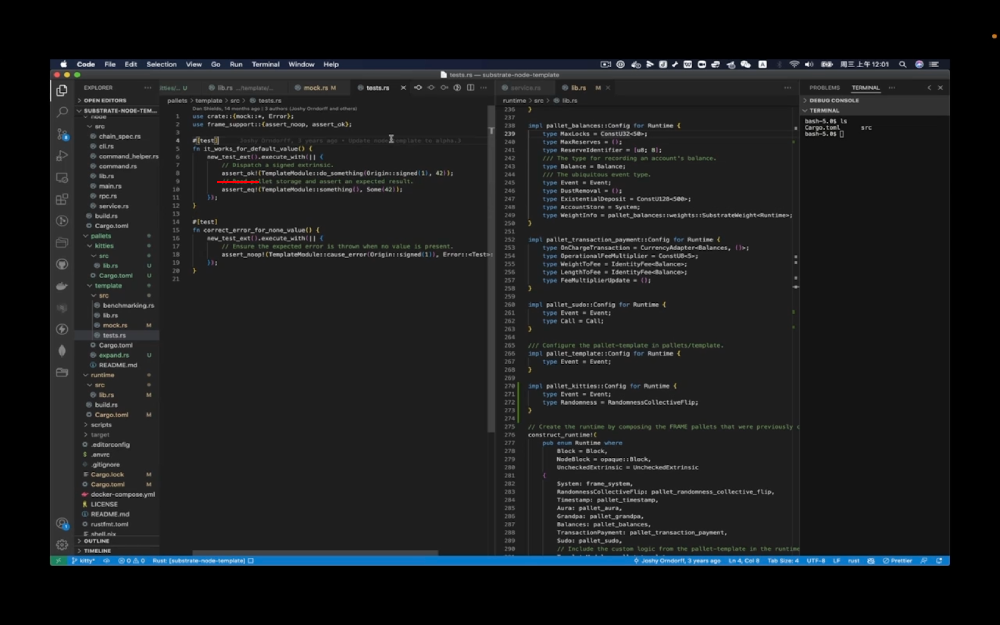

## 220911

  
mock 用于构建环境，tests 放测试 case，简单的测试也可以直接放 lib。

  
mock 中这两个参数 block，extrinsic 跟真实构建 runtime 的参数不太一样。是从 system::mock 包里取出来的。

  
只构建 system 和需要测试的 pallet？？？？

  
test 对应真实环境的 runtime。

  
绑定的 type 和 runtime 里绑定的 type 是完全一样的？？？？所以如果构建测试环境发现了错误，可以参考 runtime 里的代码。

测试时除了 runtime type pallet 之外，最重要是要有数据存储和数据更新环境。  
所以在此 fn new_test_ext 里，定义一个 build_storage 方法。构建一个基于内存的存储环境。  
这样 pallet 里定义的一些变量就能放到里面去。如果通过 extrinsic 对这些变量进行了更新，这里面会相应的 update。这些就是能做测试的基础。  
dddi

  
在 tests.rs 里的测试用例里，首先需要 new_test_ext 构建测试环境。  
通过 excute_with 方法执行里面的匿名函数，也就是个闭包？？？？  
templateModule 这个 object 就是 template_pallet 的一个实例。  
通过此实例调用方法，如这里的 do_something（它就是个 extrinsic）  
之后的 oringin::singed（1） 是一个写死的签名，后面的数值 42 是调用方法需要的值，也就是参数？？？？

  
--=  

因为调用的正常返回值是 ok，所以使用 aseert_ok 宏？？？？

除了 extrinsic 之外的，比如它只想验证链上状态，那就调用链本身提供的 getter 函数

  
接上条，比如这里的 something 就是 lib 里定义的 getter 函数，dddi  
assert_noop 宏是判断交易是否抛出错误，而且错误类型是否和右边的一致。
所以接上上条，总共可以覆盖到测试的 3 个点，1 是调用一个 extrinsic，2 是 get 链上某个状态值，3 是捕捉错误，并比较错误是否如期望一样。  
dddi

1100-1511，为 kt 写 mocks

1511-1920，为 kt 写 tests。一般 tests 才用 std，因为一般测试时是 rust 原生代码执行环境，实际上的链是 wasm 上执行，它是 no_std 方法。std 方法是没有编译到 wasm 上的。
