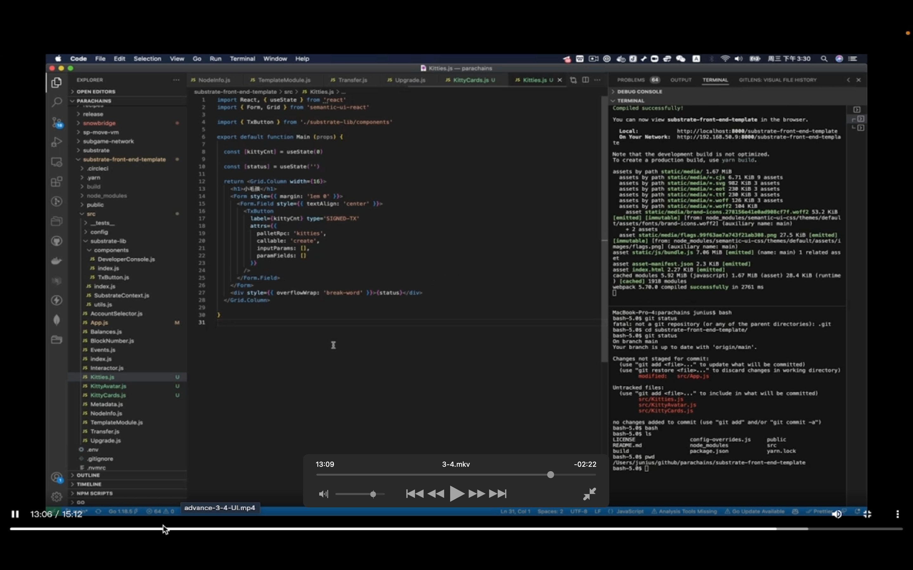

## 220911

  
polkadot.js

  
substrate-front-end-template，比 polkdadot 更简单。它们都用 react 框架

  
substrateContext。包含了整个项目所要运行交互的内容。

  
accountselector，对账号进行切换，发送交易时可选择不同账号去签名

  
appjs 是整个程序的入口

  
grid 分布页面

  
balances 显示账号余额。

  
blockNumber，侦听最新产生的块。

  
event，显示链上最新产生的 events

  
interactor 较复杂，会把所有交互列出来。

  
metadatajs，它可以把 metadata get 出来，显示在单独界面中。

  
nodeinfo，显示链的名字，版本号等，每个单独 pallet 可以单独区域显示方法或状态。

  
transfer，币转移，upgrade，链升级。

  
具体前端介绍

  
这里展示拿到 kt dna 后，怎么在资源里选取不同的 img。

  
cards

  
kitties 是一个框架

appjs 里引入 kts。之后页面就能显示部分 kts 内容了，作业就是添加这些内容让整个 dapp 更完善。
