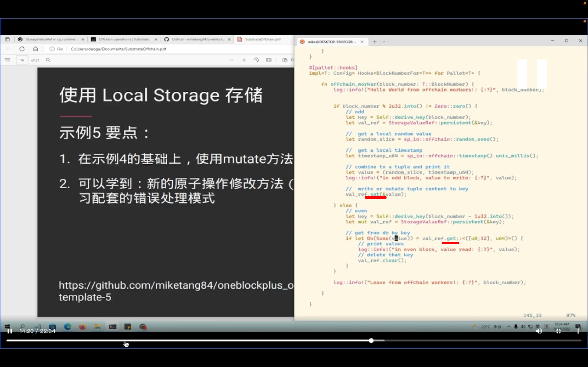
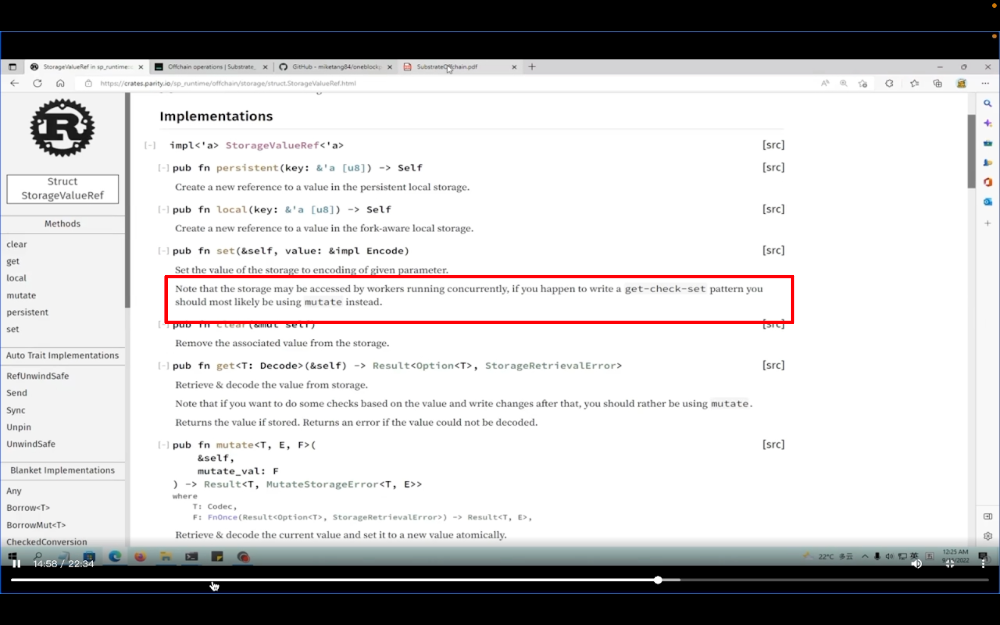
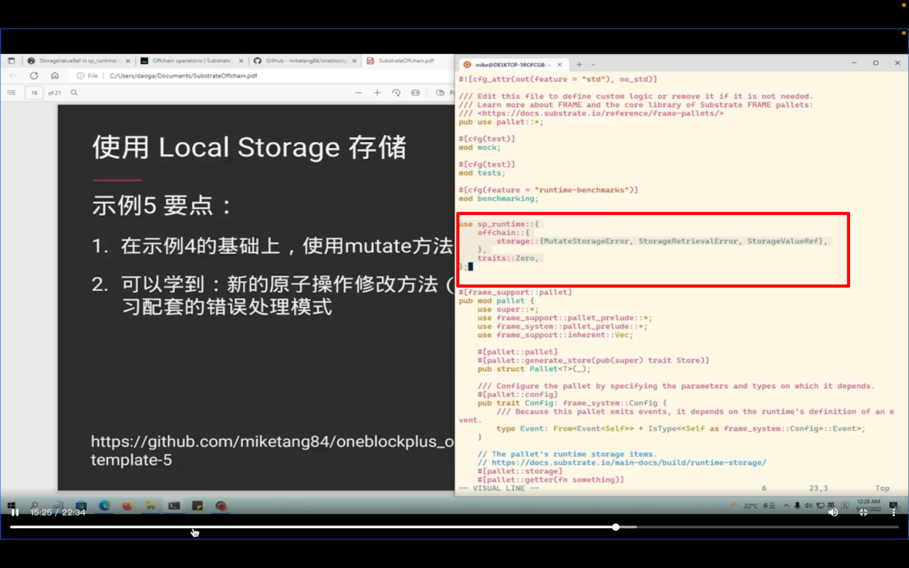
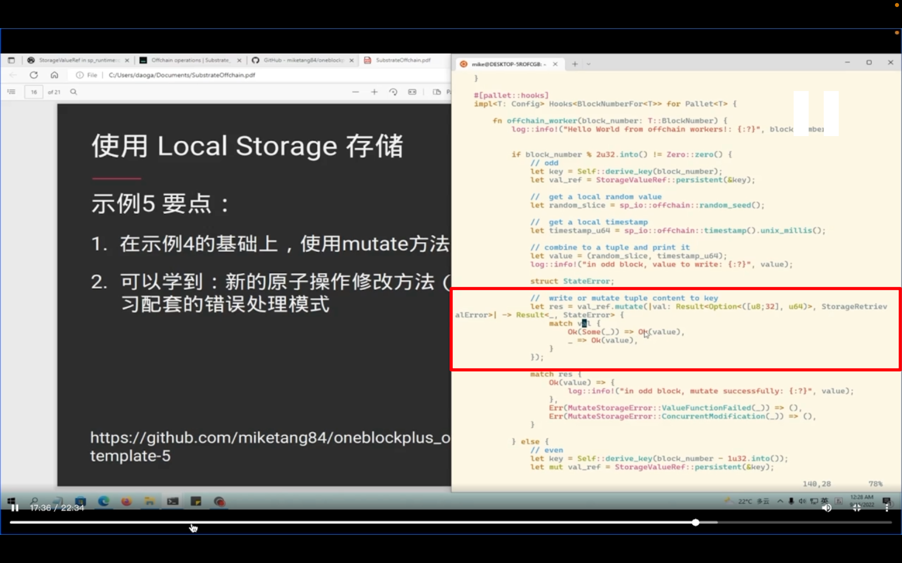
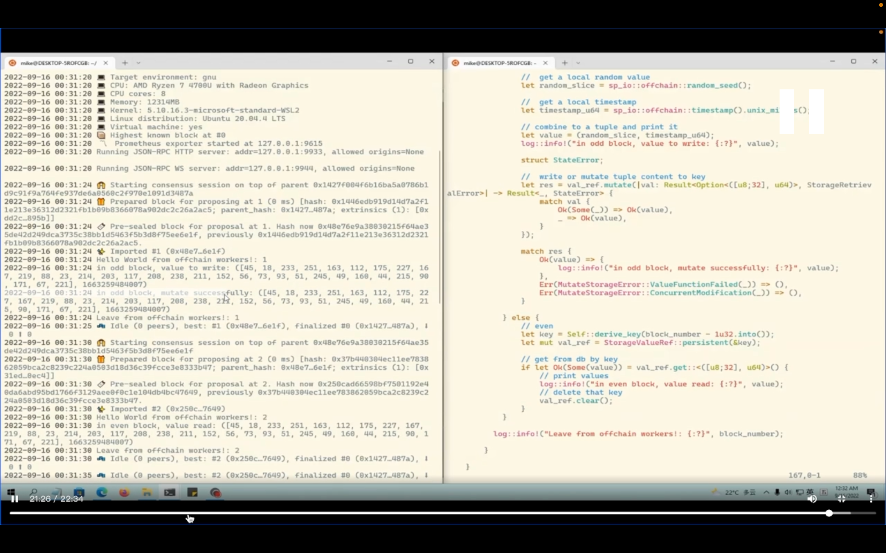
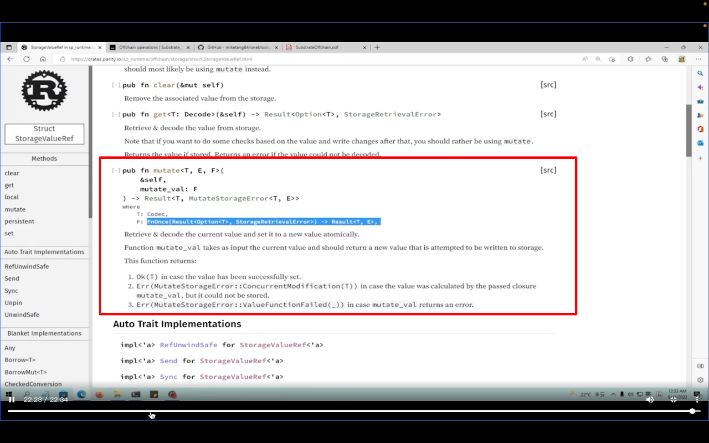

## 220917

  
local storate 使用
local storate 就是 offchain storate

  
官网有介绍 index

  
示例，如何使用 LS

  
--=  

ooov 0315-1030
为什么不直接写 0，而要 zero zero。ddda

  
奇数和偶数块不同信息。奇数块写入，偶数块读取

  
示例 5

## 220918

  
回顾示例 4，往 LS 里写就是 set，读就是 get。  
这种写法有局限

  
官方解释，并发的情况下，不推荐用以上方法，用以下的 mutate

  
引入这些依赖

  
详细解释 mutate 写法 ooov

  
效果展示，跟示例 4 一样，只是代码写法不一样

  
mutate 源码
