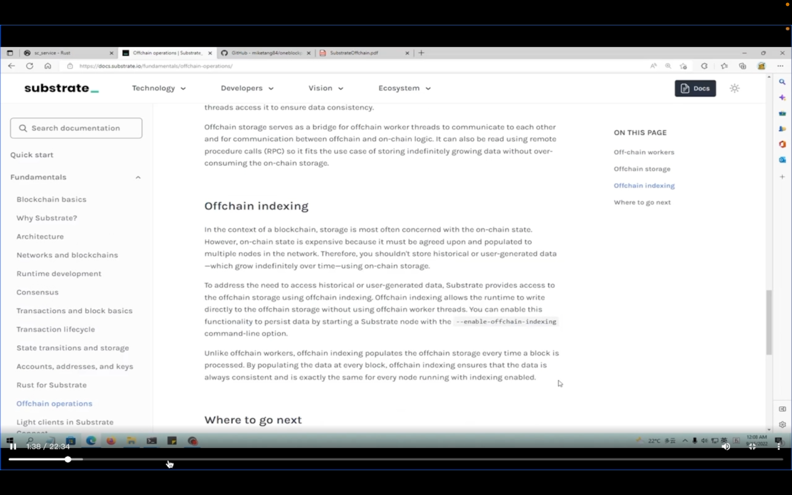
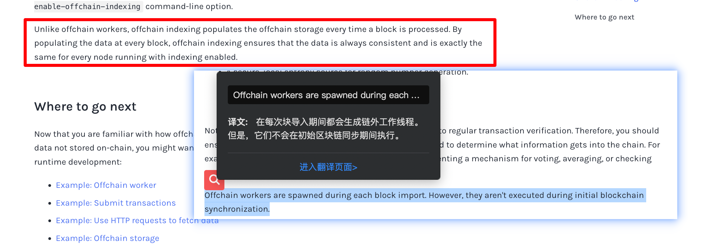
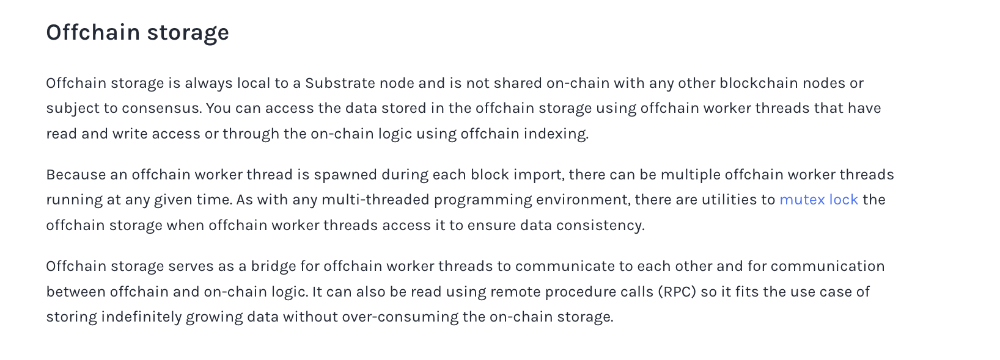

## 220917

</img>  
local storate 使用  
local storate 就是 offchain storate

</img>  
官网有介绍 index  
add220923 重点：链外索引允许运行时直接写入链外存储，而无需使用链外工作线程 OFW。  
启动节点时加上--enable-offchain-indexing 来开启此功能

</img>  
add220923，接上图，这段话意思可能是 OFW 在每个区块 import 后就执行，而 OFI 是在区块 processed 后执行

</img>  
add220923，增加 Offchain storage 这段  
1，OS 是独立于每个节点的，可以通过 OFW 这个有读写权限的东西来访问 OS，或使用 OFI 这种使用链上逻辑的方式来访问。  
2，因为每次 block import 时都能生成 OFW 线程，所以同一时间可能有很多 OFW 正在运行。与任何多线程编程环境一样，当 OFW 访问 OS 时，可以使用互斥锁来确保数据的一致性。（大概是一个线程在写入数据时其它线程无法同时写入数据）  
3，OS 作为 OFW 之间通信以及链外逻辑和链上逻辑之间通信的桥梁，还可以使用远程过程调用(RPC)读取它，因此它适合存储无限增长的数据而不过度消耗链上存储的用例。

</img>  
示例，如何使用 LS

</img>  
--=  
</img>  
add220918  
b"node-template::storage::" 是自定义的内容，估计类似随机数的 seed，其它不用管，当模版就是  
返回 vec u8，因为 substrate 不推荐 string 类型

</img>  
奇数和偶数块不同信息。奇数块写入，偶数块读取

</img>  
示例 5

## 220918

</img>  
回顾示例 4，往 LS 里写就是 set，读就是 get。  
这种写法有局限

</img>  
官方解释，并发的情况下，不推荐用以上方法，用以下的 mutate

</img>  
引入这些依赖

</img>  
详细解释 mutate 写法 ooov

</img>  
效果展示，跟示例 4 一样，只是代码写法不一样

</img>  
mutate 源码
