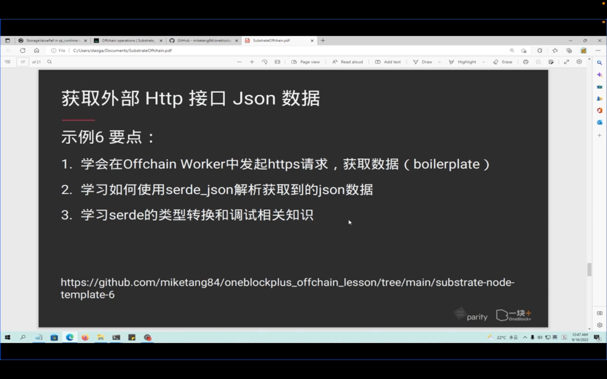
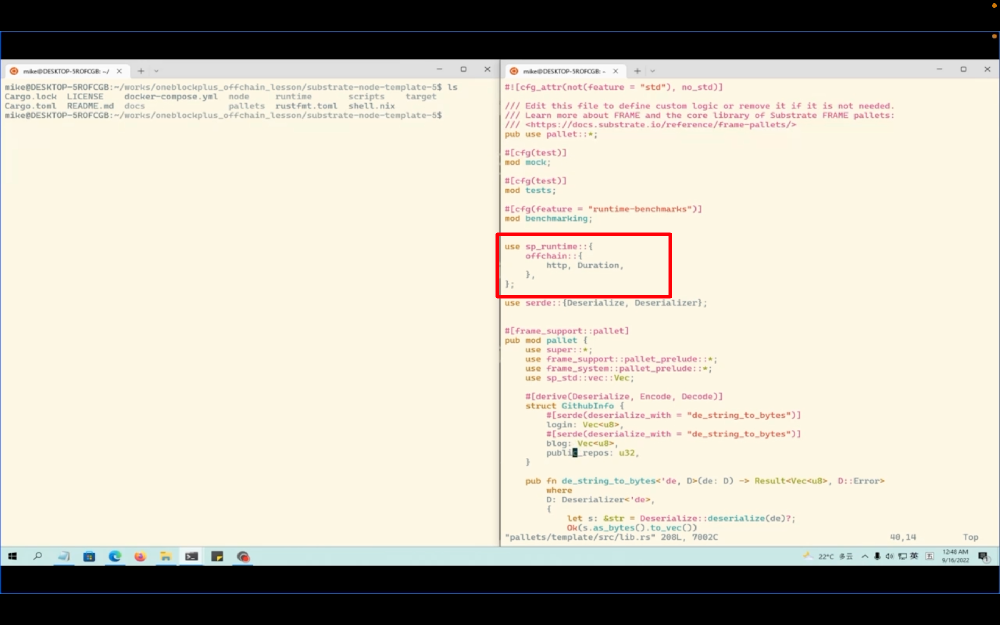
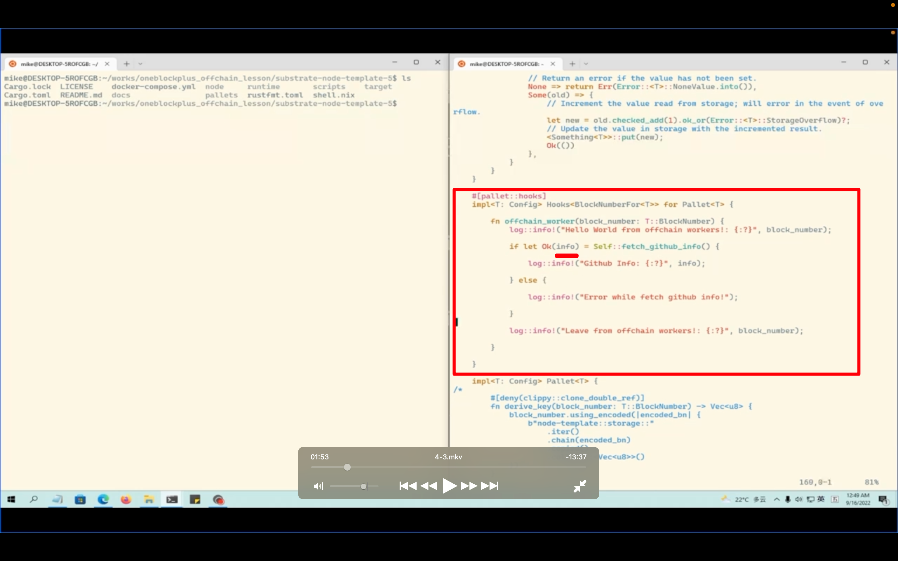
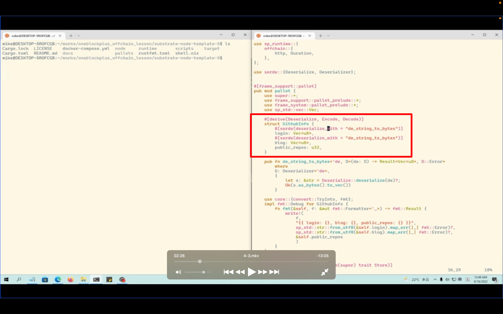
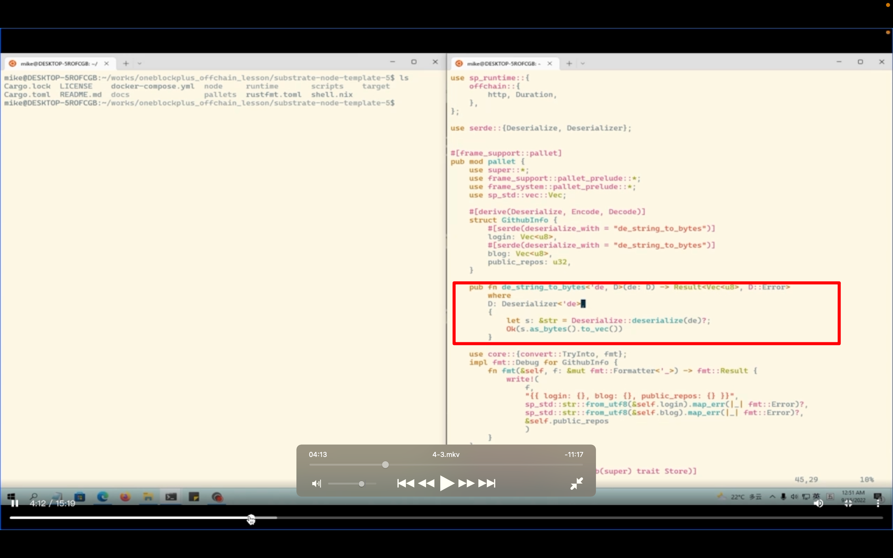
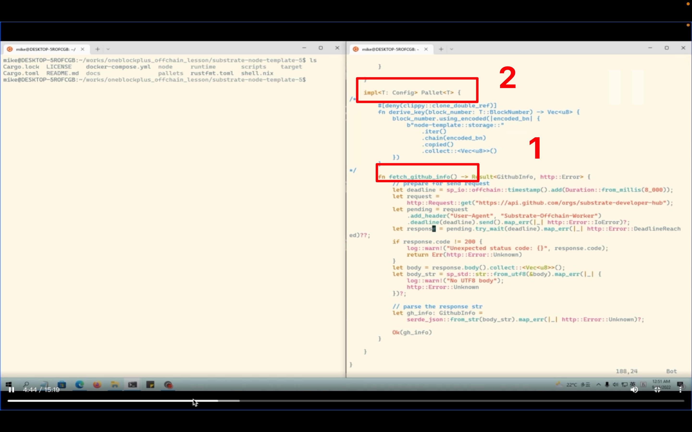
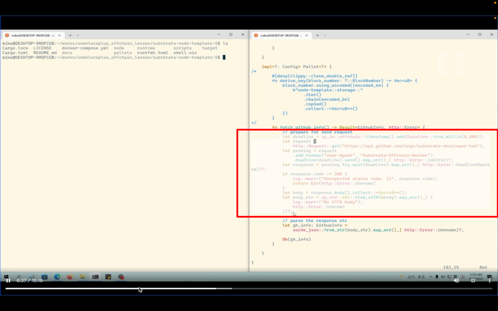
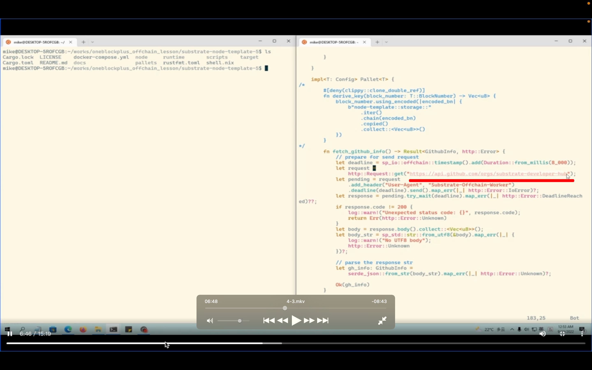
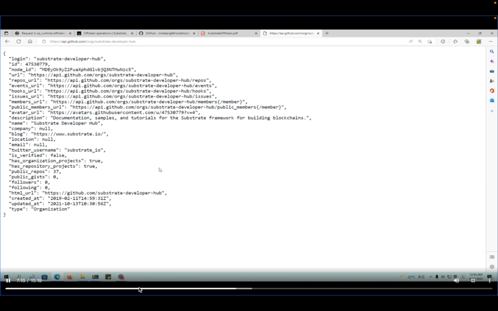
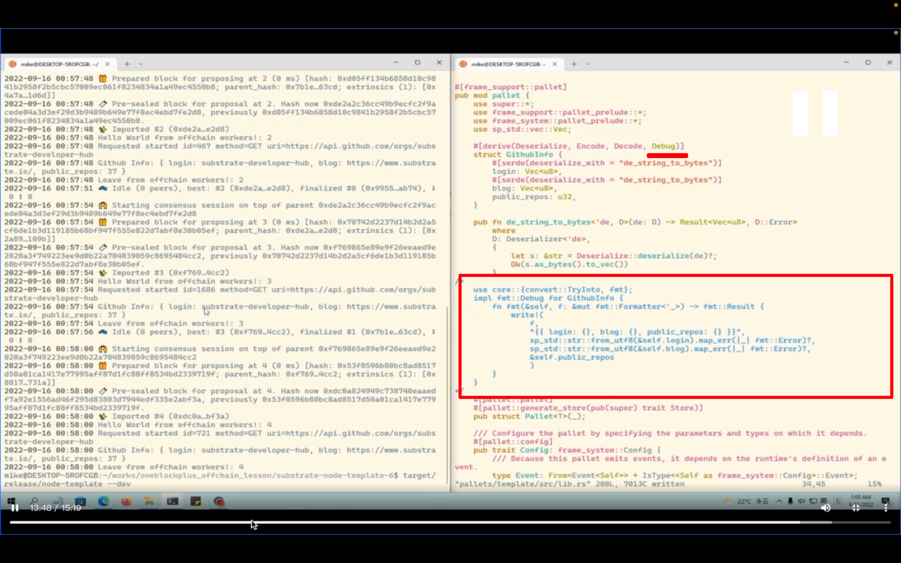

## 220918  
  
    
示例 6 要点  
  
    
引入此依赖，6 示例只需要在 5 示例基础上改此文件 template/src/librs  
  
    
获取一个 github 仓库信息，返回 info，info 是一个 GitHub 的结构体，我们自己定义的  
  
    
githubinfo 结构体，定义在当前文件的    
deservalize ooov    
login blog，常规是用 string，但在 substrate 里，但为了链上链下 storage，都是用的 vec u8  
  
    
ooov ddda  
  
  
1，之前用到函数的具体代码    
2，一般把辅助函数写到这个块里  
  
    
这一圈是模版代码，照抄就是了  
  
    
--=    
    
访问的信息是个 json 结构体    
之后还有此辅助函数介绍，ooov    
返回信息很多，但 serde 只取一部分信息 dddf    
大部分代码不用动，8000 是超时时间，只用修改链接和最后需要的类型设置好就行  
  
    
最终效果，以及 vec u8 为啥能打印出来，以及修改另一种形式打印  
