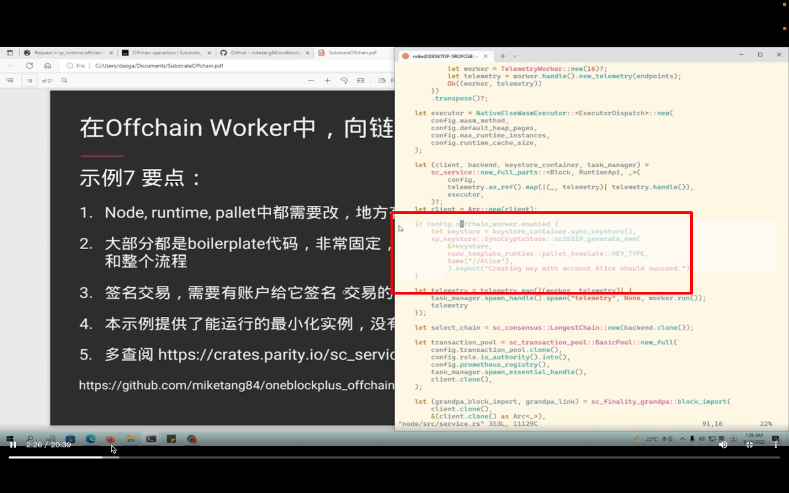
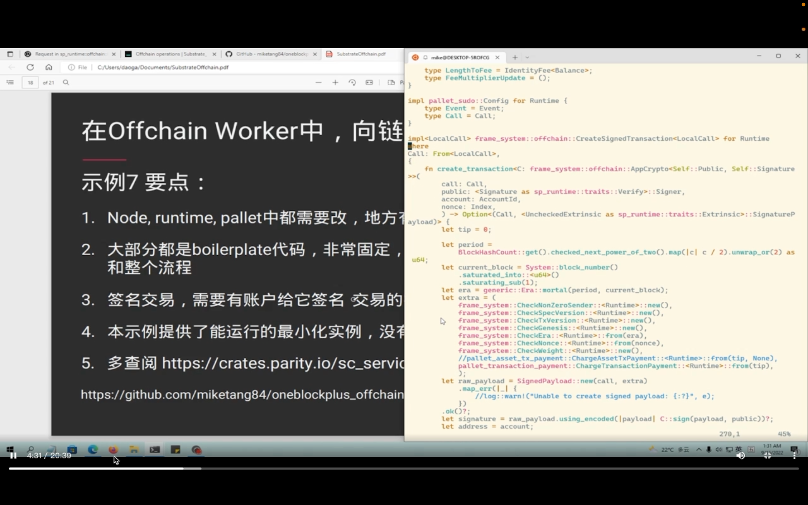

## 220918

</img>  
示例 7 要点

</img>  
node/src/servicers 中添加如图样板代码  
alice 有 sudu 权限  
代码意思是注入账户，之后 pallet 才能用，目的是 pallet 链下使用，具体 ooov

</img>  
runtime 里添加到几段样板代码，截图显示不全，看视频 ooov

</img>  
OFW 只是调起一个函数，用此函数才能真实的产生交易

</img>  
获取到真实的账户

</img>

0610-1500 都是在说 pallet/\*/librs 里的代码  
此处是发交易相关的依赖

</img>  
key type 这段没听太懂

</img>  
样板代码，引入密码学库的东西来生成一些东西

</img>  
--=  
</img>  
唯一重点是，图一图二的联系，图二是 runtime 里的代码实例化 authorityid。视频也没说太清楚  
很多都是样板代码，其实可以优化得更好

</img>  
call 里定义这个 submit_data，就是普通的一个 call，交易来了发交易调起这个函数？？？？  
没有太多逻辑，就打印下传入的参数

</img>  
ocw 里定义一个 payload，下排代码发送签名交易

</img>  
上图中所说的代码定义在辅助函数区

</img>  
这段的意思是去刚才的 keystore 里找那个账户，因为只注入了 alice，所以 signer 就是 alice，但后面说 singer 是个 vec。

</img>  
这里为什么用花括号，是因为宏把这个 call 转化为了一个大的枚举，枚举里有不同的字段，把方法名变成了字段，这字段里又包含了具体的结构体，把参数变成了结构体的字段了  
submit_data 是枚举的一个变体 lllf  
这里有个结构体的 match pattern 语法 lllf  
let results \* 就是发起签名。results 是签名的结果。  
因为 signer 是个 vector，所以 results 也是个 vector，所以后面用 for 来处理。所以是 ok 就提交，如果是 error 就做错误处理  
之后还有一些讲解，ooov，这样最后成功从 ofw 里朝链上发起了一个交易。

</img>  
--=  
</img>  
--=  
</img>  
ofw 不能直接调用 runtime 中的 call 方法的。  
比如不能图一这样 pallet::submit_data 这种形式去调用这个 call  
而是图二这样用 singer.send_signed_transaction 这样的形式，并把指定方法名用传参的形式放在 call::后 dddi  
再通过图三 runtime 里？？？？这样的来发起一个交易 dddf

</img>  
结果显示和讲解 ooov
