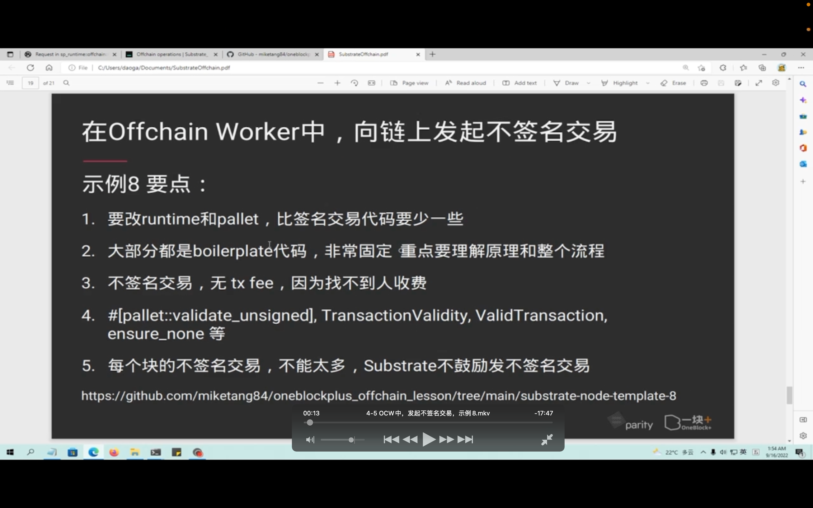
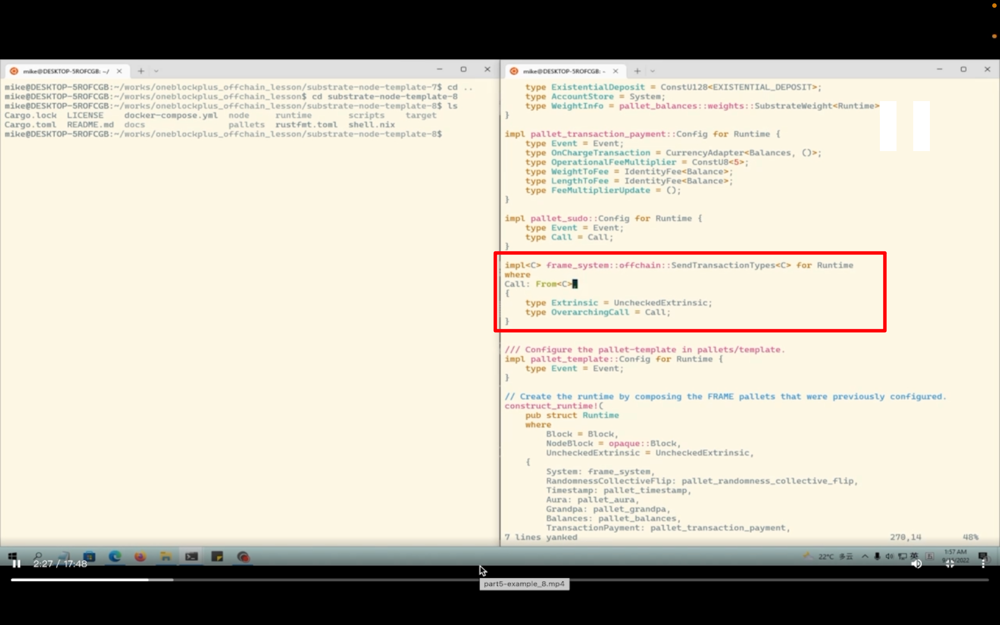
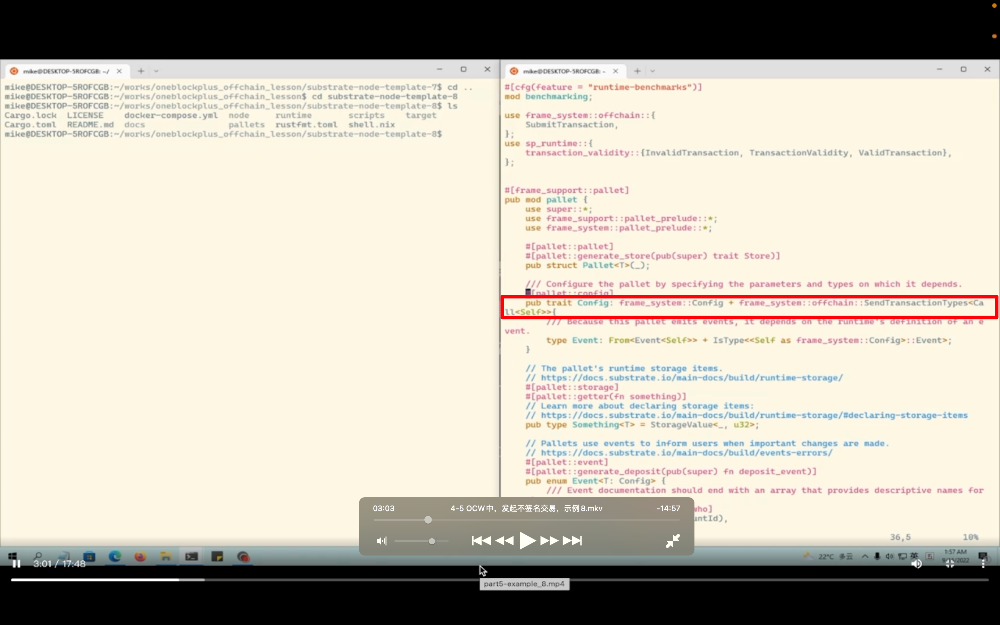
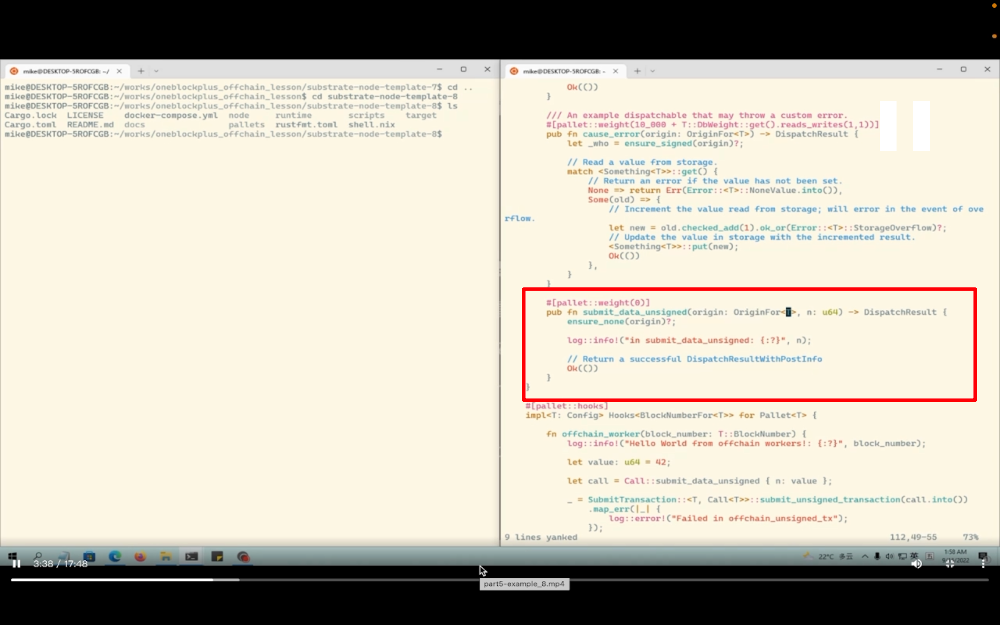
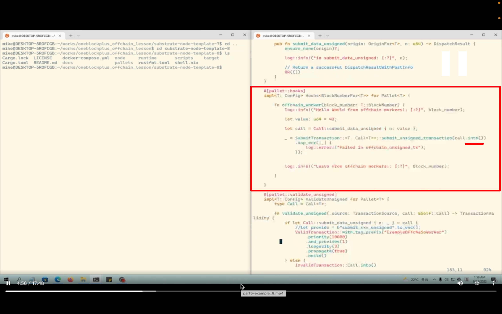
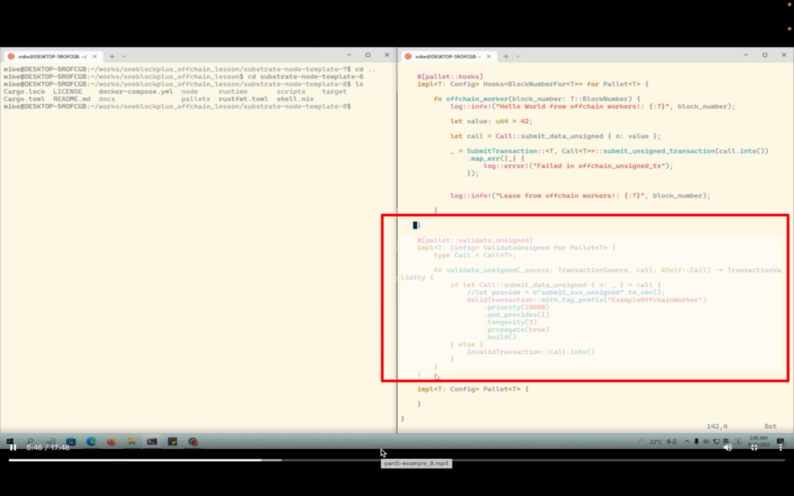
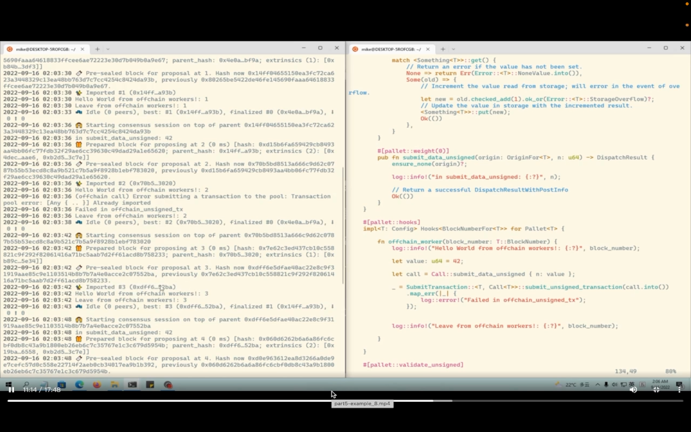
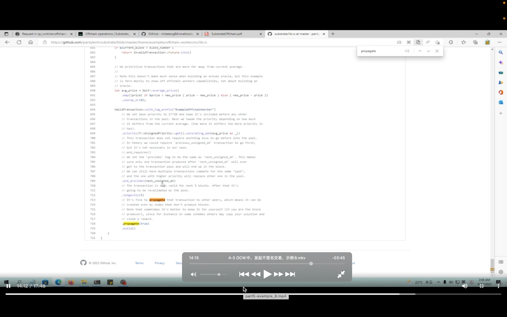
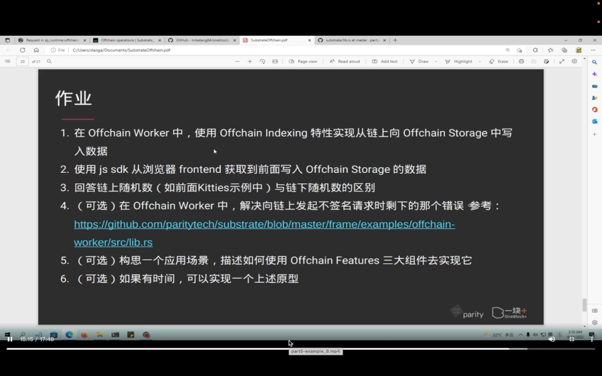

## 220918

  
示例 8 要点

  
runtime 里只用加这部分，实现如图 trait

  
pallet 里，除了依赖外，还有这个 sendtransactiontype，4-4 中这个部分也要加，忘讲了，叫 createtransactiontype。固定写法，不要搞懂为什么

  
在 runtime 里（可能口误）？？？？还有这段代码  
没有 origin，所以 ensure none

  
加这段 ooov  
.into 是转换为参数需要的类型的意思

  
默认禁止未签名交易，所以还得加这块  
因为未签名，所以怎么验证有效应就完全交给此图的 fn \*，程序员自己定义  
签名交易必须传播到其它节点，非签名交易可以传播是否传递到其它节点
ooov

  
查看效果，会有个小 error。ooov

  
这个是官方的未签名交易实现，可以参考来恢复上方的错误

  
作业
