## 220924

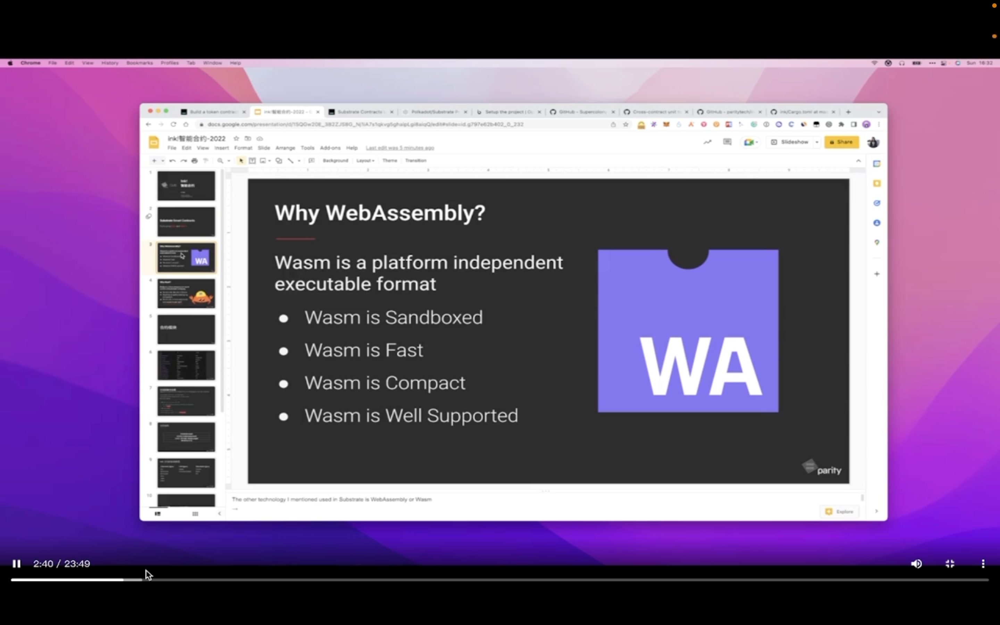  
--=  
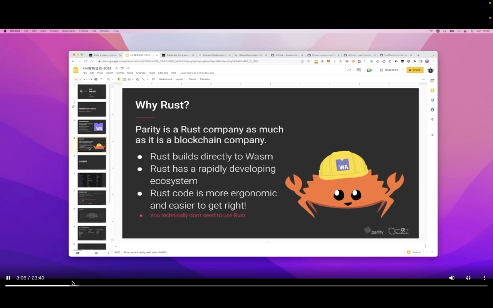  
此次用 4.0.0alpha 版本  
ink 是 rust 写的 dsl，能编译成 wasm，此 wasm 能在 substrate 上运行  
rust 已有各种库，只要这些库能编译成 wasm，都能拿给 ink 用，这是相比 solidity，move 等的优点。如能原生的解析 json 文件，实现 zk 等

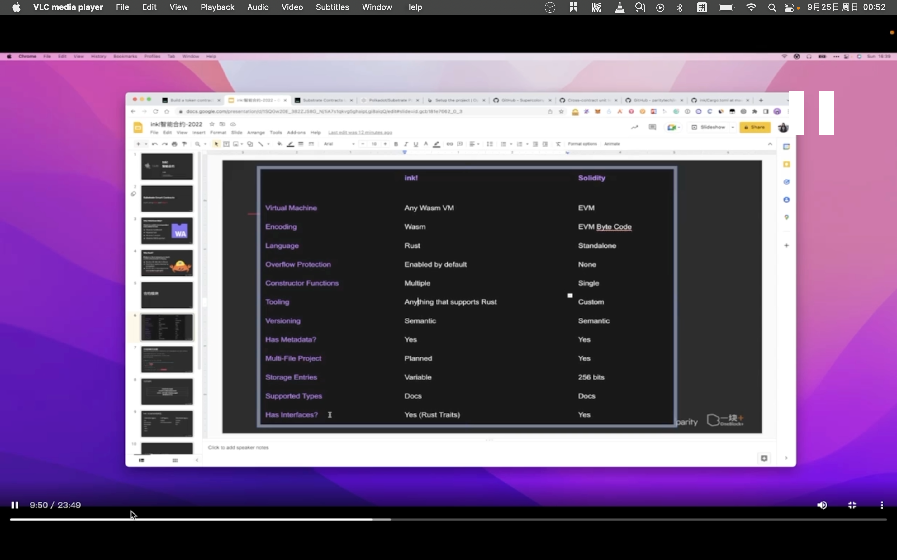  
ink solidity 区别

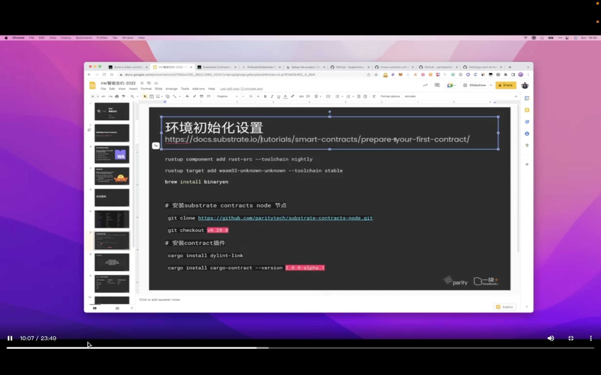  
--=  
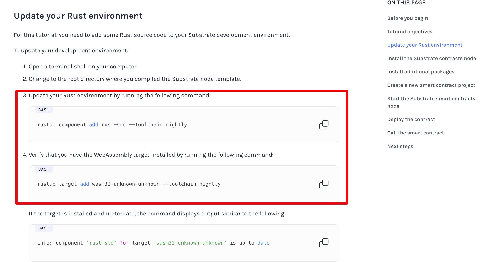
https://docs.substrate.io/tutorials/smart-contracts/prepare-your-first-contract/  
https://github.com/paritytech/substrate-contracts-node.git
初始设置  
只有 rustup component add rust-src --toolchain nightly 是安装，rustup target add wasm32-unknown-unknown --toolchain nightly 只是 verify  
官网和截图有区别，如果是 mac 系统，以截图为准  
cargo-contract 生成编译 ink 合约，而安装 cargo-contract 需要 dylint-link 依赖  
cargo-contract 2.0.0 匹配 ink4.0.0

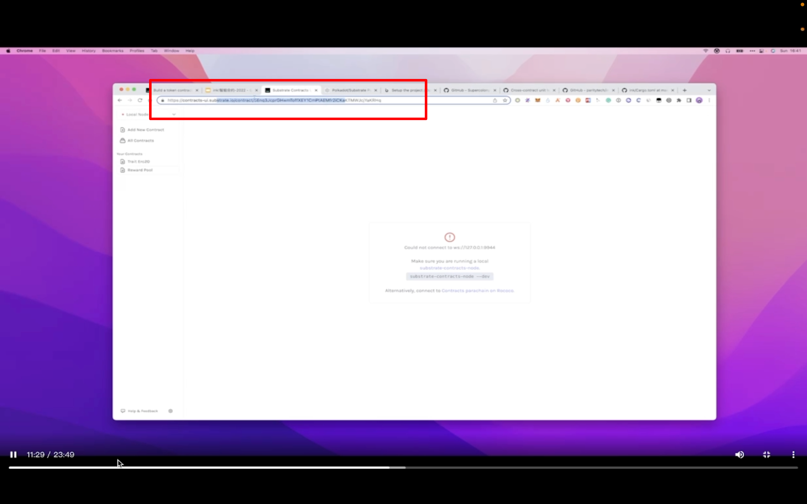  
前端  
https://contracts-ui.substrate.io/  
polkadotjs 也行

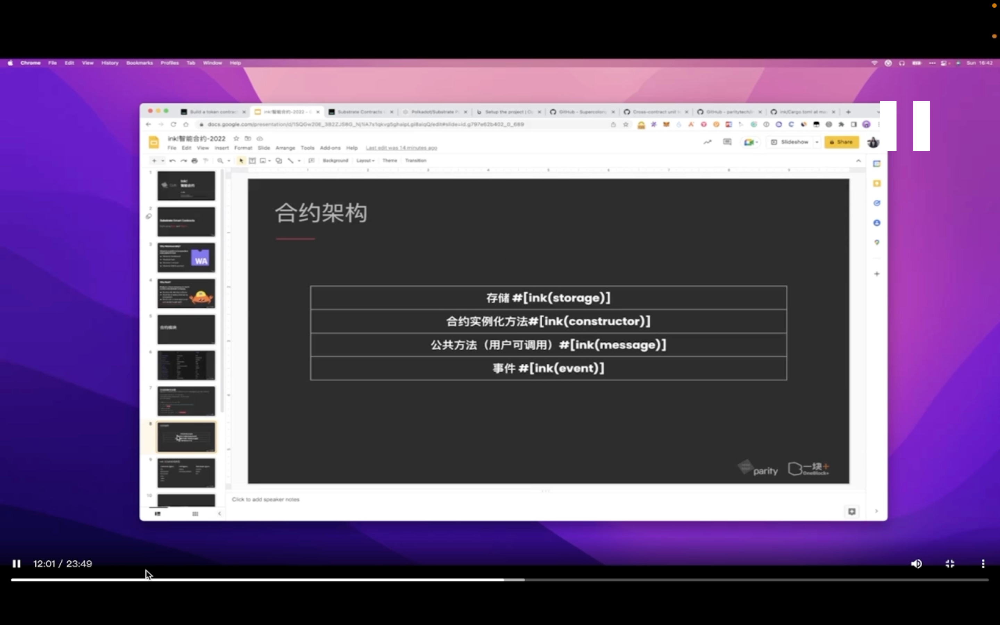  
合约架构  
类似 soldity

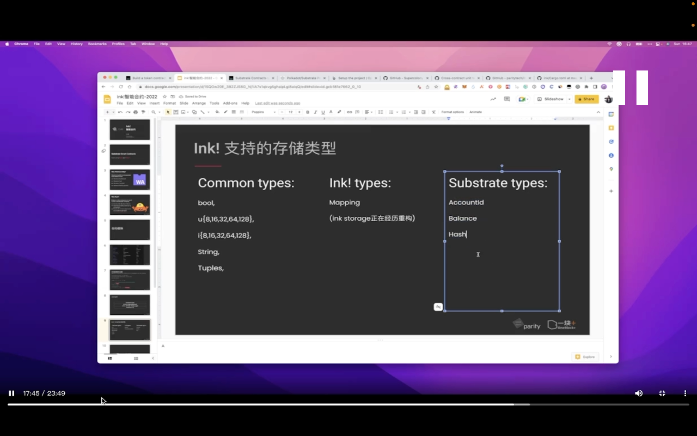  
支持的存储类型，正在变动中

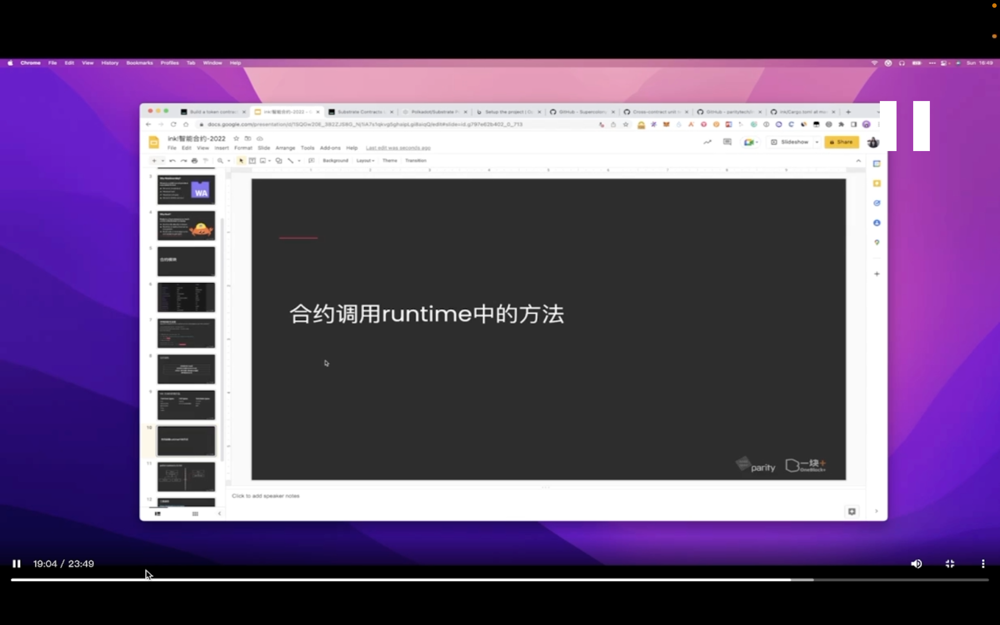  
ink 可以使用 runtime 里写好的一些方法

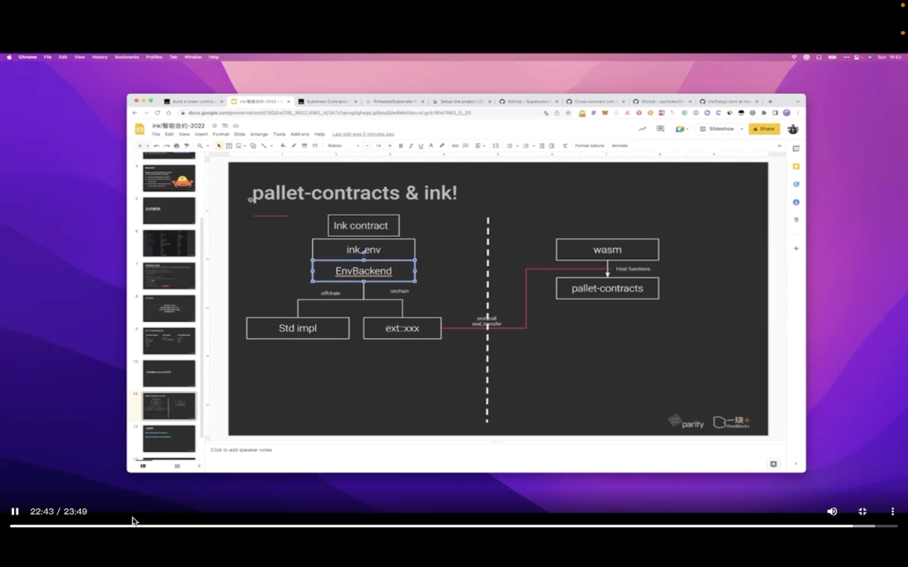  
lllf

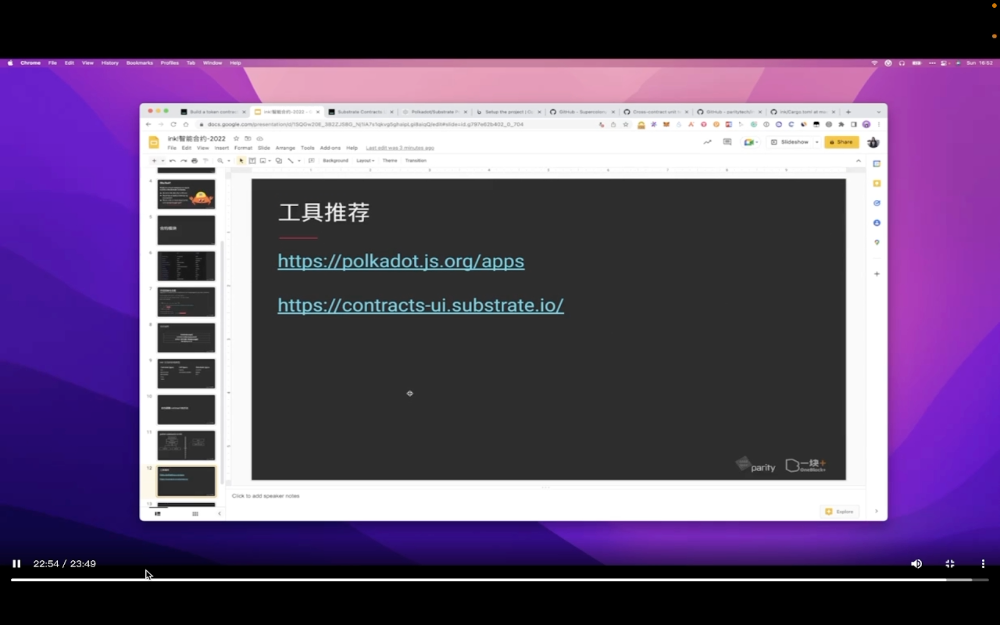  
工具推荐
