## 220924

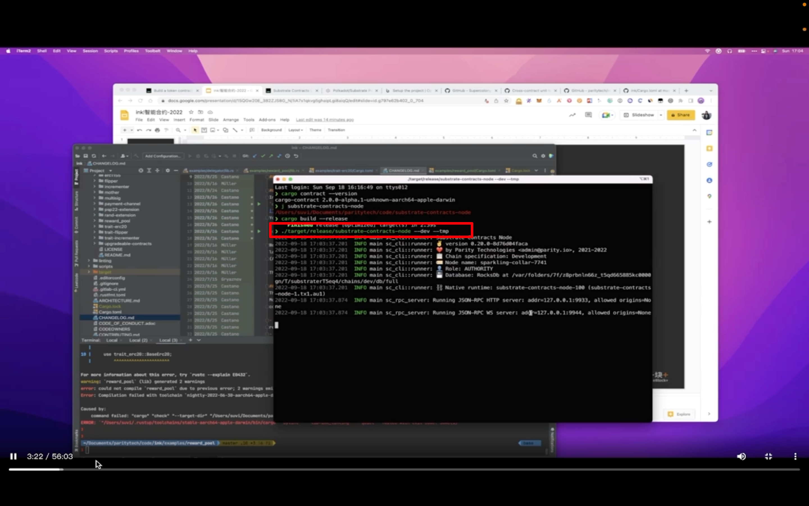</img>  
启动上节课准备好的环境，启动后就不动了，因为共识不一样，这个是交易后才出块

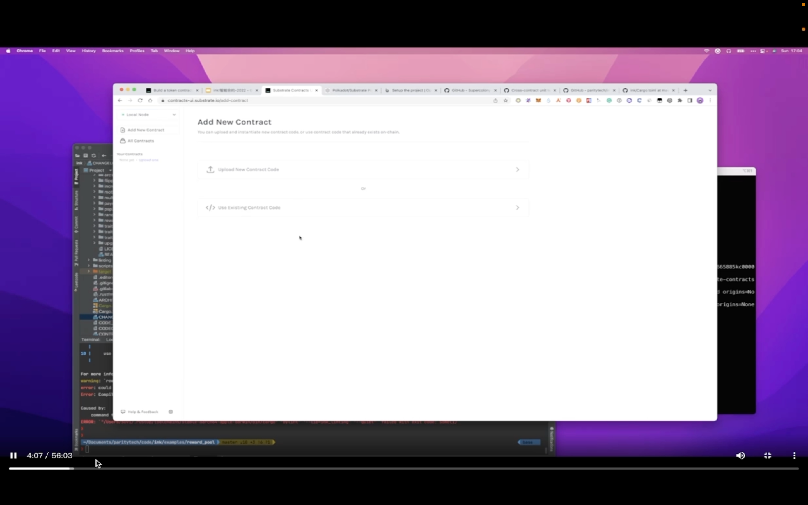</img>  
https://contracts-ui.substrate.io/?rpc=ws://127.0.0.1:9944 识别到了  
https://polkadot.js.org/apps/#/explorer 也识别到了

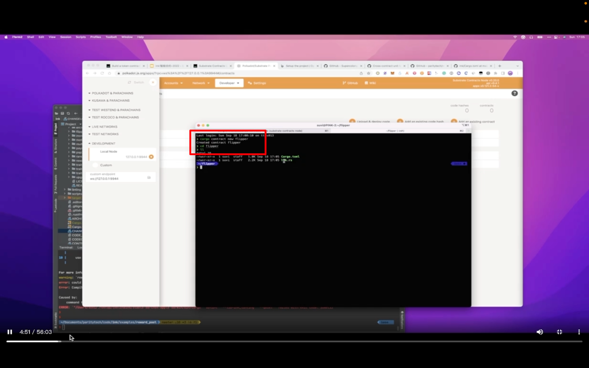</img>  
cargo contract new flipper

## 220925

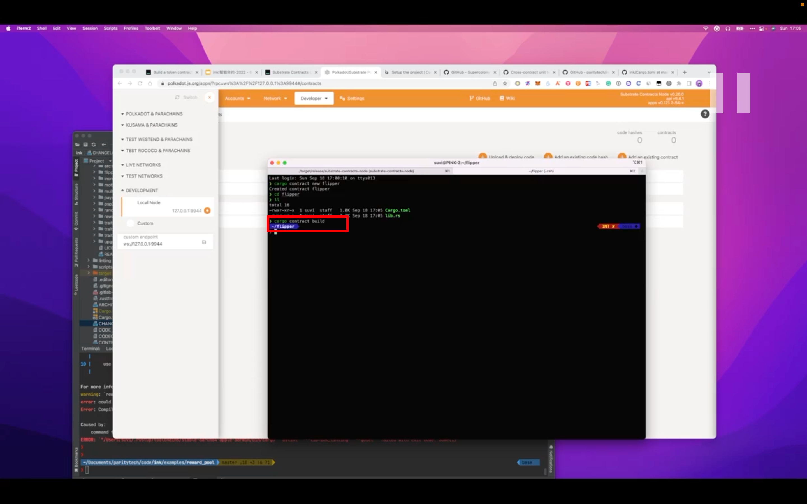</img>  
cargo contract build 编译

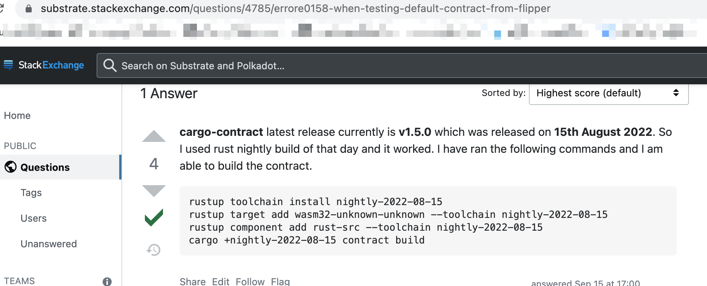</img>  
add 220926 编译会遇到报错，试了很多方法无法解决。但学到个方法，当编译无法通过时查看需要编译的东西的版本发行时间，然后再转到当天的 rustc nightly 进行编译，应该就能解决问题。虽然此处这方法仍未解决问题。  
ink 目前不稳定，暂停学习。  
add 220929 换成 cargo install cargo-contract --version 2.0.0-alpha.3 则可顺利编译

</img>  
编译结束后得到三个文件  
这里主要介绍了 metadata ooov

</img>  
通过 ink contract 宏，把整个 mod 包起来，flipper 可以理解为合约名称

</img>  
ink storage 声明合约存储

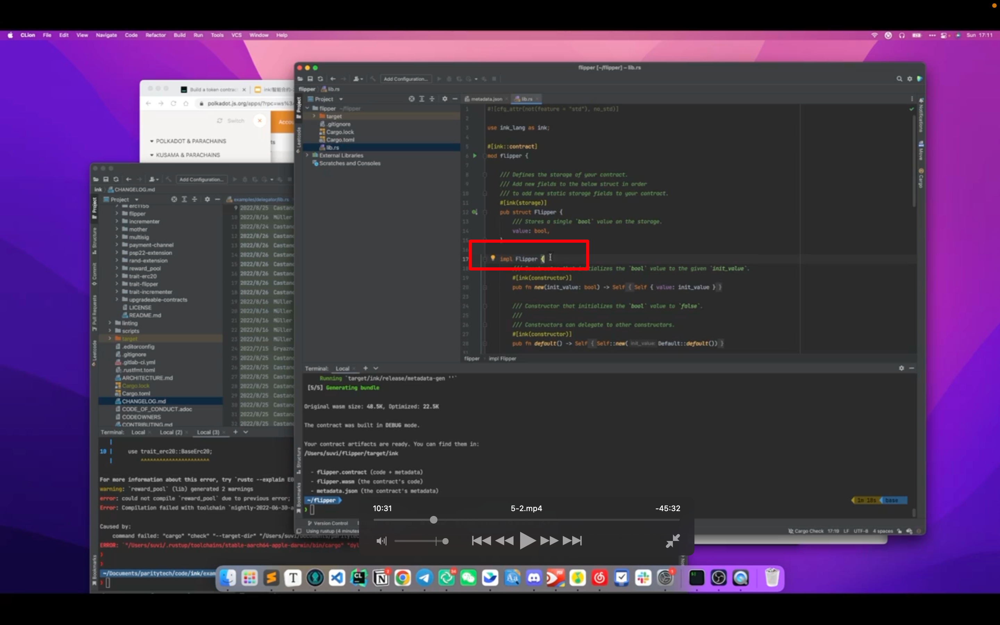</img>  
给上面说的存储 impl 一些方法，纯 rust 写法

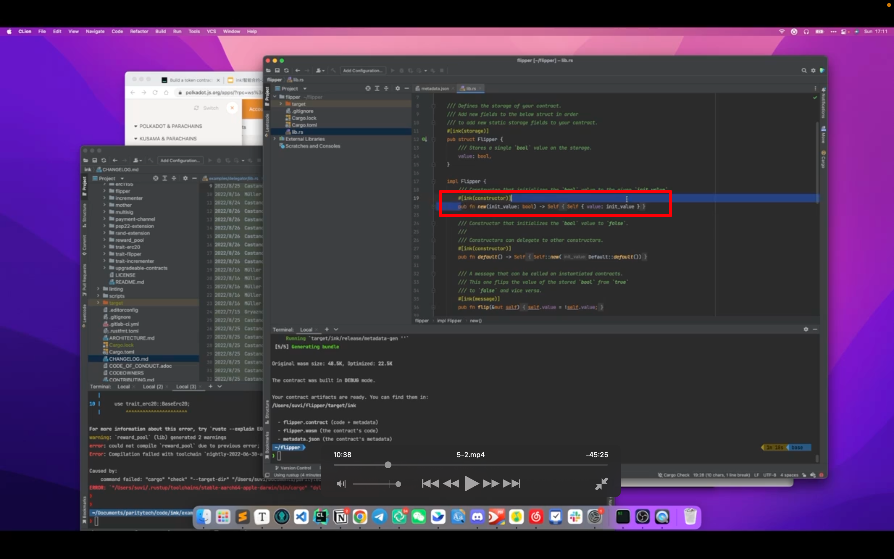</img>  
ink constructor 宏标记表示合约初始化时实现的

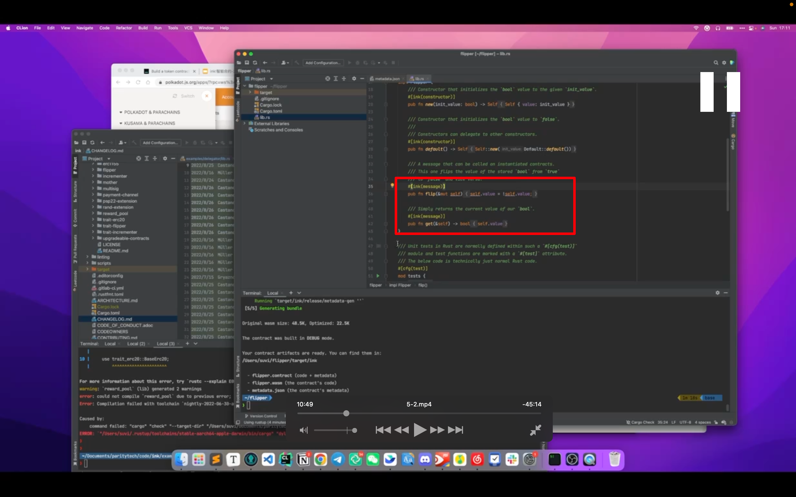</img>  
ink message 表示对外暴露的方法

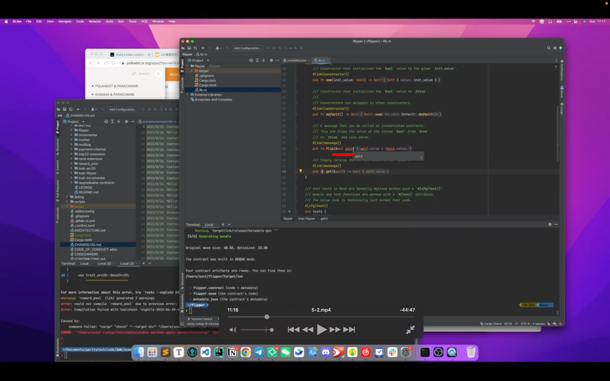</img>  
对当前合约存储有改变的方法，都要写&mut self

</img>  
由于 get 用的是不可变引用&self，用来声明此方法是对合约当前状态或存储的 rpc 读取  
ink 的 mut self 相当于 solidity 里的 public 方法，self 则相当于 public view 方法？？？？

</img>  
tests 类似普通 rust 的 test，普通 rust 用 test，这里用 ink::test 来指定需要测试哪些方法

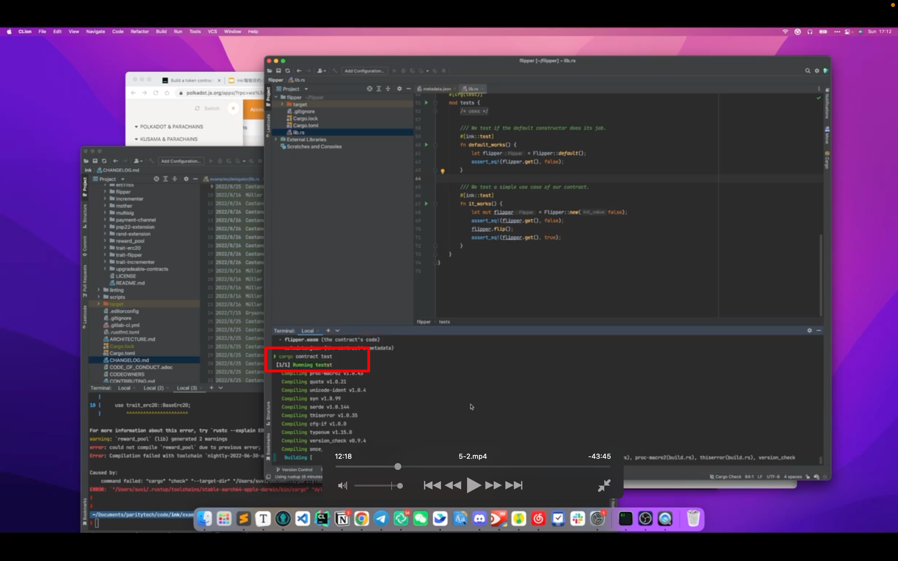</img>  
cargo contract test 来测试

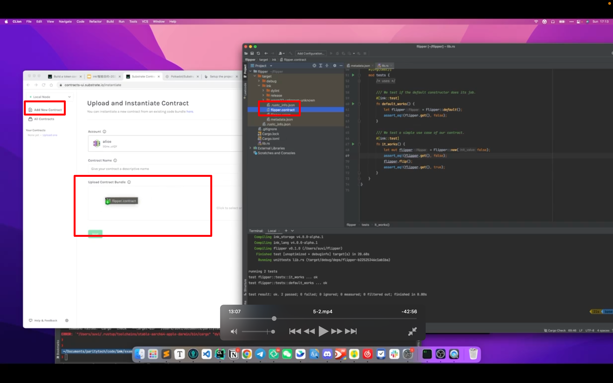</img>  
--=  
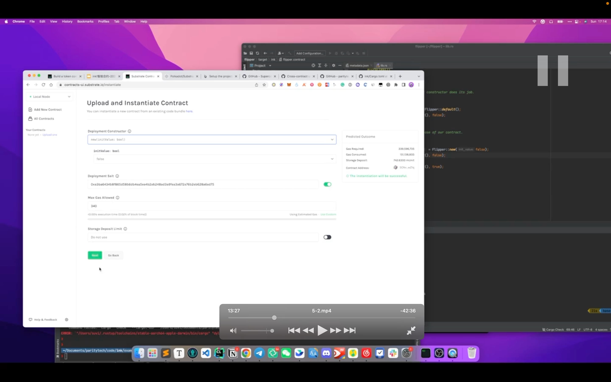</img>  
--=  
上传 contract

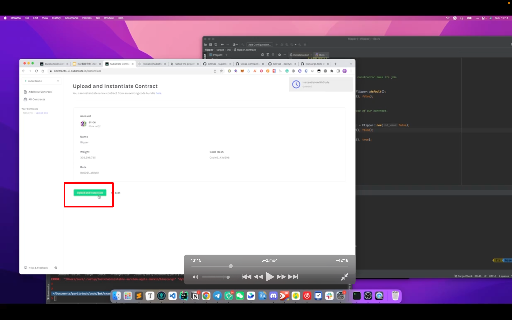</img>  
upload and instantiate  
upload codehash，并且实例化一个合约。ui 里把这两个合并了

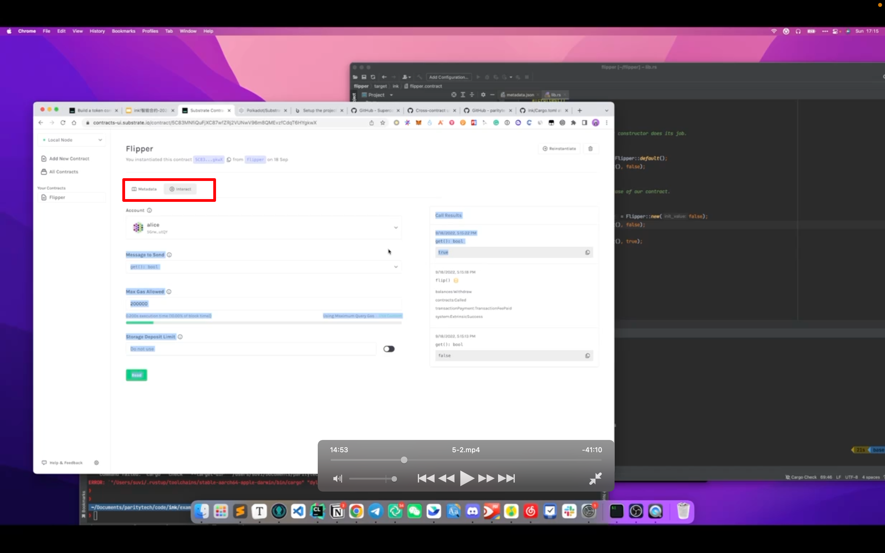</img>  
部署成功后，就可以在这里调用合约了

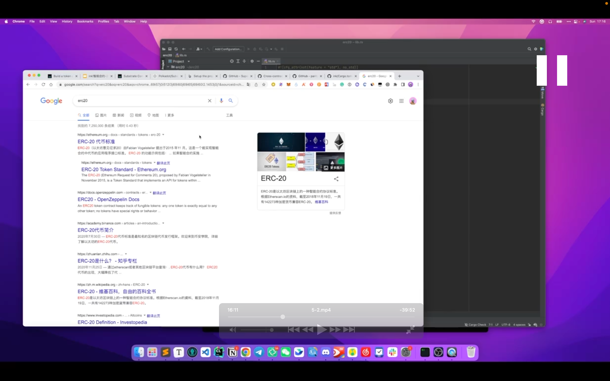</img>  
了解 erc20，大概是 8 个方法，2 个 event
