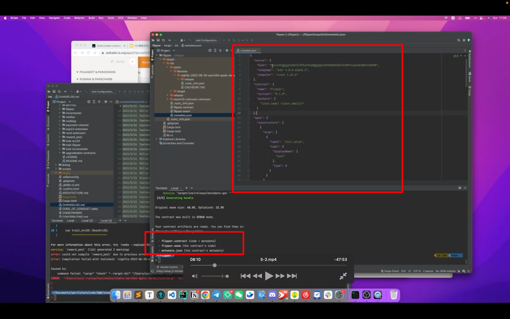

## 220924

  
启动上节课准备好的环境，启动后就不动了，因为共识不一样，这个是交易后才出块

  
https://contracts-ui.substrate.io/?rpc=ws://127.0.0.1:9944 识别到了  
https://polkadot.js.org/apps/#/explorer 也识别到了

  
cargo contract new flipper

## 220925

  
cargo contract build 编译

  
add 220926 编译会遇到报错，试了很多方法无法解决。但学到个方法，当编译无法通过时查看需要编译的东西的版本发行时间，然后再转到当天的 rustc nightly 进行编译，应该就能解决问题。虽然此处这方法仍未解决问题。  
ink 目前不稳定，暂停学习。

  
编译结束后得到三个文件  
这里主要介绍了 metadata ooov

  
通过 ink contract 宏，把整个 mod 包起来，flipper 可以理解为合约名称

  
ink storage 声明合约存储

  
给上面说的存储 impl 一些方法，纯 rust 写法

  
ink constructor 宏标记表示合约初始化时实现的

  
ink message 表示对外暴露的方法

  
对当前合约存储有改变的方法，都要写&mut self

  
由于 get 用的是不可变引用&self，用来声明此方法是对合约当前状态或存储的 rpc 读取  
ink 的 mut self 相当于 solidity 里的 public 方法，self 则相当于 public view 方法？？？？

  
tests 类似普通 rust 的 test，普通 rust 用 test，这里用 ink::test 来指定需要测试哪些方法

  
cargo contract test 来测试

  
--=  
  
--=  
上传 contract

  
upload and instantiate  
upload codehash，并且实例化一个合约。ui 里把这两个合并了

  
部署成功后，就可以在这里调用合约了

  
了解 erc20，大概是 8 个方法，2 个 event
