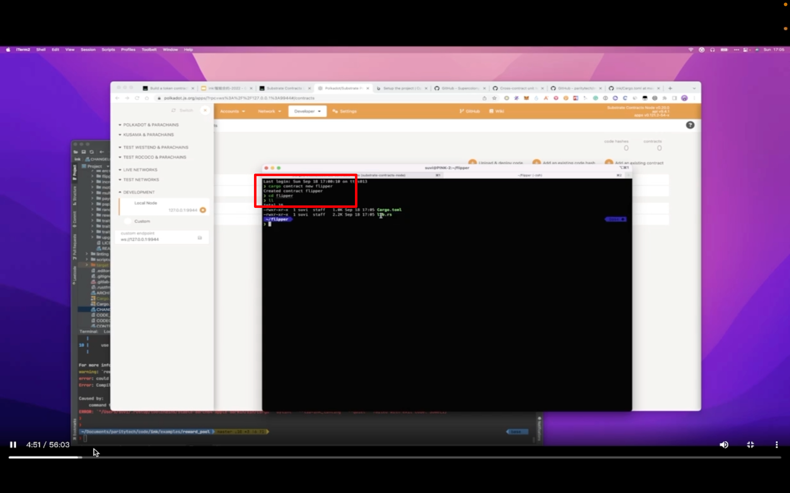

## 220924

  
启动上节课准备好的环境，启动后就不动了，因为共识不一样，这个是交易后才出块

  
https://contracts-ui.substrate.io/?rpc=ws://127.0.0.1:9944 识别到了  
https://polkadot.js.org/apps/#/explorer 也识别到了

  
cargo contract new flipper
