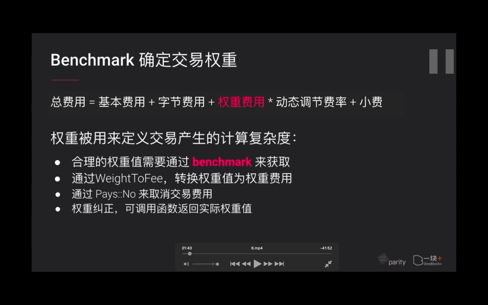

## 221002

  
ooop

  
benchmark 确定交易权重

  
官方配置，benchmark 配置，希望验证人使用的配置

  
benchmark 可用选项

  
substrate 已经对数据库读写进行了 benchmark  
读是 25us 微秒，1s 对应 weight 基础值是 1\*10\*\*12，1 毫秒就是 1\*10\*\*9，1 微秒是 1\*10\*\*6

用 substrate 内置的 benchmark 工具对可调用函数进行基本测试  
以及其它相关资料

  
--=  
  
--=

1，下划线代替 create claim，用例跟可调用函数同名就可用下划线        
2，构建benchmark需要的变量和数据
