## 221002

 </img>  
ooop

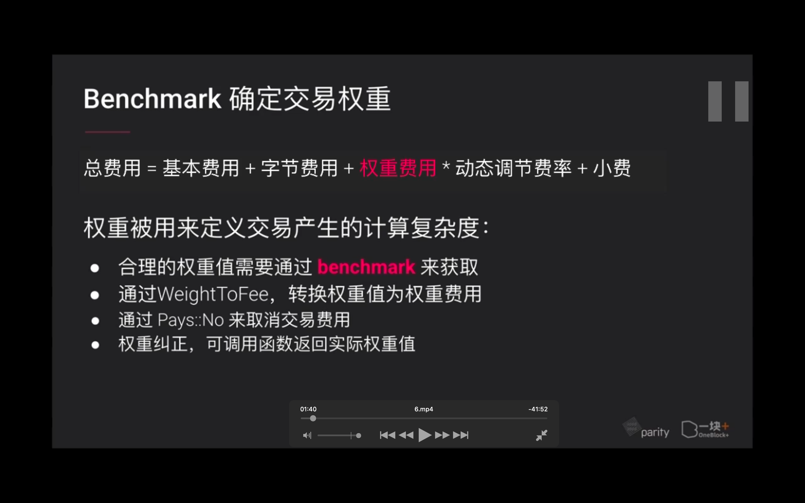 </img>  
benchmark 确定交易权重

</img>  
官方配置，benchmark 配置，希望验证人使用的配置

</img>  
benchmark 可用选项

</img>  
substrate 已经对数据库读写进行了 benchmark  
读是 25us 微秒，1s 对应 weight 基础值是 1\*10\*\*12，1 毫秒就是 1\*10\*\*9，1 微秒是 1\*10\*\*6

</img>  
用 substrate 内置的 benchmark 工具对可调用函数进行基本测试  
以及其它相关资料

</img>  
--=  
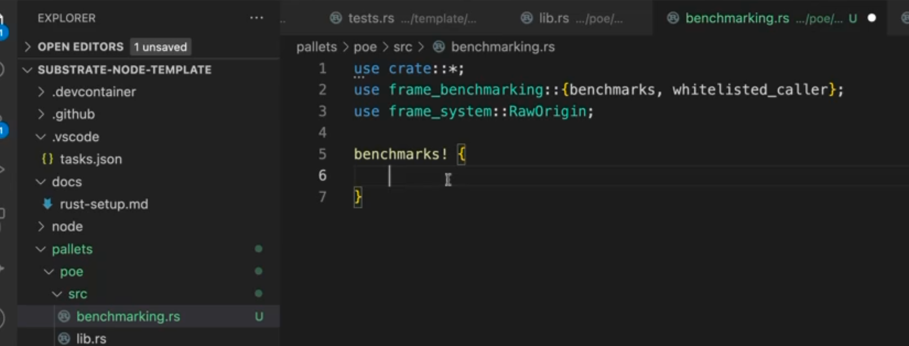</img>  
--=  
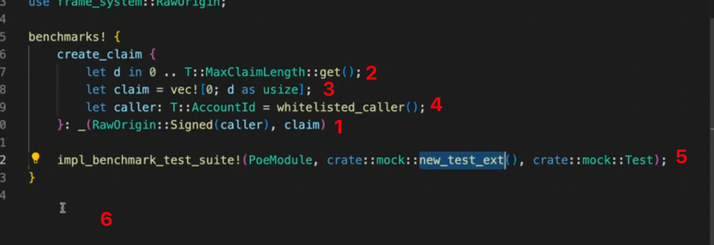</img>  
1，下划线代替 create claim，用例跟可调用函数同名就可用下划线  
2，接下来构建 benchmark 需要的变量和数据，这里是定义 claim，因为 claim 有长度，这里给一个长度区间，从 0 到最大长度。在运行 benchmark 基本测试时，选 d 作为存证长度，每次测试使用不同的 d，从而让 bm 涵盖尽可能多的场景，给出准确的权重值  
3，开始构建存证。  
4，用 whitelist caller 构建交易发送方  
5，构建 bm 的测试环境  
6，verify 用来验证 bm 中数据是否正确，这里省略了。

</img>  
--= 1  
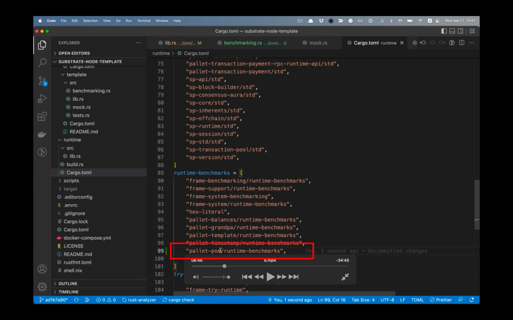</img>  
--= 2  
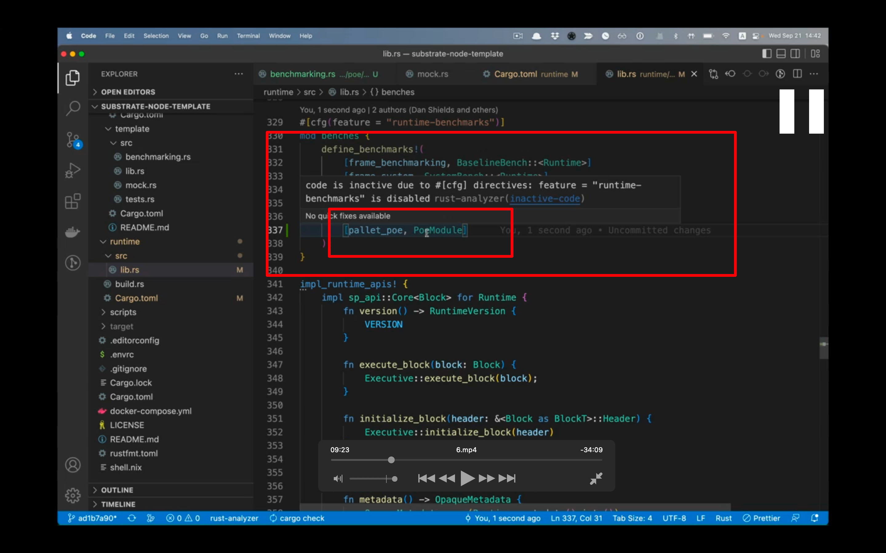</img>  
--= 3  
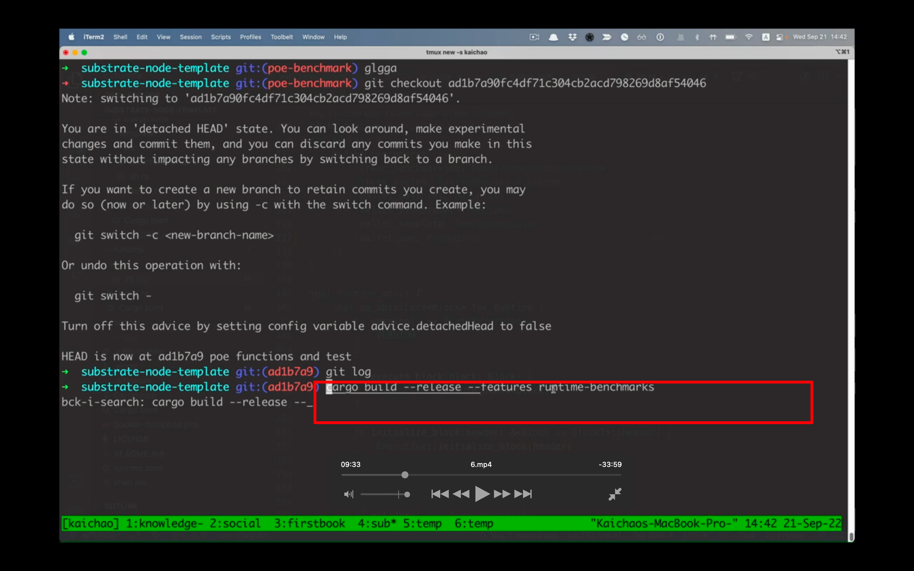</img>  
--= 4  
1，引入到 librs  
2，把 1 中的标签添加到 runtime toml 里，就是说当 runtime 使用 runtime-benchmark 编译时，poe 模块也是使用 runtime-benchmark 进行编译  
3，runtime 的 librs 里引入 poe benchmark  
4，cargo build --release --features runtime-benchmarks, build 时加入指定的 flag

</img>  
--=  
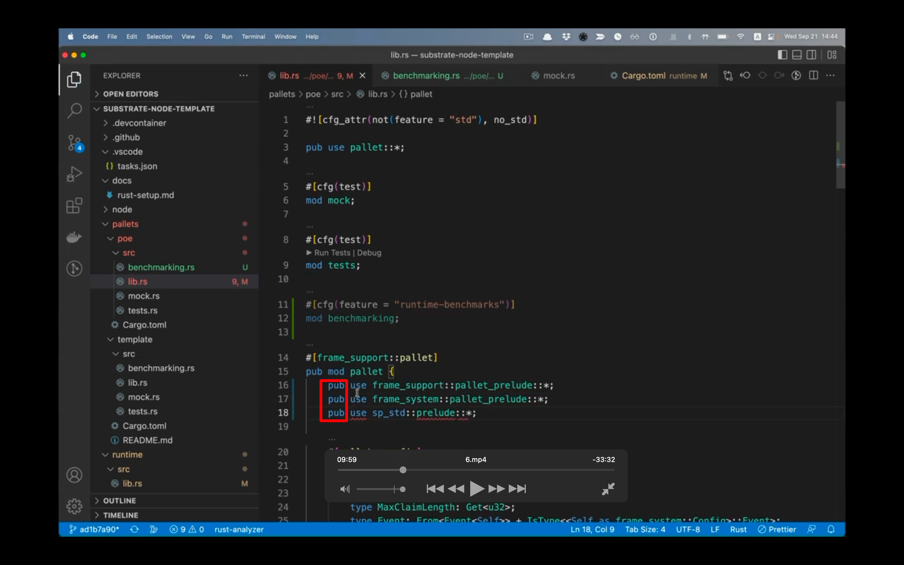</img>  
build 报错，加上 pub use 后子模块才可以依赖，然后 build 成功

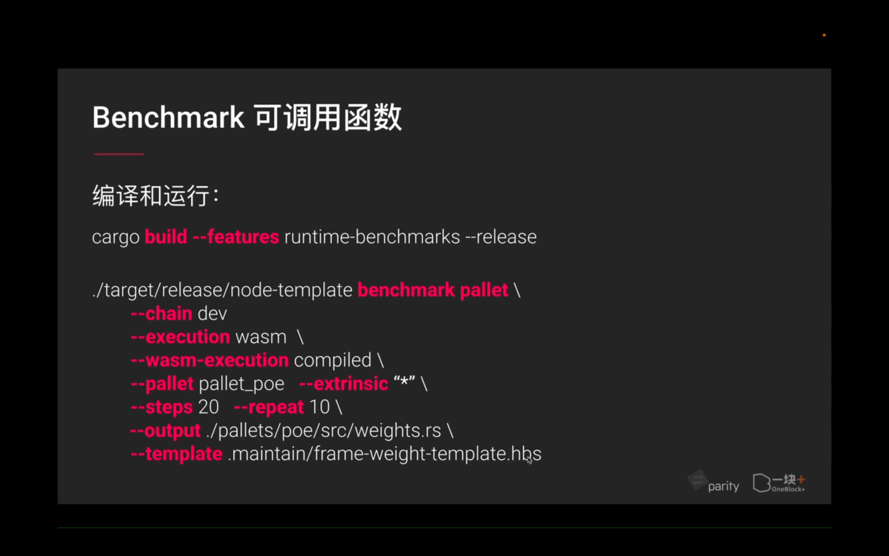</img>  
编译和运行的一些参数，ooov 1130

</img>  
--= 1  
</img>  
--= 2  
</img>  
--= 3  
</img>  
--= 4  
</img>  
--= 5  
1 的文件拷贝下来粘贴到新建的 2 里  
3 运行，4 拿到结果  
5，生成了 weightrs 和 rawjson

</img>  
生成的 weightrs ooov

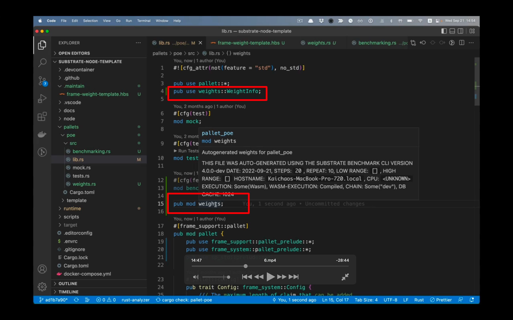</img>  
--= 1  
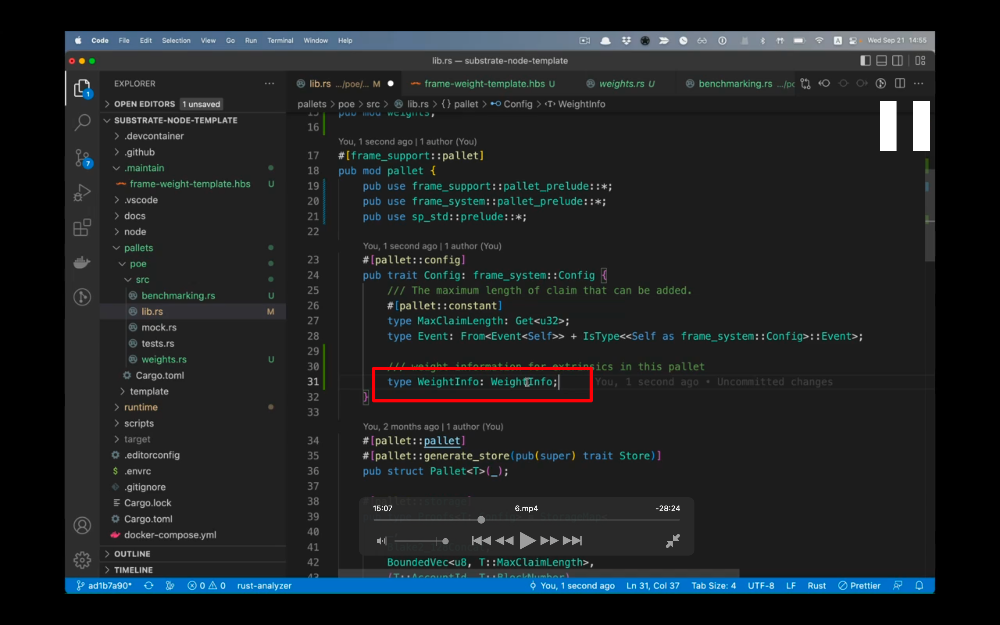</img>  
--= 2  
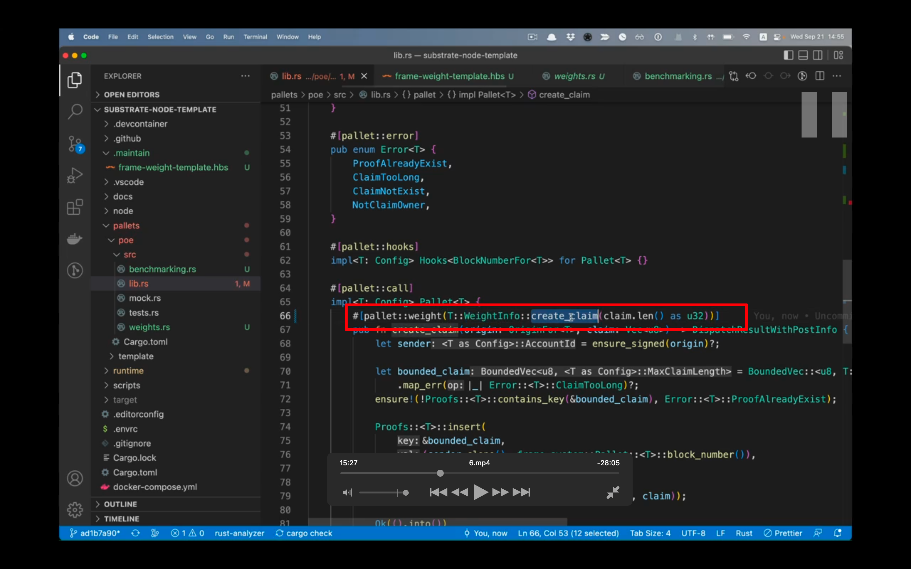</img>  
--= 3  
1，poe librs 引入 weightinfo  
2，定义 wi 接口，通过接口形式将权重值传给可调用函数，在模块配置接口 config 里定义  
3，使用配置接口的 weightinfo ，create claim bm 给出的结果替代原来的默认权重值。（所以这里的 T 意思是配置接口？？？？）

## 221004

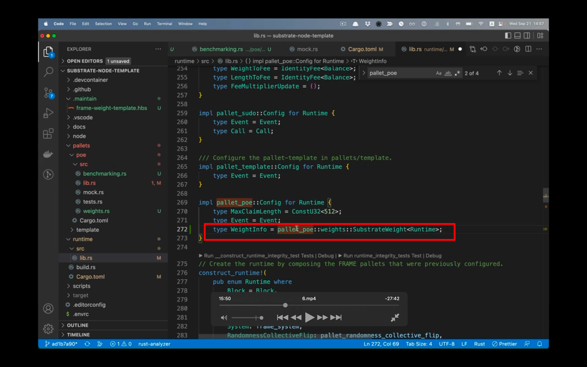</img>  
4，具体 3 中使用的 weightinfo 的哪一个实现，需要在 runtime 里定义。在 runtime librs 里找到 pallet poe，写入红色部分  
具体意思是使用 pallet poe 模块，weights 子模块，substrateWeight 这个自定义结构体，并接受范型参数 runtime dddi。

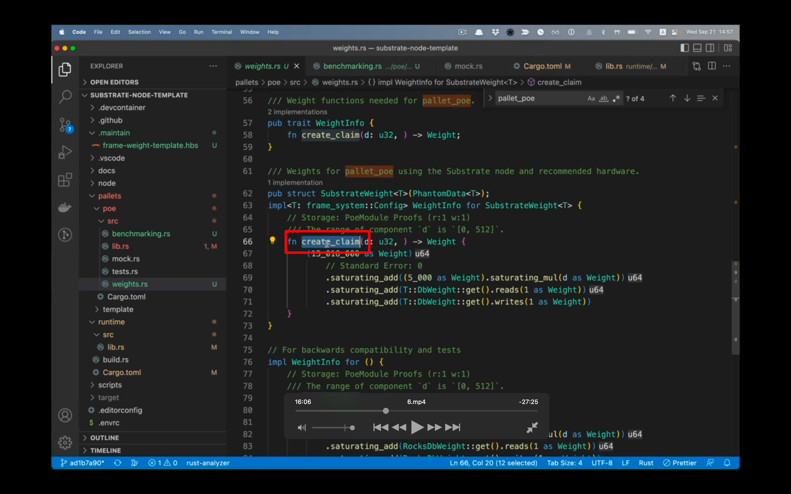</img>  
5，点击 4 中的，substrateWeight，出现如图，可以看到有 create claim 这个方法

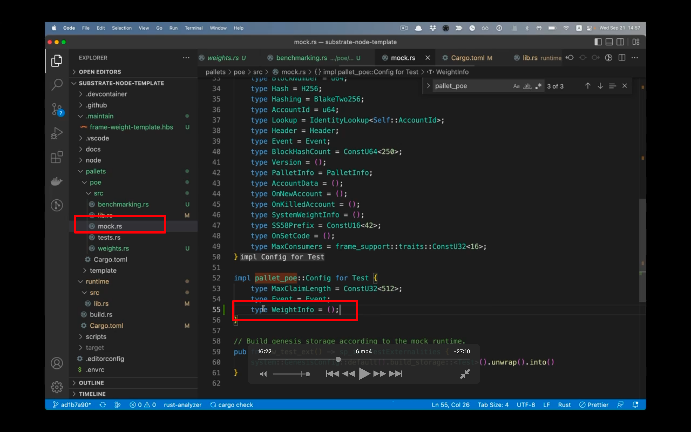</img>  
6，mock 里也需要实现，使用空 tuple 就行  
此时已经添加了基本的测试结果到可调用函数上面。

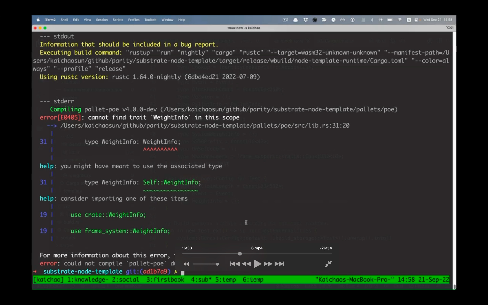</img>  
build 报错（此时正常 cargo build --release 就行了，不用再加标签了）

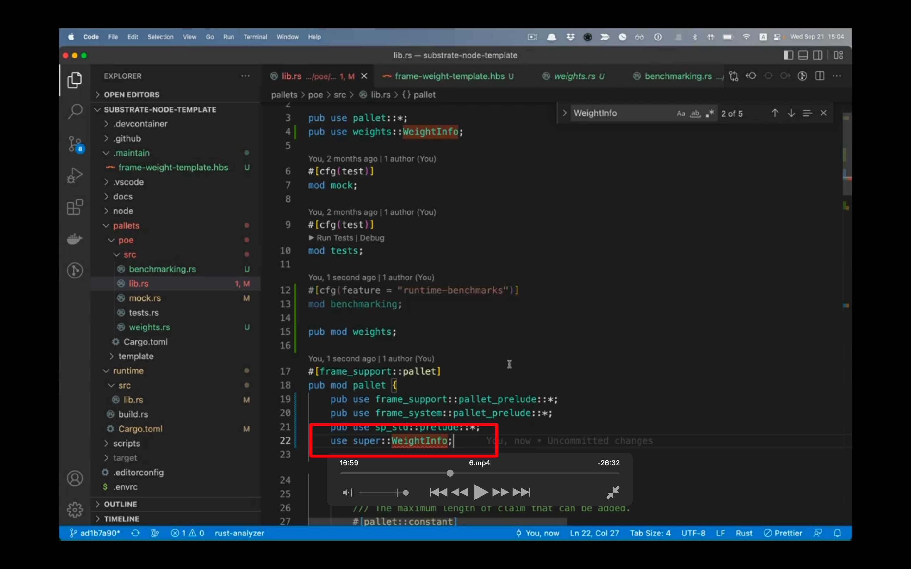</img>  
添加这段后就成功编译了，dddf

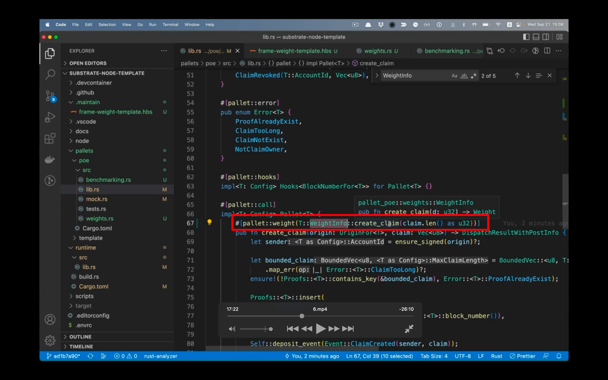</img>  
之后再发送 create claim 时，收取的交易费就会包含引入的权重费用了。
