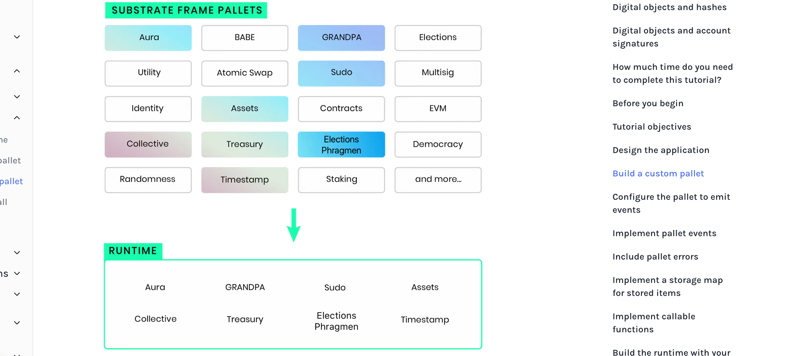
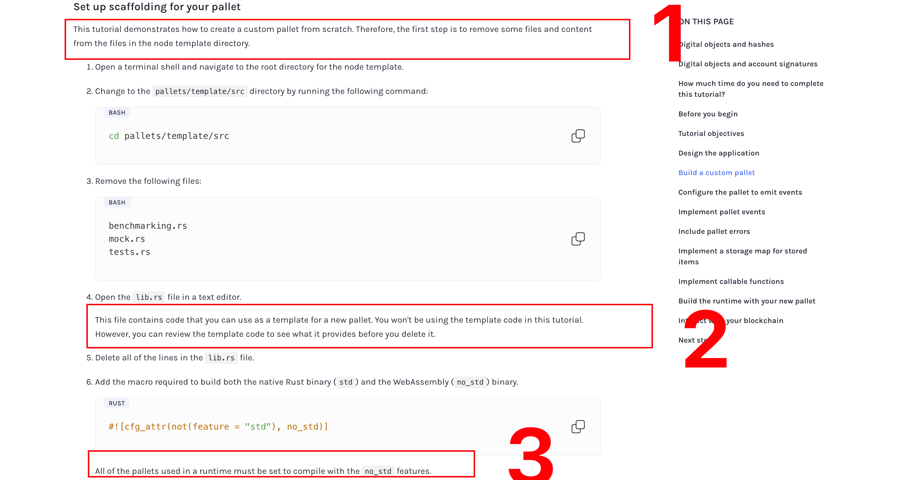
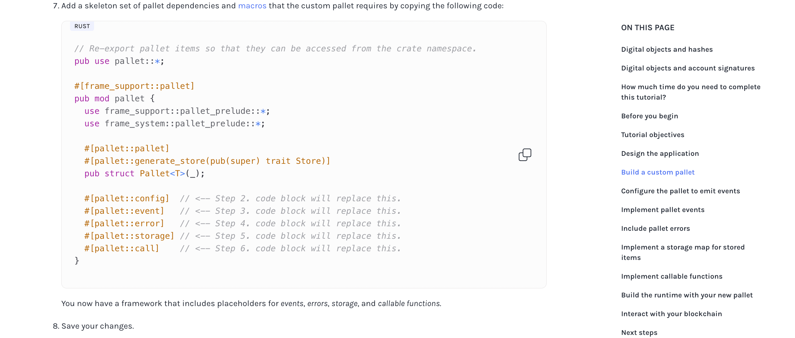
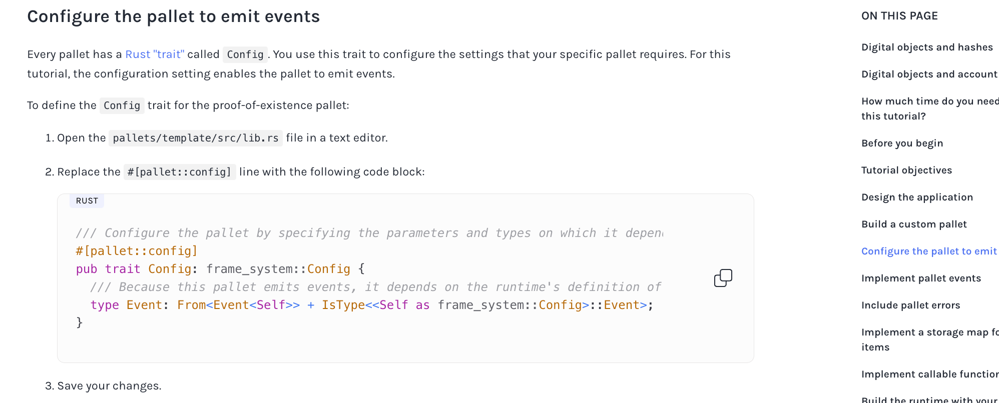
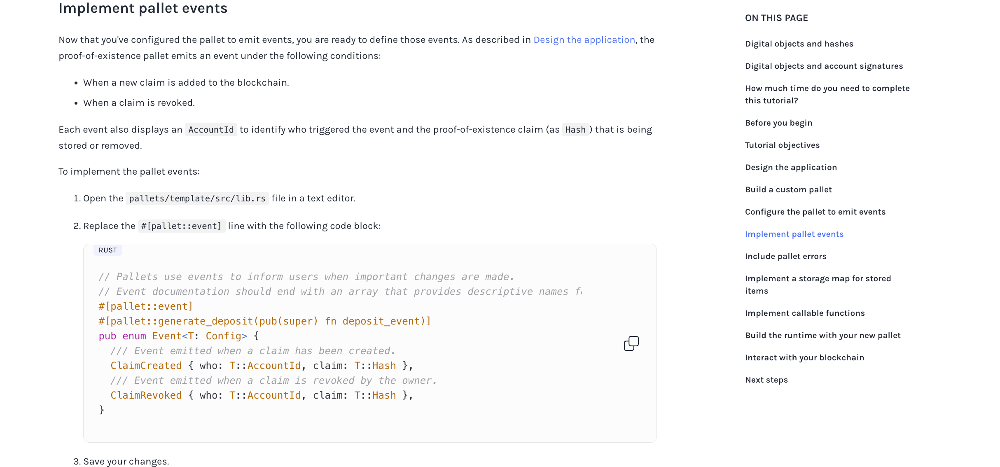
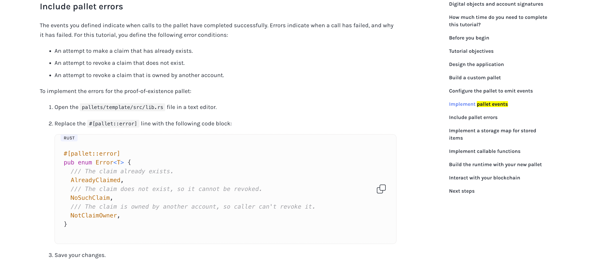
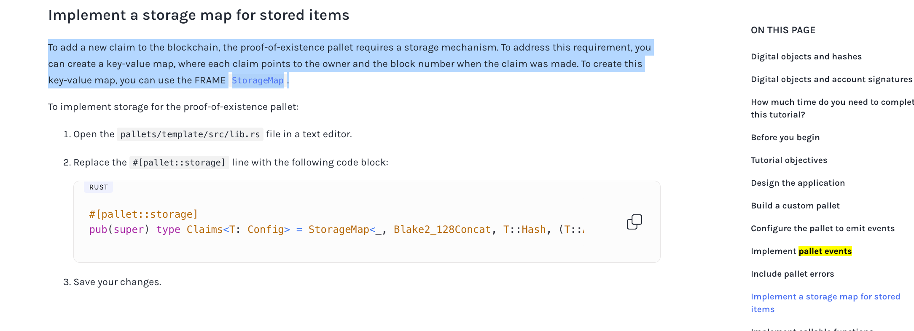
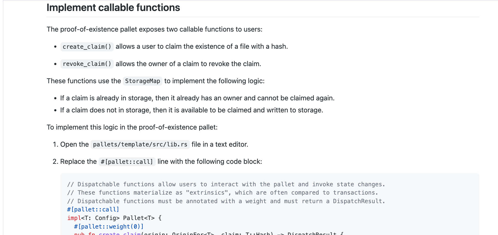

## Use macros in a custom pallet

This tutorial illustrates how to create a custom pallet for a Substrate runtime using macros that are part of the FRAME development environment.

本教程演示了如何使用 FRAME 开发环境中的宏为 Substrate 运行时创建自定义托盘。

For this tutorial, you'll build a simple proof-of-existence application. Proof-of-existence is an approach to validating the authenticity and ownership of a digital object by storing information about the object on the blockchain. Because the blockchain associates a timestamp and account with the object, the blockchain record can be used to "prove" that a particular object existed at a specific date and time. It can also verify who the owner of a record was at that date and time.

对于本教程，您将构建一个简单的存在性证明应用程序。存在证明是一种通过在区块链上存储关于对象的信息来验证数字对象的真实性和所有权的方法。因为区块链将时间戳和帐户与对象关联起来，所以区块链记录可用于“证明”特定对象在特定日期和时间存在。 它还可以验证记录的所有者在那个日期和时间是谁。

## Digital objects and hashes

Instead of storing an entire file on the blockchain, it can be much more efficient to simply store a cryptographic hash of that file. This is also known as a "digital fingerprint". The hash enables the blockchain to store files of arbitrary size efficiently by using a small and unique hash value. Because any change to a file would result in a different hash, users can prove the validity of a file by computing the hash and comparing that hash with the hash stored on chain.

与其将整个文件存储在区块链上，不如简单地存储该文件的加密 hash，这样会更有效。这也被叫做“数字指纹”。散列允许区块链通过使用一个较小且唯一的散列值有效地存储任意大小的文件。因为对文件的任何更改都会导致不同的哈希值，所以用户可以通过计算哈希值并将该哈希值与存储在 chain 上的哈希值进行比较来证明文件的有效性。

## Digital objects and account signatures

Blockchains use [public key cryptography](https://en.wikipedia.org/wiki/Public-key_cryptography) to map digital identities to accounts that have private keys. The blockchain records the account you use to store the hash for a digital object as part of the transaction. Because the account information is stored as part of the transaction, the controller of the private key for that account can later prove ownership as the person who initially uploaded the file.

区块链使用 public key cryptography 将数字身份映射到拥有私钥的账户。区块链记录你的账户存储 hash 作为一个数字对象作为交易的一部分。由于帐户信息是作为交易的一部分存储的，因此帐户私钥的控制者可以在以后证明是最初上传文件的人。

## How much time do you need to complete this tutorial?

oooe

## Before you begin

oooe

重点，需要完成[Simulate a network](/tutorials/get-started/simulate-network/)步骤，即两个节点的链，而不是单节点链。

## Tutorial objectives

oooe

## Design the application

The proof-of-existence application exposes the following callable functions:

- `create_claim()` allows a user to claim the existence of a file by uploading a hash.  
  允许用户通过上传 hash 来声明文件的存在。

- `revoke_claim()` allows the current owner of a claim to revoke ownership.  
  允许一个 claim 的当前拥有者取消所有权。

## Build a custom pallet

The Substrate node template has a FRAME-based runtime. As you learned in Runtime development, FRAME is a library of code that allows you to build a Substrate runtime by composing modules called pallets. You can think of the pallets as individual pieces of logic that define what your blockchain can do. Substrate provides you with a number of pre-built pallets for use in FRAME-based runtimes.

substrate node template 有一个 FRAME-based runtime。正如您在运行时开发中了解到的，FRAME 是一个代码库，它允许您通过组合称为托盘的模块来构建基板运行时。您可以将托盘视为定义区块链可以做什么的独立逻辑块。Substrate 为您提供了许多用于基于 Frame 的运行时的预构建托盘。

This tutorial demonstrates how to create your own FRAME pallet to be included in your custom blockchain.

本教程演示了如何创建自己的 FRAME 托盘，将其包含在您的自定义区块链中。

## Set up scaffolding for your pallet

  
1，本教程演示了如何从头开始创建一个自定义托盘。因此，第一步是从节点模板目录中的文件中删除一些文件和内容。  
2，此 lib.rs 文件包含你想创建新 pallet 的模版。此节教程不会用到它，可以学习下模版代码，然后删除掉它。  
3，在运行时中被使用的 pallets 必须被设置为 no_std features.

通过复制以下代码，添加自定义托盘所需的托盘依赖和宏的骨架集  
现在，您拥有了一个包含事件、错误、存储和可调用函数占位符的框架。

## Configure the pallet to emit events

Every pallet has a Rust "trait" called Config. You use this trait to configure the settings that your specific pallet requires. For this tutorial, the configuration setting enables the pallet to emit events.

每个托盘都有一个 Rust“trait”，称为 config。您可以使用此 trait 来配置特定托盘所需的设置。对于本教程，配置设置允许托盘发出事件。

## Implement pallet events

Now that you've configured the pallet to emit events, you are ready to define those events. As described in Design the application, the proof-of-existence pallet emits an event under the following conditions:

现在您已经配置了托盘来发出事件，现在可以定义这些事件了。正如在设计应用程序中描述的那样，proof-of-existence 托盘在以下条件下发出事件:

- When a new claim is added to the blockchain.
- When a claim is revoked.

Each event also displays an AccountId to identify who triggered the event and the proof-of-existence claim (as Hash) that is being stored or removed.

每个事件还显示一个 AccountId，以识别是谁触发了事件，以及存储或删除的 proof-of-existence claim(作为 Hash)。

## Include pallet errors

The events you defined indicate when calls to the pallet have completed successfully. Errors indicate when a call has failed, and why it has failed. For this tutorial, you define the following error conditions:

定义的事件指示对托盘的调用何时成功完成。Errors 表明失败的时间以及失败的原因。在本教程中，您定义了以下错误条件:

An attempt to make a claim that has already exists.  
An attempt to revoke a claim that does not exist.  
An attempt to revoke a claim that is owned by another account.

## Implement a storage map for stored items

To add a new claim to the blockchain, the proof-of-existence pallet requires a storage mechanism. To address this requirement, you can create a key-value map, where each claim points to the owner and the block number when the claim was made. To create this key-value map, you can use the FRAME StorageMap.

要向区块链添加新的声明，proof-of-existence pallet 需要一种存储机制。为了满足这一需求，可以创建一个键值映射，其中每个声明指向声明时的所有者和块号。要创建这个键值映射，可以使用 FRAME StorageMap。

## Implement callable functions

https://github.com/substrate-developer-hub/substrate-docs/blob/main/content/md/en/docs/tutorials/work-with-pallets/use-macros-in-a-custom-pallet.md#implement-callable-functions

## Build the runtime with your new pallet

https://github.com/substrate-developer-hub/substrate-docs/blob/main/content/md/en/docs/tutorials/work-with-pallets/use-macros-in-a-custom-pallet.md#build-the-runtime-with-your-new-pallet

oooe

## Interact with your blockchain

https://github.com/substrate-developer-hub/substrate-docs/blob/main/content/md/en/docs/tutorials/work-with-pallets/use-macros-in-a-custom-pallet.md#interact-with-your-blockchain

oooe
