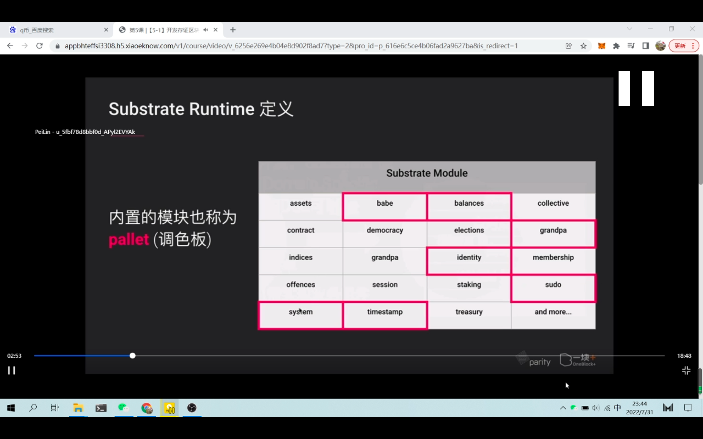
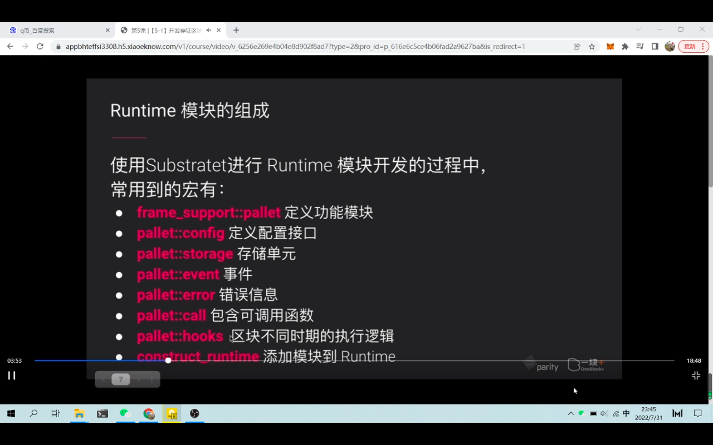
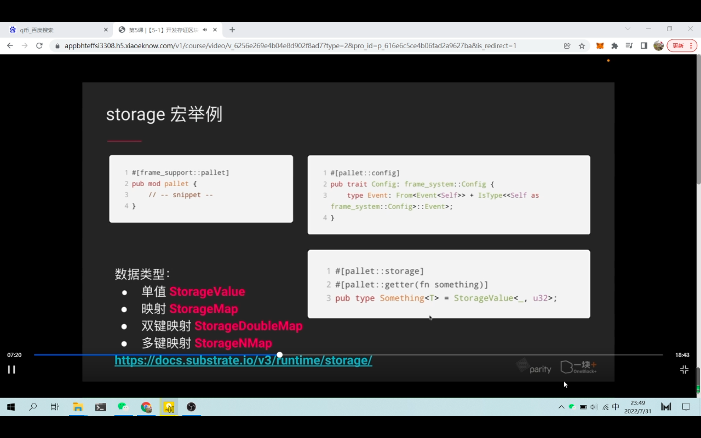

  
区块链里，区块的验证是通过链上逻辑进行校验，substrate 里把这个链上逻辑称为 runtime
a 到 b，通过交易触发，将交易信息应用到 runtime 逻辑层进行状态修改。

  
这些 moudule pallet，组成了 runtime？

  
模块开发常用的宏。

  
storage 宏，定义存储单元

以 storage 宏举例，怎么创建宏  
注意和标准 rust 语法可能不一样。        

### 本节内容较多，之后内容暂不做笔记
